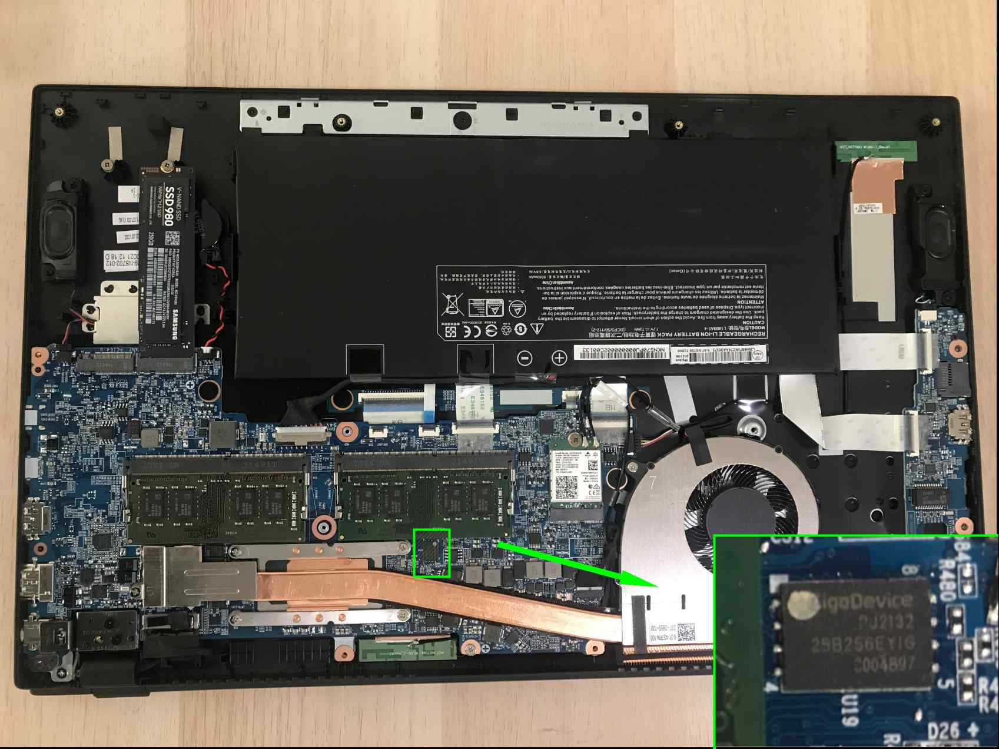
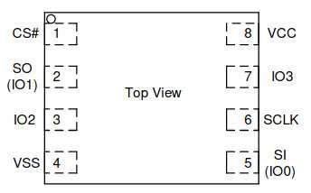

# Flashing guide

This document describes how to set up external flashing for the devices using
RTE.

## NS5x/7x 12th Generation

### Prerequisites

* [Prepared RTE](../v1.1.0/quick-start-guide.md)
* WSON8 probe

    

### Flashing

1. Unscrew the bottom cover of the laptop.
1. Disconnect the battery

    > All power must be removed from the laptop during flashing.

    

1. Localize the flash chip.

    

1. Take the WSON8 probe and locate the white dot on the needles side. The dot
    indicates the first reference pin that should be connected to the pin on the
    flash chip also marked with a dot.

    

1. Connect the cables coming out from the WSON8 probe to the
    [SPI header](../specification/) according to the pictures and table
    below.

    - Top view of flash chip:

    

    - Table with all required connections:

        | RTE SPI header | Flash Chip |
        |:--------------:|:----------:|
        | Vcc            | VCC        |
        | CS             | CS#        |
        | MISO (SO)      | SO (IO1)   |
        | GND            | VSS        |
        | SCLK           | SCLK       |
        | MOSI (SI)      | SI         |

        > Note: both the SPI header and the WSON8 probe have 8-pin headers.
        Pins marked as NC on the RTE board and as IO2 and IO3 on the flash chip
        do not require a connection.

    - Example connection appearance:

    

1. Put the flash script on RTE:

    > The next steps require the device with Linux OS, it is possible to do this
    > on e.g. Windows, but the procedure will be different.

    1. Open the terminal and run the following commands:

        ```bash
        git clone https://github.com/3mdeb/RteCtrl.git
        cd RteCtrl/scripts/
        ```

    1. Use `scp` to transfer flash script, in places marked with `XX` enter the
        RTE IP address, which you can check with the command `ip a`:

        ```bash
        scp flash.sh root@XX.XX.XX.XX:/home/root/
        ```

1. Login to RTE via `ssh` or `minicom`.
1. Connect and hold the WSON8 probe to the flash chip.
1. Read the flash chip by executing the following command on RTE:

    ```bash
    ./flash.sh read dump.rom
    ```

1. If the reading was successful, the output from the command above should
    contain the phrase `Verifying flash... VERIFIED.`. Only after the entire
    script has been executed, the WSON8 probe can be disconnected.
1. Connect and hold again the WSON8 probe to the flash chip.
1. Write the flash chip by executing the following command on RTE:

    ```bash
    ./flash.sh write coreboot.rom
    ```

1. If the writing was successful, the output from the command above should
    contain the phrase `Verifying flash... VERIFIED.`. Only after the entire
    script has been executed, the WSON8 probe can be disconnected.
1. Reconnect the battery and screw in the bottom cover.
1. Power on the device. If the platform is booting up and basic functionalities
    are working, the entire procedure was successful.
