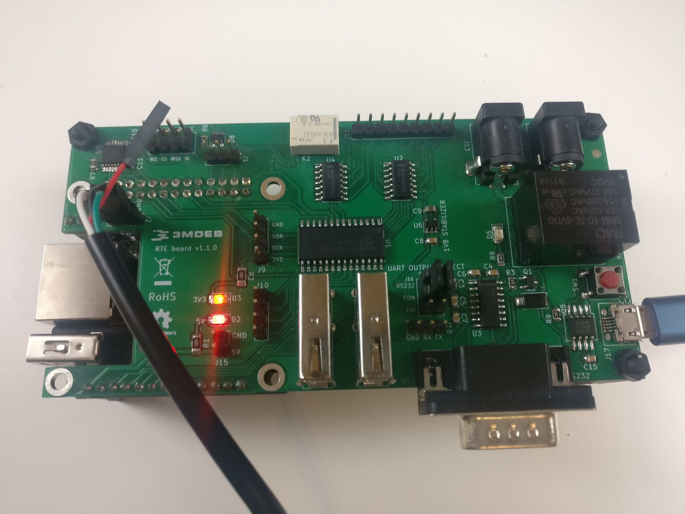

# RTE Getting Started

## Connect USB-to-TTL serial UART converter

<center>



</center>

* Connect J2 Orange Pi Zero system debug output
* Power the board and confirm it boots
* **Please note** typical convention of USB-UART converter colors is as follows
    * black - GND
    * red - +5V
    * green - TX
    * white - RX

## Setup terminal emulator

Connect terminal to RTE and read OS version:

```shell
sudo minicom -b 115200 -D /dev/ttyUSB0 -o -C /tmp/minicom.cap
```

* `-b 115200` sets baudrate
* `-D /dev/ttyUSB0` points to USB-UART converter device, it can be different if
  you already have some devices connected or you use different operating system
* `-o` skip initialization
* `-C /tmp/minicom.cap` capture serial terminal output, if you will have
  problems with exercises please post this file

Power on RTE but connecting power supply.

