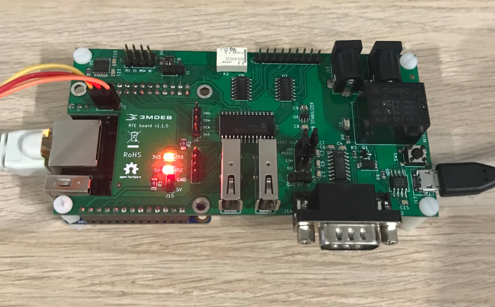

# Quick start guide

The canonical example of RTE usage is hooking it to some hardware for SPI
flashing, power control and serial logs gathering. This document describes the
common preparation of RTE without listed functions.



## Prerequisites

* [RTE board](https://shop.3mdeb.com/shop/open-source-hardware/open-source-hardware-3mdeb/rte/)
    (this document is based on v1.1.0)
* Micro-USB 5V 2.5A power supply
* Orange Pi
* SD card
* Ethernet cable
* USB-UART converter with 3 wire cables
* Ubuntu (based on 22.04)

## Preparation of RTE

1. Download the latest version of the RTE image from the
    [meta-rte repository](https://github.com/3mdeb/meta-rte/releases/latest).
1. Flash the SD card using `bmaptool` or `balenaEtcher`.
    1. to do this by `balenaEtcher` go to the [producer site](https://www.balena.io/etcher/)
        and follow his procedure on how to download and flash an SD card.
    1. to do this by `bmaptool` reproduce the following steps:
        1. install `bmaptool` by opening the terminal and typing the following
            command:

            ```bash
            sudo apt install bmap-tools
            ```

        1. create the bmap by typing the following command:

            ```bash
            bmaptool create /path/to/your/image > /path/where/you/want/bmap/file/saved/bmapfilename.bmap
            ```

        1. flash image to the SD card by typing the following command:

            ```bash
            sudo bmaptool copy --bmap ~/path/where/your/bmap/file/is/located /path/where/your/image/is/located /path/to/memory/device
            ```

1. Insert Orange Pi into RTE.
1. Insert SD card into Orange Pi.
1. Connect the ethernet cable to Orange Pi.
1. Plug the USB-UART converter into your computer and connect its pins with
    [RTE J2 Header](specification.md#uart0-header).
    (you may need a USB extension cable)

    |UART Converter | RTE J2 Header|
    |:-------------:|:------------:|
    | GND           | GND          |
    | TXD           | RX           |
    | RXD           | TX           |

1. Open the serial connection with RTE from your PC using a previously connected
    USB-UART converter by executing the following command:

    ```bash
    sudo minicom -D /dev/ttyUSB<x> -b 115200
    ```

    > Substitute `<x>` with the device number corresponding to your USB-UART
    > Converter for example `/dev/ttyUSB0`. The `dmesg` command allows to
    > identify the latest connected devices.

1. Plug the power supply into the RTE J17 Micro-USB slot.
1. Login into the device by using the default credentials:
    - Login: `root`
    - Password: `meta-rte`
