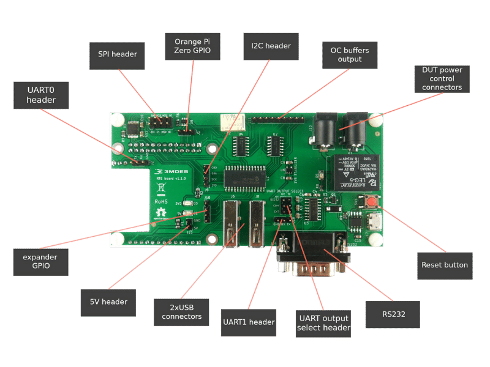

# RTE elements



* **UART0 header** - 1x3 Orange Pi Zero system debug output and console
  (pins: `RX`, `TX`, `GND`).
* **SPI header** - 2x4 standard 2.5mm IDC compatible header with all necessary
  signals to flash SPI chips.
* **Orange Pi Zero GPIO** - 1x3 GPIO pin header directly connected to Orange Pi
  zero platform.
* **I2C header** - 1x4 populated pins: `3.3V`, `SCK`, `SDA`, `GND`.
* **OC buffers output** - 1x12 GPIO pin header connected to Open Collector buffers.
* **DUT power control connectors** - 2x DC jack 5.5/2.1mm female connectors for
  a Device Under Test power supply controlled directly through the relay.
* **Reset button** - Simple switch to reset RTE
* **RS232** - DB9 male connector for RS232 communication with a hardware flow control.
* **UART output select header** 2x3 UART OUTPUT SELECT header destined for
  selecting serial output between UART1 header and DB9 RS232 connector.
* **UART1 header** - 1x3 UART header for 3V3 serial communication with DUT
  (pins: `RX`, `TX`, `GND`).
* **2x USB connectors** - Connect additional storages, external flash
  programmers, USB-RS232 or USB-UART converters.
* **5V header** - 1x2 5V output populated pins: `5V`, `GND`.
* **expander GPIO** - 1x4 GPIO pin header connected to GPIOs expander with no
  OC buffers.
* **Relay** - Controls Device Under Tests power supply
* **micro USB connector** - Connector for powering up RTE and OrangePi Zero
  setup.

## Product features

### Key features

* Cheaper and more feature-rich in comparison to other products
* Ultra-fast SPI flashing (16MHz)
* In-Circuit Programming (program onboard SPI Flash)
* Pomona connector to work with Serial Flash soldered on board
* Two logic levels SPI (1.8V and 3.3V)
* Remote power control over the target device
* Open Hardware
* Open Source software attached
* Open Source REST API controller
* Cost-free future software improvements

### RteCtrl: Web interface


**RteCtrl** is a REST API controller used for RTE board. It comes with meta-rte
operating system and starts automatically on port `8000` without the necessity
of additional configuration. REST API dashboard can be reached through the
Internet browser and provides a possibility to:

* control Device Under Test power supply (coldboot and warmboot)
* reset Device Under Test platform
* flash Device Under Test firmware
More information can be found at [RteCtrl repository](https://github.com/3mdeb/RteCtrl)

> **DISCLAIMER:** Before starting the flashing procedure through REST API console,
  make sure that appropriate SPI logic levels are set accordingly to
  [SPI](#spi-header) section.

## Specification

### GPIO header (1)

First GPIO header (`J1`) is a 1x3 pin header straight type 2.54mm pitch. It is
derived directly from Orange Pi GPIOs for general use. By default, these GPIOs
are set to `INPUT` mode.

Maximum voltage for all data signals: 3.3 V.

<center>

| Description | Pin # |
|:-----------:|:-----:|
| GPIO12      | 1     |
| GPIO11      | 2     |
| GPIO6       | 3     |

</center>

### GPIO header (2)

Second GPIO header (`J10`) is a 1x4 pin header straight type 2.54mm pitch. It
is derived from GPIO expander on RTE board. They are accessible for general
use. By default, these GPIOs are set to `INPUT` mode. Some of them may have a
fixed purpose by convention used in
[OSFV](https://github.com/Dasharo/osfv-scripts). It is recommended to keep
the connections to DUT consistent with the purpose of the pins.

Maximum voltage for all data signals: 3.3 V.
Expander GPIO: 25 mA maximum output current.

<center>

| Description | Pin # | Usage |
|:-----------:|:-----:|:-----:|
| GPIO400     | 1     | Power LED |
| GPIO401     | 2     | Free  |
| GPIO402     | 3     | Free  |
| GPIO403     | 4     | Free  |

</center>

### GPIO header (3)

Third GPIO header (`J11`) is a 1x9 pin header straight type 2.54mm pitch. It
is derived from GPIO expander on RTE board with an additional connection to OC
(Open Collector) buffers. By default, these GPIOs are set to `OUTPUT` mode.
Some of them have a fixed purpose by design (some of the pins are named on the
schematics) and convention used in
[OSFV](https://github.com/Dasharo/osfv-scripts). It is recommended to keep
the connections to DUT consistent with the purpose of the pins.

Maximum voltage for all data signals: 3.3 V.
OC buffers: 40 mA maximum output current.

<center>

| Description | Pin # | Usage |
|:-----------:|:-----:|:-----:|
| GPIO407     | 1     | Free  |
| GPIO415     | 2     | Free  |
| GPIO414     | 3     | Free  |
| GPIO408     | 4     | Watchdog (PC Engines APU2 specific) |
| GPIO409     | 5     | Reset button |
| GPIO410     | 6     | Power button |
| GPIO411     | 7     | Mode switch (PC Engines APU2 specific) |
| GPIO412     | 8     | CMOS clear |
| GPIO413     | 9     | SPI Write Protect |

</center>

### I2C header

I2C header (`J9`) is 1x4 pin header straight type 2.54mm pitch. It is used to
rather low-speed applications such as reading sensors or accessing DACs and ADCs.

Maximum voltage for all data signals: 3.3 V.

<center>

| Description | Pin # |
|:-----------:|:-----:|
| 3V3         | 1     |
| SCK         | 2     |
| SDA         | 3     |
| GND         | 4     |

</center>

### SPI header

SPI header (`J7`) is a 2x4 pin header straight type 2.54mm pitch. It is used to
control the application SPI flash with a minimal set of connections.

Maximum voltage for all data signals: 3.3 V.

<center>

| Description | Pin # |  Pin # | Description |
|:-----------:|:-----:|:------:|:-----------:|
| Vcc         | 1     | 2      | GND         |
| CS          | 3     | 4      | SCLK        |
| MISO (SO)   | 5     | 6      | MOSI (SI)   |
| ISP         | 7     | 8      | NC          |

</center>

Revision v1.1.0 features new possibilities for SPI configuration:

* SPI `Vcc` pin has been populated - power is now supplied to the SPI `Vcc`
connector and can be enabled/disabled on demand:

<center>

| GPIO406 (OC_OUT1) state | SPI Vcc               |
|:-----------------------:|:---------------------:|
| 0 - low                 | disabled (by default) |
| 1 - high                | enabled               |

</center>

* user can choose the voltage level for `Vcc` SPI - either 1.8V or 3.3 V:

<center>

| GPIO405 (OC_OUT2) state | SPI Vcc voltage level |
|:-----------------------:|:---------------------:|
| 0 - low                 | 1.8 V (by default)    |
| 1 - high                | 3.3 V                 |

</center>

* user can enable/disable SPI lines (some platforms have problems when booting
  with SPI wires connected):

<center>

| GPIO404 (OC_OUT3) state | SPI lines (MOSI/MISO/CS/SCLK) |
|:-----------------------:|:-----------------------------:|
| 0 - low                 | disabled (by default)         |
| 1 - high                | enabled                       |

</center>

### UART OUTPUT SELECT header

UART OUTPUT SELECT header (`J16`) is a 2x3 pin header straight type 2.54mm pitch.
It is used for enabling serial communication output: RS232 DB9 port (`J14`) or
UART1 header (`J18`). If jumpers are not attached, serial ports are disabled.

<center>

| Jumper position (TX) | Jumper position (RX) | Serial communication enabled |
|:--------------------:|:--------------------:|:----------------------------:|
| RS232 + COM          | RS232 + COM          | RS232 DB9 port (J14)         |
| EXT + COM            | EXT + COM            | 3.3V UART1 header (J18)      |

</center>

### RS232 connector

RS232 connector (`J14`) is a DB9 male 9 pin connector for serial communication
between Remote Testing Environment and Device Under Test platform. It supports
a hardware flow control. RS232 connector can be enabled/disabled according to
[UART OUTPUT SELECT](#uart-output-select-header) section.

<center>

| Pin # | Signal | Description         |
|:-----:|:------:|:-------------------:|
| 1     | DCD    | Data Carrier Detect |
| 2     | RXD    | Receive Data        |
| 3     | TXD    | Transmit Data       |
| 4     | DTR    | Data Terminal Ready |
| 5     | GND    | Signal Ground       |
| 6     | DSR    | Data Set Ready      |
| 7     | RTS    | Request to Send     |
| 8     | CTS    | Clear to Send       |
| 9     | RI     | Ring Indicator      |

</center>

### UART0 header

UART0 header (`J2`) is a 1x3 pin header straight type 2.54mm pitch. It is
derived from Orange Pi Zero serial debug UART for debugging and serial
communication purposes.

Maximum voltage for all data signals: 3.3 V.

<center>

| Description | Pin # |
|:-----------:|:-----:|
| GND         | 1     |
| RX          | 2     |
| TX          | 3     |

</center>

### UART1 header

UART1 header (`J18`) is a 1x3 pin header straight type 2.54mm pitch. It is used
for serial communication with DUT. UART1 header can be enabled/disabled
according to [UART OUTPUT SELECT](#uart-output-select-header) section.

Maximum voltage for all data signals: 3.3 V.

<center>

| Description | Pin # |
|:-----------:|:-----:|
| GND         | 1     |
| RX          | 2     |
| TX          | 3     |

</center>

### Power output header

Power output header (`J15`) is 1x2 pin header straight type 2.54mm pitch. It is
used for additional 5V or ground pin connections with various devices.

<center>

| Description | Pin # |
|:-----------:|:-----:|
| 5V          | 1     |
| GND         | 2     |

</center>

### DC jack

Two DC Jacks (`J12` and `J13`) are 5.5/2.1mm female plug connectors used for
Device Under Test power supply. The output from DC Jacks is controlled through a
relay. There is no matter whether `J12` or `J13` plug is input/output for power
supply.

### Relay

Relay (`K1`) is a mechanical switch for controlling Device Under Test power
supply.

Technical reference:

* 1 Form C (1PDT) contact arrangement
* 5 V coil nominal voltage
* 70 Ohms nominal resistance
* 72 mA nominal current
* 24 VDC maximal input voltage
* 10 A maximal input voltage
* Expected relay life: 100 000 operations

Relay state is indicated by LED (`D5`) located near relay and can be controlled
via meta-rte operating system through GPIO199:

<center>

| GPIO199 state | Relay state | D5 LED state |
|:-------------:|:-----------:|:------------:|
| 0             | OFF         | OFF          |
| 1             | ON          | ON           |

</center>

### USB connectors

USB connectors (`J6`, `J8`) available on RTE are additional USB type A ports
derived from Orange Pi Zero header. They can be used for storage extension,
serial communication through various adapters or USB programmer extension.

### microUSB connector

The micro USB connector (`J17`) is a USB B micro socket for powering up RTE and
OrangePi Zero setup. It is required to use a 5V/2A power adapter. There is no
difference whether the user plugs the power supply to the micro USB connector
located on RTE board or use OrangePi Zero original socket.

### Reset button

Reset button (`SW1`) located near relay is used for resetting the RTE itself.

## How to set GPIO states to flash SPI?

1. Set proper SPI Vcc Voltage:

    Adequate Vcc voltage is necessary for a successful flash procedure. If it is
    too low the chip will not recognize any signals, if too high the chip will
    be damaged.

    ```bash
    echo 0 > /sys/class/gpio/gpio405/value
    ```

    Or when flash chip operates on 3.3V:

    ```bash
    echo 1 > /sys/class/gpio/gpio405/value
    ```

1. Enable SPI Vcc:

    ```bash
    echo 1 > /sys/class/gpio/gpio406/value
    ```

1. Enable SPI signals:

    ```bash
    echo 1 > /sys/class/gpio/gpio404/value
    ```

1. Flash SPI chip:

    ```bash
    flashrom -w /path/to/coreboot.rom -p linux_spi:dev=/dev/spidev1.0,spispeed=16000
    ```

1. When done, change back all states:

    ```bash
    echo 0 > /sys/class/gpio/gpio405/value

    echo 0 > /sys/class/gpio/gpio406/value

    echo 0 > /sys/class/gpio/gpio404/value
    ```
