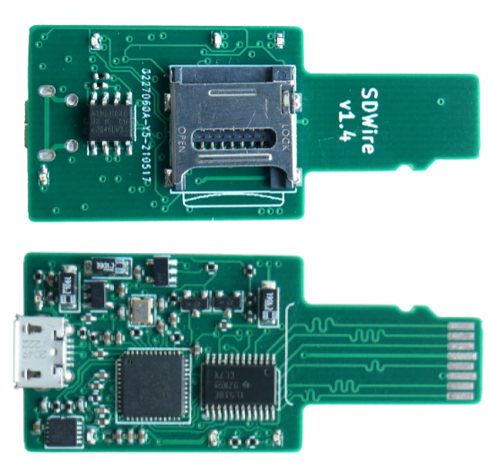

# SDWire is a small board with two features

* SD card reader
* SD card MUX

SDWire allows to flash SD card connected to the DUT (Device Under Test),
without physical contact with the device. There is only one micro USB socket for
connecting to host PC. Both USB mass storage and MUX control are served through
the same USB connection.

The PCB board is designed in such way that it fits into micro SD card slots.
Thanks to this, there is no need for special cables with a [micro SD
adapter][shop1], like in the [muxPi product][shop2].

[shop1]: https://3mdeb.com/shop/open-source-hardware/open-source-hardware-3mdeb/muxsd-adapter/
[shop2]: https://3mdeb.com/shop/open-source-hardware/open-source-hardware-3mdeb/muxpi/
