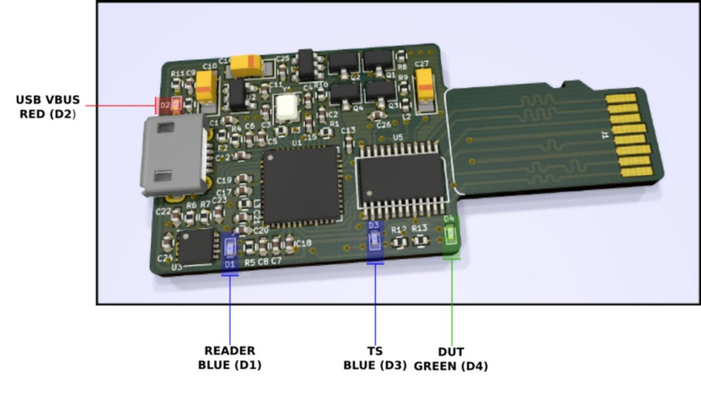

# Hardware design

Design of this board is based on [SD MUX](https://wiki.tizen.org/SD_MUX). SDWire
does not have power switch or USB switch but has built in USB SD card reader. SD
card multiplexer itself is exactly the same in both devices.

There are four LEDs on the board:

```bash
red - power presence from USB
blue - USB reader activity
blue - card connected to TS (Test Server)
green - card connected to DUT (Device Under Test)
```

All LEDs are present on both sides of the board to make them visible no matter
which side of the board will be facing you.

LED positions are showed in the image below.



<center>Source: [wiki.tizen.org](https://wiki.tizen.org/File:SDWire-leds.png)</center>

## PCB elements and scheme


<center>Source: [wiki.tizen.org](https://wiki.tizen.org/images/c/cb/SDWire-v1.4-sch.pdf)</center>
