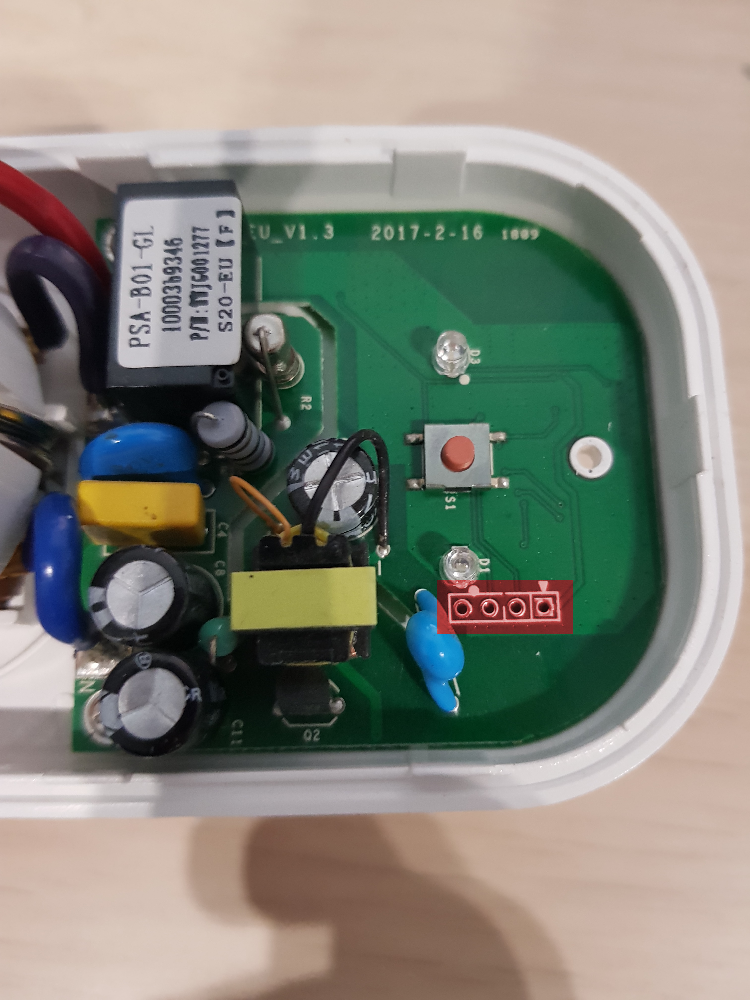
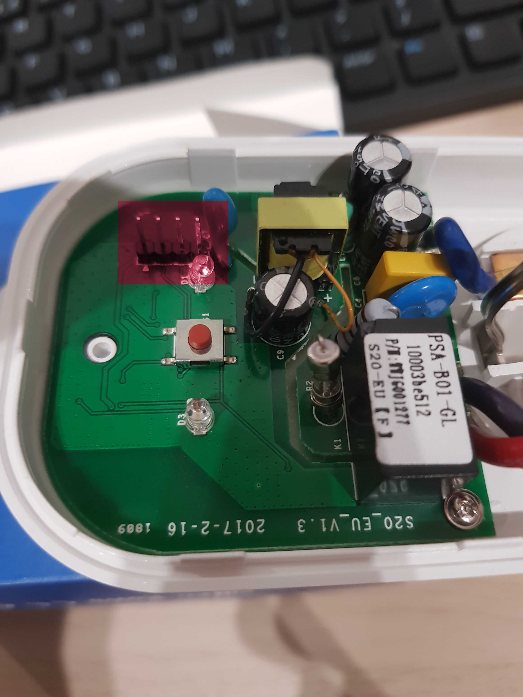
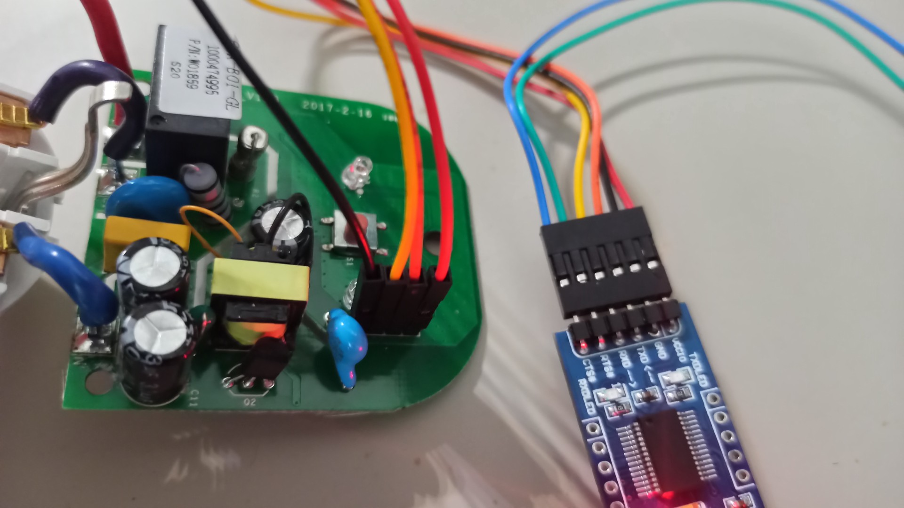

# Sonoff S20 - preparation guide

## Hardware prequisities

- Sonoff S20,
- USB - UART converter.

## Flashing

This document is based on
[EPSHome documentation](https://esphome.io/devices/sonoff_s20.html)

1. Open the case.

1. Headers soldering
    Make sure that headers are soldered - if not, it has to be done.
    
    

1. Connect the uart converter to usb.

    

1. Run docker container in the folder containing yaml
    configuration file  eg. `sonoff_s20.yaml`:

    ```sh
    docker run --rm -v "${PWD}":/config --device=/dev/ttyUSB0 -p 6052:6052 -it esphome/esphome
    ```

    > you can copy the following with modified wifi
    credentials and `esphome:name`

    example configuration file:

    ```yml
    esphome:
      name: XXXXXX
      platform: ESP8266
      board: esp01_1m

    wifi:
      ssid: "XXXXXX"
      password: "XXXXXX"
      # manual_ip:
      #   # Set this to the IP of the ESP
      #   static_ip: 192.168.4.187
      #   # Set this to the IP address of the router. Often ends with .1
      #   gateway: 192.168.4.1
      #   # The subnet of the network. 255.255.255.0 works for most home networks.
      #   subnet: 255.255.255.0
      power_save_mode: none


      # # Enable fallback hotspot (captive portal) in case wifi connection fails
      ap:
        ssid: "Sonoff1 Fallback Hotspot"
        password: "123456789"


    captive_portal:

    # Enable logging
    logger:

    # Enable Home Assistant API
    api:


    ota:


    binary_sensor:
    - platform: gpio
      pin:
        number: GPIO0
        mode: INPUT_PULLUP
        inverted: True
      name: "Sonoff S20 Button"
      on_press:
        - switch.toggle: relay
    - platform: status
      name: "Sonoff S20 Status"


    switch:
    - platform: gpio
      name: "Sonoff S20 Relay"
      pin: GPIO12
      id: relay

    output:
    - platform: esp8266_pwm
      id: s20_green_led
      pin: GPIO13
      inverted: True

    light:
    - platform: monochromatic
      name: "Sonoff S20 Green LED"
      output: s20_green_led

    web_server:
      port: 80
    ```

1. Go to:

    ```sh
    http://localhost:6052/#
    ```

**In your browser:**

1. Put the device in a flash mode as explained
    [here](https://esphome.io/devices/sonoff_s20.html#step-4-uploading-firmware).

    - unplug the device
    - plug with the button pressed and hold 2sec

1. Change the upload method from OTA to `/dev/ttyUSB0`
    Now you should see new element with name that you specified in
    `esphome:name`.
1. Click upload - the program will be generated, compiled
    and uploaded to the device.

1. After successful upload replug the device to the usb
    (**without** the button pressed)
    to get out of the flashing mode.

1. Use minicom to inspect if the device is flashed properly and
    if it can connect to the network.

    Bear in mind that the antenna in this device is very poorly
    performing - effective range is only few meters.

Useful links:

- <https://gitlab.com/3mdeb/mazetron/docs/-/blob/master/firmware-flashing.md#troubleshooting>

---

The device will host the website which can be used to switch the relay.

The IP may be inspected via minicom serial logs.

In the future the device should have statically assigned IP by its
MAC address.

---

## Controlling the relay switch

To switch the relay the following bash commands may be used:

> `192.168.43.171` should be replaced with assigned IP.

```sh
curl -X POST http://192.168.43.171/switch/sonoff_s20_relay/toggle
curl -X POST http://192.168.43.171/switch/sonoff_s20_relay/turn_off
curl -X POST http://192.168.43.171/switch/sonoff_s20_relay/turn_on
```

To check the state of the component use:

```sh
# user@user in /home/user/workspace/sonoff/docker [16:28:02] C:1
$ curl  http://192.168.43.171/switch/sonoff_s20_relay
{"id":"switch-sonoff_s20_relay","state":"OFF","value":false}
```
