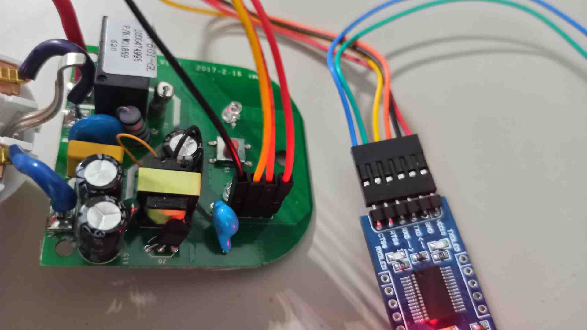

# Sonoff preparation

The following page is based on the
[EPSHome](https://esphome.io/devices/sonoff_s20.html)
and [Tasmota](https://tasmota.github.io/docs/devices/Sonoff-S26-Smart-Socket)
documentations.

## Firmware setup

### Connecting the programmer

As for choosing the programming device, we have found that both ch341a in UART
mode and a generic USB-UART adapter work seamlessly.

=== "Sonoff S26 R2"

    Please attach the programmer wires as specified in
    [this step](https://tasmota.github.io/docs/devices/Sonoff-S26-Smart-Socket/#s26-release-2)
    of Tasmota documentation.

=== "Sonoff S20"

    1. Open the Sonoff case.

    1. Check if the headers are soldered to the board. If not - 4 pin header
        raster 2.54 mm should be soldered to the board in accordance with the below
        images.

        

        

    1. Connect the USB-UART converter to the USB port.

        

After connecting the wires, remember to plug in the programmer while holding
down the Sonoff power button to get into flash mode:

* Disconnect the programmer from your PC
* Hold down the Sonoff power button
* Plug the programmer into the PC
* Release the power button

### Installation and initial configuration of the firmware

We strongly advise using the more popular
[Tasmota](https://tasmota.github.io/docs/),
which has demonstrated higher stability in our office, over
[ESPhome](https://esphome.io/index.html).
However, in case you have reasons to choose the latter, our guide provides
instructions for both.

=== "Tasmota"

    The most lightweight and versatile way to go about flashing Tasmota is using
    `esptool.py`. You can install it for your copy of [Python](https://www.python.org/)
    by running

    ```sh
    pip install esptool
    ```

    1. Figure out what is the device name of the programmer - run `dmesg | tail`
    and see what is the most recently attached `/dev/ttyUSB`, e.g. `/dev/ttyUSB0`.
    You will need to substitute DEVICE with the correct name as you follow along
    this guide.

    1. Backup the vendor firmware by running

        ```sh
        esptool.py --port DEVICE read_flash 0x00000 0x100000 backup.bin
        ```

    1. Erase firmware

        ```sh
        esptool.py --port DEVICE erase_flash
        ```

    1. Download a copy of [tasmota.bin](http://ota.tasmota.com/tasmota/release/)
        and place it in your working directory

    1. Flash Sonoff with `tasmota.bin`

        ```sh
        esptool.py write_flash -fm dout 0x0 tasmota.bin
        ```

    1. After the flashing has been completed, unplug the programmer from your PC
    and detach all wires from the Sonoff. Reassemble the Sonoff and plug it into
    a socket.

    1. Connect to Sonoff's temporary WiFi hotspot named after Tasmota,
    visit `http://192.168.4.1` and follow on-screen instructions to connect
    the Sonoff to your network of choice.

=== "ESPhome"

    1. Create a Sonoff configuration file. The file extension should be `.yaml` and
        it should contain the device configuration.

        Example configuration:

        ```yml
        esphome:
        name: XXXXXX
        platform: ESP8266
        board: esp01_1m

        wifi:
        ssid: "XXXXXX"
        password: "XXXXXX"
        # manual_ip:
        #   # Set this to the IP of the ESP
        #   static_ip: 192.168.4.187
        #   # Set this to the IP address of the router. Often ends with .1
        #   gateway: 192.168.4.1
        #   # The subnet of the network. 255.255.255.0 works for most home networks.
        #   subnet: 255.255.255.0
        power_save_mode: none


        # # Enable fallback hotspot (captive portal) in case wifi connection fails
        ap:
            ssid: "Sonoff1 Fallback Hotspot"
            password: "123456789"


        captive_portal:

        # Enable logging
        logger:

        # Enable Home Assistant API
        api:


        ota:


        binary_sensor:
        - platform: gpio
        pin:
            number: GPIO0
            mode: INPUT_PULLUP
            inverted: True
        name: "Sonoff S20 Button"
        on_press:
            - switch.toggle: relay
        - platform: status
        name: "Sonoff S20 Status"


        switch:
        - platform: gpio
        name: "Sonoff S20 Relay"
        pin: GPIO12
        id: relay

        output:
        - platform: esp8266_pwm
        id: s20_green_led
        pin: GPIO13
        inverted: True

        light:
        - platform: monochromatic
        name: "Sonoff S20 Green LED"
        output: s20_green_led

        web_server:
        port: 80
        reboot_timeout: 0s
        ```

    1. Run the docker container in the folder containing created `.yaml`
        configuration file:

        ```sh
        docker run --rm -v "${PWD}":/config --device=/dev/ttyUSB0 -p 6052:6052 -it esphome/esphome
        ```

    1. Open the browser and type into the web browser the following address:

        ```bash
        http://localhost:6052/
        ```

    1. Put the device in flash mode. Putting the device in this mode should be done
        in accordance with the
        [documentation](https://esphome.io/devices/sonoff_s20.html#step-4-uploading-firmware).
    1. Change the upload method from OTA to `/dev/ttyUSB0`. After this operation,
        the new element with the name specified in `esphome:name` should be
        displayed.

    1. Select the option `Upload`. After clicking, the program should generate
        the image, compile it and upload it to the device.
    1. After successful upload replug the device to the USB (**without** the button
        pressed) to get out of the flashing mode.

    1. Open connection to the device in the PC terminal by typing:

        ```bash
        sudo minicom -D /dev/ttyUSB0 -o -b 115200.
        ```

        > Note: `/dev/ttyUSB0` is example device - check whether `USB0` is the
        correct one.

    1. Check if the device is responsible - whether network connectivity
        information is generated.

        > Note: The effective range for this device is only a few meters.

    1. Based on the minicom logs read the IP address assigned to the device.

    1. The device should have a statically assigned IP address based on its MAC
        address - this will make it easy to find it on the network.

    The device will host the website which can be used to switch the relay.

    Bear in mind that the antenna in this device is very poorly
    performing - effective range is only few meters

    ---

## Controlling the relay switch

To switch the relay the following bash commands may be used:

> `192.168.43.171` should be replaced with assigned IP.

=== "Tasmota"

    ```sh
    curl -X POST http://192.168.43.171/cm?cmnd=Power%20TOGGLE
    curl -X POST http://192.168.43.171/cm?cmnd=Power%20On
    curl -X POST http://192.168.43.171/cm?cmnd=Power%20off
    ```

    Full list of commands provided [here](https://tasmota.github.io/docs/Commands/#control)

=== "ESPhome"

    ```sh
    curl -X POST http://192.168.43.171/switch/sonoff_s20_relay/toggle
    curl -X POST http://192.168.43.171/switch/sonoff_s20_relay/turn_off
    curl -X POST http://192.168.43.171/switch/sonoff_s20_relay/turn_on
    ```

To check the state of the component use:

```sh
# name @ name in /home/name/workspace/sonoff/docker [16:28:02] C:1
$ curl  http://192.168.43.171/switch/sonoff_s20_relay
{"id":"switch-sonoff_s20_relay","state":"OFF","value":false}
```
