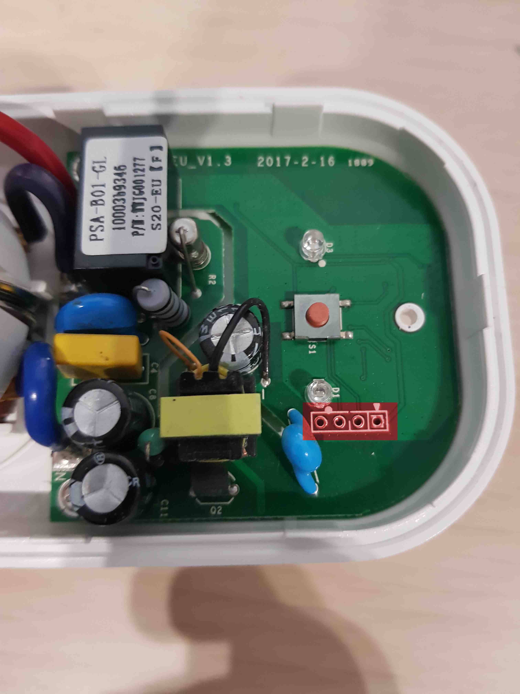
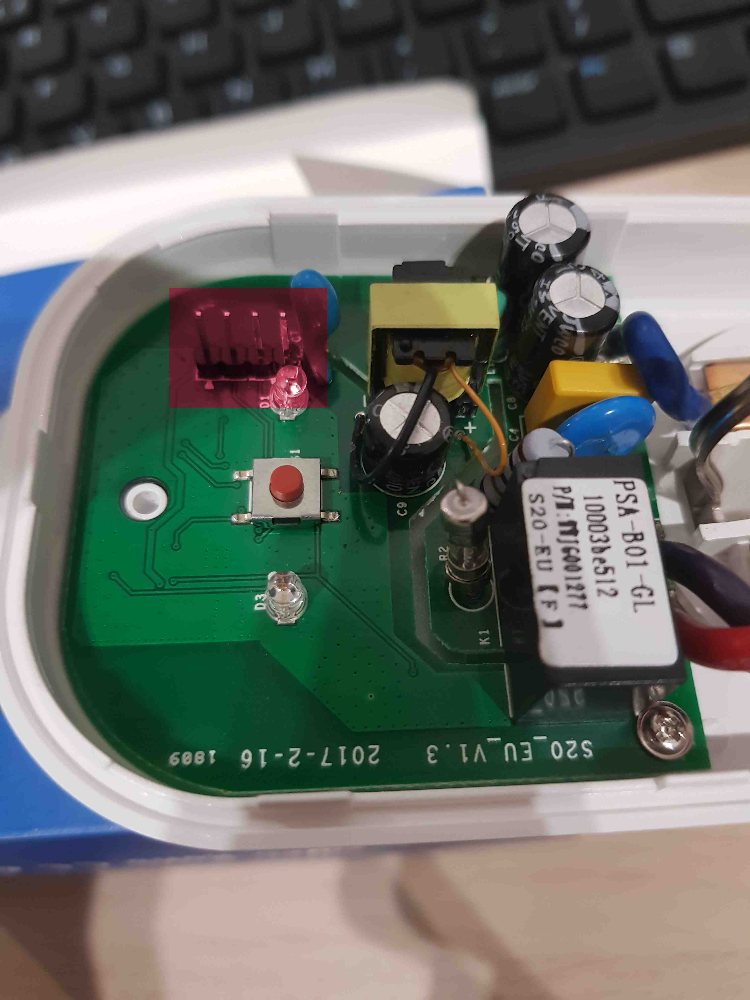

# Sonoff preparation

The below section of the documentation is based on the
[EPSHome documentation](https://esphome.io/devices/sonoff_s20.html)

1. Open the Sonoff case.

1. Check if the headers are soldered to the board. If not - 4 pin header
    raster 2.54 mm should be soldered to the board in accordance with the below
    images.

    

    

1. Connect the USB-UART converter to the USB port.

    

1. Create a Sonoff configuration file. The file extension should be `.yaml` and
    it should contain the device configuration.

    Example configuration:

    ```yml
    esphome:
      name: XXXXXX
      platform: ESP8266
      board: esp01_1m

    wifi:
      ssid: "XXXXXX"
      password: "XXXXXX"
      # manual_ip:
      #   # Set this to the IP of the ESP
      #   static_ip: 192.168.4.187
      #   # Set this to the IP address of the router. Often ends with .1
      #   gateway: 192.168.4.1
      #   # The subnet of the network. 255.255.255.0 works for most home networks.
      #   subnet: 255.255.255.0
      power_save_mode: none


      # # Enable fallback hotspot (captive portal) in case wifi connection fails
      ap:
        ssid: "Sonoff1 Fallback Hotspot"
        password: "123456789"


    captive_portal:

    # Enable logging
    logger:

    # Enable Home Assistant API
    api:


    ota:


    binary_sensor:
    - platform: gpio
      pin:
        number: GPIO0
        mode: INPUT_PULLUP
        inverted: True
      name: "Sonoff S20 Button"
      on_press:
        - switch.toggle: relay
    - platform: status
      name: "Sonoff S20 Status"


    switch:
    - platform: gpio
      name: "Sonoff S20 Relay"
      pin: GPIO12
      id: relay

    output:
    - platform: esp8266_pwm
      id: s20_green_led
      pin: GPIO13
      inverted: True

    light:
    - platform: monochromatic
      name: "Sonoff S20 Green LED"
      output: s20_green_led

    web_server:
      port: 80
      reboot_timeout: 0s
    ```

1. Run the docker container in the folder containing created `.yaml`
    configuration file:

    ```sh
    docker run --rm -v "${PWD}":/config --device=/dev/ttyUSB0 -p 6052:6052 -it esphome/esphome
    ```

1. Open the browser and type into the web browser the following address:

    ```bash
    http://localhost:6052/
    ```

1. Put the device in flash mode. Putting the device in this mode should be done
    in accordance with the
    [documentation](https://esphome.io/devices/sonoff_s20.html#step-4-uploading-firmware).
1. Change the upload method from OTA to `/dev/ttyUSB0`. After this operation,
    the new element with the name specified in `esphome:name` should be
    displayed.

1. Select the option `Upload`. After clicking, the program should generate
    the image, compile it and upload it to the device.
1. After successful upload replug the device to the USB (**without** the button
    pressed) to get out of the flashing mode.

1. Open connection to the device in the PC terminal by typing:

    ```bash
    sudo minicom -D /dev/ttyUSB0 -o -b 115200.
    ```

    > Note: `/dev/ttyUSB0` is example device - check whether `USB0` is the
    correct one.

1. Check if the device is responsible - whether network connectivity
    information is generated.

    > Note: The effective range for this device is only a few meters.

1. Based on the minicom logs read the IP address assigned to the device.
