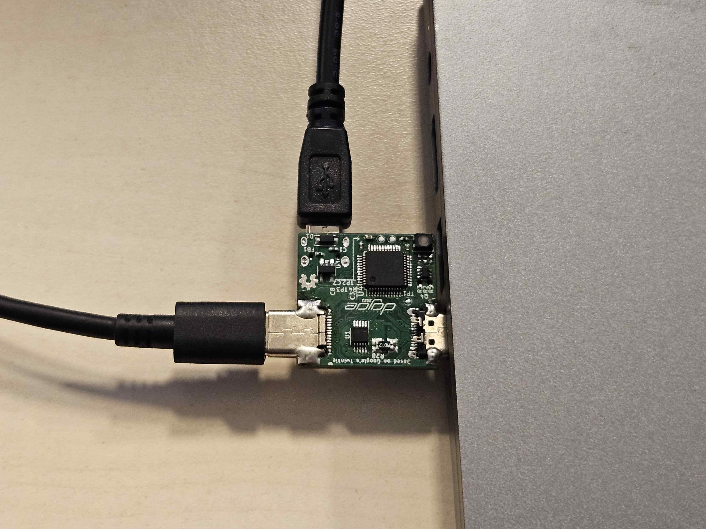

# Twonkie Introduction

Twonkie is an open source USB Power Delivery protocol sniffer and debugging
tool, created by Joachim "dojoe" Fenkes, based on Google's Twinkie. It can:

- Measure voltage and current on the Vbus and Vconn rails (version 2.0 can
  handle EPR voltages up to 48V)
- Capture USB-PD packets for later analysis
- Pass through signals at full speed (20Gb/s lanes are verified to work)
- Send USB-PD packets

Twonkie can be bought in [3mdeb shop](https://shop.3mdeb.com/shop/open-source-hardware/twonkie-usb-c-sniffer/).

Links:

- [Project page](https://github.com/dojoe/Twonkie)
- [Original Twinkie documentation](https://www.chromium.org/chromium-os/twinkie/)

## Setup

### Preparation

For flashing and using the Twonkie, you will need to install `dfu-util` and
`minicom`. You can find them in your Linux distro's repositories:

=== "Ubuntu / Debian"

    ```bash
    $ sudo apt install dfu-util minicom
    ```

=== "Fedora"

    ```bash
    $ sudo dnf install dfu-util minicom
    ```

=== "Arch"

    ```bash
    $ sudo pacman -S dfu-util minicom
    ```

### Flashing

Steps to flash firmware to the Twonkie:

1. Download the latest firmware from [the project's release page](https://github.com/dojoe/Twonkie/releases)
1. While holding the SW1 button on the Twonkie, connect it to your computer using
   a USB micro-B cable
1. Verify in `lsusb` that the device has booted in DFU mode:

    ```bash
    $ lsusb | grep 0483:df11
    Bus 003 Device 083: ID 0483:df11 STMicroelectronics STM Device in DFU Mode
    ```

1. Navigate to the location where you downloaded the firmware
1. Flash the firmware:

    ```bash
    $ sudo dfu-util -a 0 -s 0x08000000 -D ~/Downloads/twonkiev2-20230611.bin
    ```

    > The command may take a long time to complete. Do not be alarmed if progress
    > appears to stop.
1. Disconnect and reconnect the newly flashed Twonkie to reboot it into the
   firmware
1. Verify in `lsusb` that the device has booted into firmware:

    ```bash
    $ lsusb | grep 18d1:500a
    Bus 003 Device 084: ID 18d1:500a Google Inc. Twinkie
    ```

### Testing

#### Sniffing a PD negotiation

1. Open minicom on Twonkie's console:

    ```bash
    $ sudo minicom -D /dev/ttyUSB0
    ```

1. Type in `tw trace on` to start logging
1. Connect a twonkie between a USB-PD power supply and a USB-PD power sink

1. Verify that the device is charging and logs appear on the screen

Example output:

```bash
> tw trace on
33.754913 SRC/0 [41a1]SRCCAP 5000mV/3000mA 9000mV/3000mA 15000mV/3000mA 20000mV/3250mA
33.906189 SRC/0 [41a1]SRCCAP 5000mV/3000mA 9000mV/3000mA 15000mV/3000mA 20000mV/3250mA
34.057128 SRC/0 [41a1]SRCCAP 5000mV/3000mA 9000mV/3000mA 15000mV/3000mA 20000mV/3250mA
34.208091 SRC/0 [41a1]SRCCAP 5000mV/3000mA 9000mV/3000mA 15000mV/3000mA 20000mV/3250mA
34.359253 SRC/0 [41a1]SRCCAP 5000mV/3000mA 9000mV/3000mA 15000mV/3000mA 20000mV/3250mA
34.360608 SNK/0 [0041]GOODCRC
34.364597 SNK/0 [1082]REQUEST{4} 43851545
34.365421 SRC/0 [0121]GOODCRC
34.367411 SRC/1 [03a3]ACCEPT
34.368118 SNK/1 [0241]GOODCRC
34.593451 SRC/2 [05a6]PSRDY
34.594166 SNK/2 [0441]GOODCRC
34.595642 SRC/3 [17af]VDM Vff00:DISCSVID,INI:ff00a002
34.597310 SRC/3 [17af]VDM Vff00:DISCSVID,INI:ff00a002
34.598213 SNK/3 [0641]GOODCRC
34.602898 SNK/1 [328f]VDM Vff00:DISCSVID,ACK:ff00a042 8087ff01 00000000
34.603946 SRC/1 [0321]GOODCRC
```

#### Measuring voltage and current

1. Open minicom on Twonkie's console:

    ```bash
    $ sudo minicom -D /dev/ttyUSB0
    ```

1. Connect a twonkie between a USB-PD power supply and a USB-PD power sink

1. Type in `tw vbus` to display the voltage and current measurement

Example output:

```bash
> tw vbus
VBUS = 20112 mV ; -1274 mA
```

#### Power sink

1. Open minicom on Twonkie's console:

    ```bash
    $ sudo minicom -D /dev/ttyUSB0
    ```

1. Connect a twonkie between a USB-PD power supply and a USB-PD power meter
1. Type in `tw sink` to enable sink mode - the firmware will reboot at this
   point
1. Type in `pd 0 dev 20` to set voltage limit to 20V
1. Verify that the power meter turns on and displays 20V measured at the USB-C
   plug
1. Verify that the RGB LED has changed its color to red

Example of a successful test:


