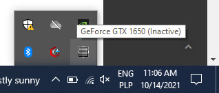

# Dasharo Compatibility: NVIDIA Graphics support

## Test cases common documentation

**Test setup**

1. Proceed with the
    [Generic test setup: firmware](../generic-test-setup.md#firmware).
1. Proceed with the
    [Generic test setup: OS installer](../generic-test-setup.md#os-installer).
1. Proceed with the
    [Generic test setup: OS installation](../generic-test-setup.md#os-installation).
1. Proceed with the
    [Generic test setup: OS boot from disk](../generic-test-setup.md#os-boot-from-disk).

## NVI001.001 NVIDIA Graphics detect (Ubuntu)

**Test description**

This test aims to verify that the NVIDIA graphics card is correctly
initialized and can be detected by the operating system.

**Test configuration data**

1. `FIRMWARE` = Dasharo
1. `OPERATING_SYSTEM` = Ubuntu

**Test setup**

1. Proceed with the
    [Test cases common documentation](#test-cases-common-documentation) section.

**Test steps**

1. Open a terminal window and execute the following command:

    ```bash
    lspci | grep -i nvidia
    ```

**Expected result**

1. The command should return the name of the graphics
   card, e.g:

    ```bash
    2d:00.0 3D controller: NVIDIA Corporation TU117M (rev a1)
    ```

    or

    ```bash
    01:00.1 VGA compatible controller: NVIDIA Corporation AD106M [GeForce RTX 4070 Max-Q / Mobile] (rev a1)
    ```

## NVI001.002 NVIDIA Graphics detect (Windows)

**Test description**

This test aims to verify that the NVIDIA graphics card is correctly
initialized and can be detected by the operating system

**Test configuration data**

1. `FIRMWARE` = Dasharo
1. `OPERATING_SYSTEM` = Windows

**Test setup**

1. Proceed with the
    [Test cases common documentation](#test-cases-common-documentation) section.
1. Install the driver for the graphics card (GTX 1650) from
    [the official page](https://www.nvidia.com/).

**Test steps**

1. Run PowerShell as administrator and execute following command:

```powershell
Get-WmiObject -Class Win32_VideoController | Select Description, Name, Status
```

**Expected result**

1. The output should contain the information about installed NVIDIA Graphics
    card.

    Example output:

    ```powershell
    Description                  Name                         Status
    -----------                  ----                         ------
    Intel(R) Iris(R) Xe Graphics Intel(R) Iris(R) Xe Graphics OK
    NVIDIA GeForce GTX 1650      NVIDIA GeForce GTX 1650      OK
    ```

## NVI002.001 NVIDIA Graphics power management (Ubuntu)

**Test description**

This test aims to verify that the NVIDIA graphics power management is functional
and the card powers on only while it's used.

**Test configuration data**

1. `FIRMWARE` = Dasharo
1. `OPERATING_SYSTEM` = Ubuntu

**Test setup**

1. Proceed with the
    [Test cases common documentation](#test-cases-common-documentation) section.
1. Install the package `mesa-utils` with the following command:

    ```bash
    sudo apt install mesa-utils
    ```

**Test steps**

1. Open a terminal window.
1. Run the following command to see whether the card is off:

    ```bash
    cat /sys/class/drm/card1/device/power/runtime_status
    ```

1. Launch a test application on the discrete graphics card using the following
   command:

    ```bash
    __NV_PRIME_RENDER_OFFLOAD=1 __GLX_VENDOR_LIBRARY_NAME=nvidia glxgears
    ```

1. Run the following command to see whether the card has turned on:

    ```bash
    cat /sys/class/drm/card1/device/power/runtime_status
    ```

1. Close the test application and wait ~20 seconds to let the graphics card
    shut itself down.
1. Run the following command to see whether the card has turned off again:

    ```bash
    cat /sys/class/drm/card1/device/power/runtime_status
    ```

**Expected result**

1. The output from the first command should be the word `suspended`.
1. The output from the second command should be the word `active`.
1. The output from the third command should be the word `suspended`.

## NVI002.002 NVIDIA Graphics power management (Windows)

**Test description**

This test aims to verify that the NVIDIA graphics power management is functional
and the card powers on only while it's used.

**Test configuration data**

1. `FIRMWARE` = Dasharo
1. `OPERATING_SYSTEM` = Windows

**Test setup**

1. Proceed with the
    [Test cases common documentation](#test-cases-common-documentation) section.
1. Install the driver for the graphics card (GTX 1650) from
    [the official page](https://www.nvidia.com/).
1. Download and extract `gputest` from [Geeks3D](https://geeks3d.com/gputest).

**Test steps**

1. Open the NVIDIA Control Panel window.
1. In the menu bar, open the Desktop menu.
1. Enable the `Display GPU Activity Icon in Notification Area` option.
1. Open the system tray located in the bottom right corner of the screen
   and locate the GPU activity icon:



1. Open the previously extracted gputest directory and open the `GPUTest_GUI`
   application.
1. Click on the `Run stress test` button to start the test application.
1. Locate the GPU activity icon and check that it indicates that the GPU has
   powered on.
1. Close the test application.
1. Locate the GPU activity icon and check that it indicates that the GPU has
   powered off again.

**Expected result**

1. The GPU activity icon should indicate that the GPU is OFF when no application
   is using the GPU.
1. The GPU activity icon should indicate that the GPU is ON when an application
   is using the GPU.
1. The GPU activity icon should indicate that the GPU is OFF again after the
   test application is closed.
