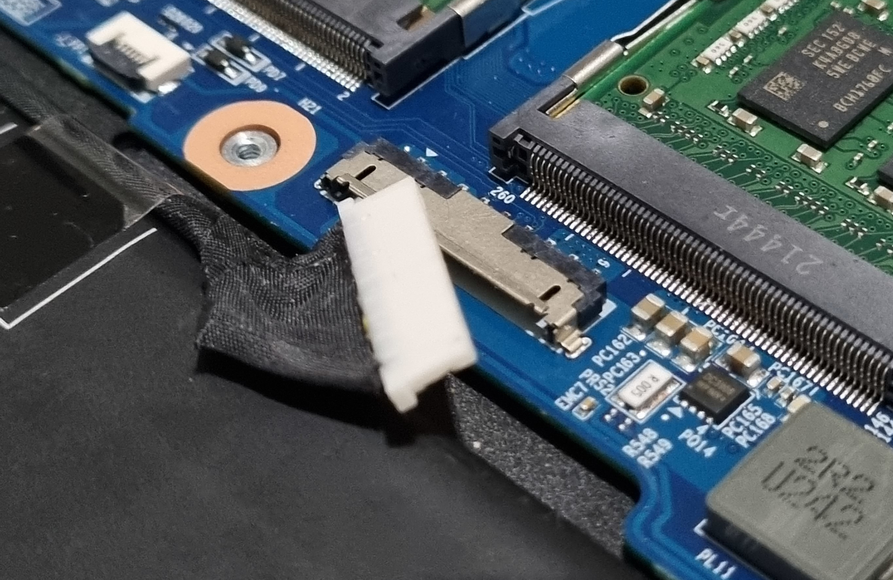

# Dasharo Compatibility: Battery boot block

## Test cases common documentation

**Test setup**

1. Proceed with the
   [Generic test setup: firmware](../generic-test-setup.md#firmware).
1. Proceed with the
   [Generic test setup: OS installation](../generic-test-setup.md#os-installation).
1. Proceed with the
   [Generic test setup: OS preparation](../generic-test-setup.md#os-preparation).
1. Proceed with the
   [Generic test setup: OS post installation steps](../generic-test-setup.md#post-installation).

## BBB001.001 Boot blocking (charger disconnected) (Ubuntu)

**Test description**

This test aims to verify that booting is blocked when the battery
level is below 5% with charger disconnected from the DUT.

**Test configuration data**

1. `FIRMWARE` = Dasharo
1. `OPERATING_SYSTEM` = Ubuntu

**Test setup**

1. Proceed with the
    [Test cases common documentation](#test-cases-common-documentation) section.

**Test steps**

1. Make sure the charger is not plugged into the DUT.
1. Power on the DUT.
1. Boot into the system.
1. Log into the system by using the proper login and password.
1. Open a terminal window and install `stress-ng` package by executing following
    command:

```bash
sudo apt install stress-ng
```

1. Open a terminal window and run following bash script:

```bash
get_battery_level() {
    battery_level=$(cat /sys/class/power_supply/BAT0/capacity)
    echo "$battery_level"
}
target_battery_level=3
while true; do
    current_battery_level=$(get_battery_level)
    echo "Current battery level: $current_battery_level%"
    if [ "$current_battery_level" -le "$target_battery_level" ]; then
        echo "Battery level reached 3%. Stopping stress-ng."
        break
    fi
    stress-ng --cpu 0 --timeout 10s
done
```

1. After the script finished working, reboot the DUT.

**Expected result**

1. The bash script reads current battery charge level and stresses the CPU until
    the battery charge level reaches below 5%. Example output:

```bash
Current battery level: 92%
stress-ng: info:  [25309] setting to a 10 secs run per stressor
stress-ng: info:  [25309] dispatching hogs: 16 cpu
```

1. After reboot, booting into the OS should be blocked and following warning
    message should appear:

    

## BBB001.002 Boot blocking (charger connected) (Ubuntu)

**Test description**

This test aims to verify that booting is not blocked when the battery
level is below 5% with charger connected to the DUT.

**Test configuration data**

1. `FIRMWARE` = Dasharo
1. `OPERATING_SYSTEM` = Ubuntu

**Test setup**

1. Proceed with the
    [Test cases common documentation](#test-cases-common-documentation) section.

**Test steps**

1. Make sure the charger is not plugged into the DUT.
1. Power on the DUT.
1. Boot into the system.
1. Log into the system by using the proper login and password.
1. Open a terminal window and install `stress-ng` package by executing following
    command:

```bash
sudo apt install stress-ng
```

1. Open a terminal window and run following bash script:

```bash
get_battery_level() {
    battery_level=$(cat /sys/class/power_supply/BAT0/capacity)
    echo "$battery_level"
}
target_battery_level=3
while true; do
    current_battery_level=$(get_battery_level)
    echo "Current battery level: $current_battery_level%"
    if [ "$current_battery_level" -le "$target_battery_level" ]; then
        echo "Battery level reached 3%. Stopping stress-ng."
        break
    fi
    stress-ng --cpu 0 --timeout 10s
done
```

1. After the script finished working, plug the charger into the DUT.
1. Reboot the DUT.

**Expected Result**

1. After reboot, the warning message should not appear and the DUT should boot
    normally.

## BBB002.001 Battery not connected warning (Firmware)

**Test description**

This test aims to verify whether a warning message appears when the battery is
disconnected from the DUT.

**Test configuration data**

1. `FIRMWARE` = Dasharo

**Test setup**

1. Proceed with the
    [Test cases common documentation](#test-cases-common-documentation) section.

**Test steps**

1. Unscrew the bottom cover from the DUT.

    

1. Disconnect the battery (1)

    

1. Reattach the bottom cover and flip the DUT over.
1. Plug the charger into the DUT.
1. Power on the DUT.

**Expected result**

1. After powering on the DUT, following warning message should appear:

    

1. After pressing enter or passing the timeout, the DUT should continue booting.
