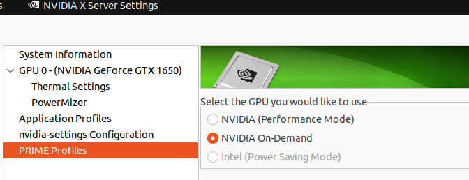

# Dasharo Compatibility: Generic test setup

## Test setup

Test setup is a set of procedures to be executed before the test execution.
Typically, the same setup can be reused by multiple test cases, so there is no
need to execute the setup actions before each independent case.

### Generic test setup

#### Firmware

1. Obtain `FIRMWARE` binary:
    1. you can download it from `Releases` page dedicated for your platform
    1. or you can build one yourself as shown in the `Building manual` page
        dedicated for platform which is used by you.
1. Flash `FIRMWARE` binary to the DUT according to the instructions in [docs.dasharo](../variants/overview.md)
for your device.
    1. If the device already has Dasharo, see the `Firmware update` page
    1. If the device has a different firmware installed, see the
    `Firmware transition` page
    1. If the device is bricked, see the `Recovery` page.

#### OS installation

Install all the supported operating systems.
In case the 'OPERATING_SYSTEM' is supported by [Dasharo Preseeds](https://github.com/dasharo/preseeds)
use the instructions from there. Otherwise continue with the steps below:

##### OS installer

1. Download an `OPERATING_SYSTEM` installer image
1. Attach USB stick to the PC.
1. Flash `OPERATING_SYSTEM` image to the USB stick.
1. Attach the USB stick to the `DUT`.

##### Installing the OS

1. Power on the DUT
1. Enter the boot menu using the `BIOS_SETUP_KEY`.
1. Select the `Boot Menu` and press `Enter`.
1. Select the USB stick and press `Enter`.
    1. In case of the `Ubuntu 22.04`, select the `Ubuntu (safe graphics)` in the
       GRUB menu.
1. Wait for the `OPERATING_SYSTEM` installer to start.
1. Install `OPERATING_SYSTEM` on the disk.
1. Power off the DUT.
1. Remove the installation media (USB stick with installer).

#### OS Preparation

##### Logging in

If the OS was installed using the [Dasharo Preseeds](https://github.com/dasharo/preseeds)
the hostname, username and password will be the same as in the
[OSFV repository](https://github.com/Dasharo/open-source-firmware-validation/tree/develop/os-config).
Make sure that the hostname, username and password are the same as
in the OSFV repository in order for the automatic tests to run properly if the
device already had the OS installed.

=== "Windows"

    1. Run PowerShell as an Administrator.
    1. Install the OpenSSH Client

        ```powershell
        Add-WindowsCapability -Online -Name OpenSSH.Client~~~~0.0.1.0
        ```

    2. Install the OpenSSH Server

        ```powershell
        Add-WindowsCapability -Online -Name OpenSSH.Server~~~~0.0.1.0
        ```

    3. Start the sshd service

        ```powershell
        Start-Service sshd
        ```

    4. Make the sshd service start automatically on startup:

        ```powershell
        Set-Service -Name sshd -StartupType 'Automatic'
        ```

    5. Confirm the Firewall rule is configured. It should be created automatically
    by setup. Run the following to verify

        ```powershell
        if (!(Get-NetFirewallRule -Name "OpenSSH-Server-In-TCP" -ErrorAction SilentlyContinue | Select-Object Name, Enabled)) {
            Write-Output "Firewall Rule 'OpenSSH-Server-In-TCP' does not exist, creating it..."
            New-NetFirewallRule -Name 'OpenSSH-Server-In-TCP' -DisplayName 'OpenSSH Server (sshd)' -Enabled True -Direction Inbound -Protocol TCP -Action Allow -LocalPort 22
        } else {
            Write-Output "Firewall rule 'OpenSSH-Server-In-TCP' has been created and exists."
        }
        ```

    6. If during connection via SSH you want to run `PowerShell.exe` instead of
    `cmd.exe` use below command:

        ```powershell
        New-ItemProperty -Path "HKLM:\SOFTWARE\OpenSSH" -Name DefaultShell \
            -Value "C:\Windows\System32\WindowsPowerShell\v1.0\powershell.exe" \
            -PropertyType String -Force
        ```

    7. Sets the PowerShell execution policies for Windows computers.

        ```powershell
        Set-ExecutionPolicy RemoteSigned
        ```

    8. Use powercfg.exe to control power plans to prevent sleep.

        ```powershell
        Powercfg /Change standby-timeout-ac 0
        Powercfg /Change standby-timeout-dc 0
        ```

=== "Ubuntu"

    1. Open the terminal.
    1. Disable the shutdown confirmation dialogues

        ```bash
        sudo gsettings set org.gnome.SessionManager logout-prompt false
        ```

    1. Set up a serial terminal:

        ```bash
        sudo nano /etc/default/grub
        ```

    1. Edit the file `/etc/default/grub` by adding
    `console=tty0 console=ttyS0,115200` in variable `GRUB_CMDLINE_LINUX_DEFAULT`.
    1. Update grub

        ```bash
        sudo update-grub
        ```

    1. Configure SSH:

        ```bash
        sudo apt install openssh-server
        systemctl start sshd
        ```

=== "Fedora"

    1. Open the terminal.
    1. Disable the shutdown confirmation dialogues

        ```bash
        sudo gsettings set org.gnome.SessionManager logout-prompt false
        ```

    1. Set up a serial terminal:

        ```bash
        sudo nano /etc/default/grub
        ```

    1. Add the following at the end of`/etc/default/grub`:

        ```
        GRUB_CMDLINE_LINUX='rhgb quiet console=tty0 console=ttyS0,115200 console=ttyUSB0,115200'
        GRUB_TERMINAL='serial gfxterm'
        GRUB_SERIAL_COMMAND='serial --speed=115200 --unit=0 --word=8 --parity=no --stop=1'
        ```

    1. Update grub

        ```bash
        sudo grub2-mkconfig -o /boot/grub2/grub.cfg
        ```

    1. Configure SSH:

        ```bash
        sudo dnf install openssh-server
        systemctl enable --now sshd
        ```
    1. Additionally for Using serial via FTDI USB converter
        ```
        sudo systemctl enable serial-getty@ttyUSB0.service
        sudo systemctl start serial-getty@ttyUSB0.service
        sudo setenforce 0
        ```
    

#### NVIDIA drivers - Ubuntu

> Only necessary if the device has an Nvidia GPU

1. Power on the DUT.
1. Wait until the `OPERATING_SYSTEM` boots from disk.
1. Login into the `OPERATING_SYSTEM`.
1. Open a terminal window.
1. Search for the newest driver version

```bash
sudo apt update
sudo apt search nvidia-driver --names-only
```

1. Install the newest driver (you might find a version higher than 560)

```bash
sudo apt install nvidia-driver-560
```

1. A password prompt for secure boot configuration will appear. Choose a
   password (you can use your system password) and press `Enter`.
1. Reboot the DUT.
1. Upon entry into MOKUtil, select `Enroll MOK` and enter the password you
   chose during driver installation.
1. Select the option `Continue boot`.
1. Wait until the `OPERATING_SYSTEM` boots from disk.
1. Login into the `OPERATING_SYSTEM`.
1. Open the `NVIDIA X Server Settings` application.
1. Open the `PRIME Profiles` section.
1. Select `NVIDIA On-demand` and apply.
1. Enter the `OPERATING_SYSTEM` password when prompted.

{ class="center" }

#### Post installation

1. Look for an optional `Post-Installation Setup` document in the device's documentation
at the [Supported Hardware documentation](https://docs.dasharo.com/variants/overview/)
and perform the instructions in it.

### Special cases

Special cases are documented in [Open Source Firmware Validation repo docs](https://github.com/Dasharo/open-source-firmware-validation/tree/develop/docs)
