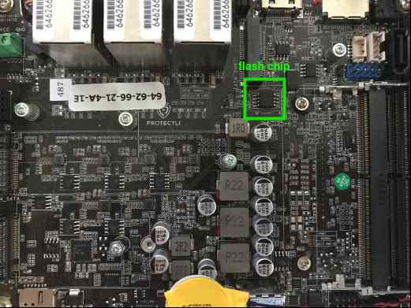
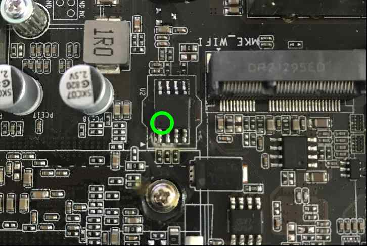
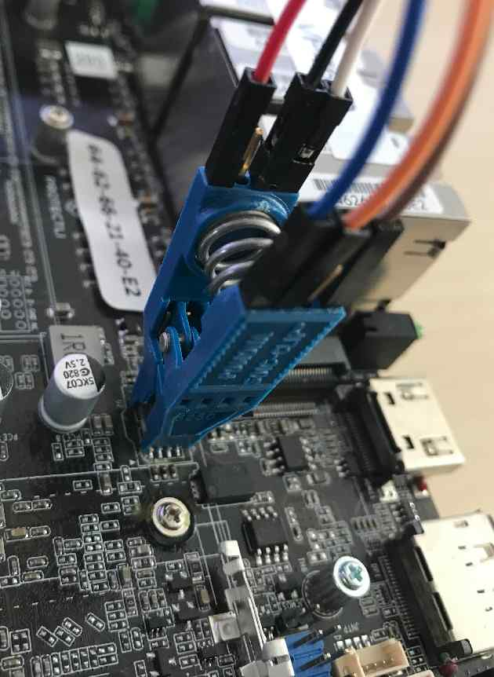
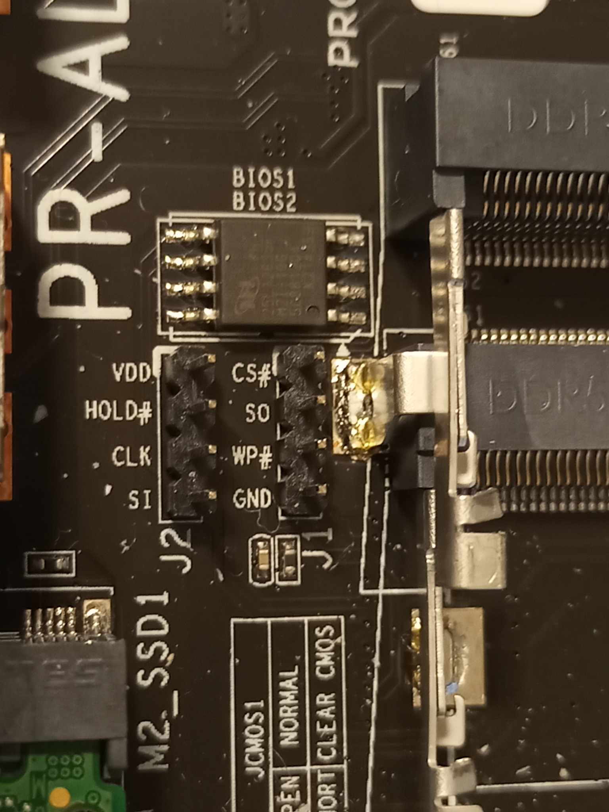
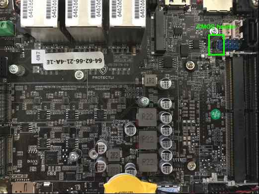
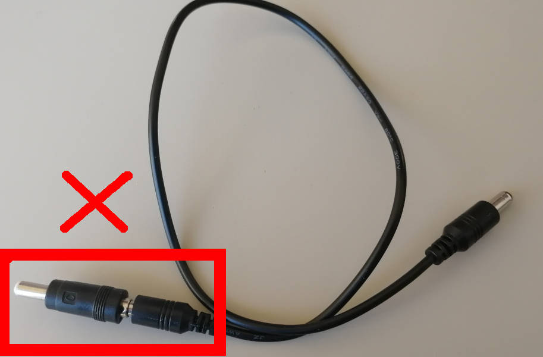
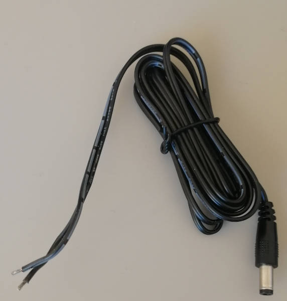

# Generic testing stand preparation

## Introduction

This document aims to provide a comprehensive, generic guide to setting up a
Remote Testing Environment for Dasharo platforms. As you follow along, please
cross-examine with our platform-specific documentation or motherboard
datasheets.

## Detailed description of the process

If you are dealing with a new platform, you might want to first dump logs
from it for future reference. We suggest using the dedicated functionality
of
[DTS](https://docs.dasharo.com/common-coreboot-docs/dasharo_tools_suite/).

### Compiling a list of peripherals

Before starting to set up the platform in the rack, make sure you plan it
carefully. It is worth first determining what connections should be made on the
stand, and then what equipment we need to be able to do it. When we put the
device in a rack, we want to have remote access to it. Mainly used devices,
depending on the functionalities needed:

* RTE - if we need low voltage control, switching on or off the platform,
  connection via serial and external flashing.
* Sonoff - if we need line voltage control.
* PiKVM - if it is not possible to read the device via serial or it is limited,
  it is possible to simulate the keyboard and read the image from HDMI.

Once we've collected everything, we can move on to setting up the equipment.

Remember about two important rules while making connections and placing stand
in the rack:

> **Use ESD Strap**: When assembling and connecting equipment in the lab, it is
  essential to use ESD straps. These straps help to prevent electrostatic
  discharge and protect sensitive electronic components from damage. Make sure you
  wear a strap every time you make a connection, and if someone is helping you,
  they have to also wear an ESD strap.
> **Cut off the power supply**: Before making any connections and ensure that the
  platform, RTE and any other components are disconnected from power. This
  precautionary measure reduces the risk of electrical accidents and protects both
  the equipment and you.

### RTE setup

You need to examine the platform's motherboard and its manual to determine
whether it has dedicated **SPI headers**, or will you have to use a Pomona clip
to connect to the flash chip. If headers are present, they are preferred over
Pomona connection for stability reasons.

For exact chip/header locations, see
platform-specific recovery guides in respective
[Supported Hardware](https://docs.dasharo.com/variants/overview/)
subsections. This guide will use Protectli VP46XX as a general example.

This guide should cover for most of
available platforms, however there are unique exceptions - for example
[MSI boards](https://docs.dasharo.com/unified/msi/recovery/) where we use the
JTPM headers and a FlashBIOS button. Refer to our platform-specific
documentation when in doubt.

#### Prerequisites

* [Prepared RTE](../../transparent-validation/rte/v1.1.0/quick-start-guide.md)
* SOIC-8 Pomona clip (if applicable)
* 6x female-female wire cables

#### Connections

If your motherboard **does not** have SPI headers available, follow this guide
for setting up a Pomona clip connection:

##### Pomona

1. Connect the wire cables to the **Pomona clip**.

    
    

1. Connect the Pomona clip to the [SPI header](../../transparent-validation/rte/v1.1.0/specification.md)
   on RTE.

    | SPI header | Pomona clip  |
    |:----------:|:------------:|
    | Vcc        | pin 5 (Vcc)  |
    | GND        | pin 4 (GND)  |
    | CS         | pin 1 (CS)   |
    | SCLK       | pin 7 (CLK)  |
    | MISO       | pin 2 (MISO) |
    | MOSI       | pin 8 (MOSI) |

    

1. Open the platform cover and locate the **SPI flash chip**.

    

1. Match **pin 1(CS)** on the Pomona clip with the first pin of the flash chip,
   marked with a small dot engraved on the chip.

    
    

##### SPI headers

If your platform has dedicated SPI flash headers like the Protectli VP66XX,
consider yourself lucky and simply connect corresponding pins with Dupont
wires:



| SPI header | RTE          |
|:----------:|:------------:|
| Vcc        | Vcc          |
| GND        | GND          |
| CS         | CS           |
| SCLK       | CLK          |
| MI**SO**   | MI**SO**     |
| MO**SI**   | MO**SI**     |

##### Remaining pins

1. Locate **CMOS headers** and wire them to GPIO pins on the RTE. You usually
need to reset the CMOS after flashing for a successful firmware update.

    | RTE       | DUT                        |
    |:---------:|:--------------------------:|
    | J11 pin 8 | CLR_CMOS                   |
    | Any GND   | GND                        |

1. Locate the power and reset button pins. A motherboard will usually have a
dedicated set of headers where the power and reset button wires are connected.
Connect them to proper pins on the RTE. In extreme cases you might need to use
clips to grab pins of soldered-in power and reset buttons.

    | RTE       | DUT                           |
    |:---------:|:-----------------------------:|
    | J11 pin 5 | PWR_ON#                       |
    | J11 pin 6 | RST#                          |
    | J15 pin 1 | GND                           |

#### DC voltage supply control

If your device runs on DC voltage up to 24V, power management should be
executed via RTE. Otherwise, skip to [Sonoff setup](#sonoff-setup).

Connect 12-24V power supply to RTE J13 connector, then RTE J12 connector to
DC connector. Do not use any DC jack adapters as these seem to introduce
power losses and noises, making the power connection unstable.

Picture of the improper cable:



Picture of the proper cable:



You have to solder the good cable with the half of bad cable to form a full
cable. Cut the bad cable in half and strip the isolation. Take the red wire
and solder it to the proper cables' white striped wire, this is the hot
wire with positive voltage. Isolate the connection with a tape. Take the
second black wire from the improper cable and solder it to the unstriped
wire of the proper cable. Use tape to isolate and strengthen the whole
connection. The cable is ready. Be sure to use plugs in the following way:


### Sonoff setup

If you require line voltage control, follow our guide for [Sonoff preparation](https://docs.dasharo.com/transparent-validation/sonoff/sonoff_preparation/).

### PiKVM setup

If serial connection to the DUT is known to be problematic, follow our guide
for [PiKVM preparation](https://docs.dasharo.com/transparent-validation/pikvm/assembly-and-validation/).

### Access to the DUT

Access to the DUT should be realized by connecting the serial port on the DUT
to the serial port on RTE. The location of the serial port should be determined
based on the platform's documentation. Documentation describing this process and
including connections with various cables can be found
[here](https://docs.dasharo.com/transparent-validation/rte/v1.1.0/serial-port-connection-guide/).

Follow the steps below to configure `ser2net` on RTE, which will allow you to
access the DUT via serial using the telent console. In this example scenario, a
micro USB-USB converter is used to connect the DUT with RTE.

1. Connect to RTE via ssh.
1. Run the `dmesg -w` command.
1. Disconnect and connect a micro USB-USB converter.
1. On the `dmesg -w` command output look for the attached converter, in this
   case:

    ```sh
    [  164.136255] usb 8-1: f81232 converter now attached to ttyUSB0
    ```

1. Then use vim to modify settings in `/etc/ser2net.conf` according to the port
   received from the `dmesg -w` command, in this case(`ttyUSB0`):

    ```sh
    13541:telnet:1200:/dev/ttyUSB0:115200 8DATABITS NONE 1STOPBIT
    ```

    ```sh
    13542:telnet:1200:/dev/debug_uart_converter:115200 8DATABITS NONE 1STOPBIT
    ```

1. Check access to the DUT using the `telnet <IP> <port>` command.

In case it is not possible to read the device via serial, set up PiKVM and
properly connect to the platform. PiKVM setup documentation can be found
[here](https://docs.dasharo.com/transparent-validation/pikvm/assembly-and-validation/).

#### Platform external flashing

Platform external flashing is needed for two reasons:

* it enables quick changes to the firmware,
* it enables the process of unbricking the platform.

The flashing operation usually consists of several commands, involving crucial
power management, so it is advisable to prepare a script that automates the
process. This is a crucial function, so if in doubt, ask your supervisor.

> NOTE: On some platforms, the flash chip supply voltage is 1.8V, not 3.3V.
  The supply voltage should be determined before making any connections, based
  on our platform-specific documentation or the flash chip datasheet.

Example script template:

```bash
#!/bin/bash

# Platform power control, example commands:
./sonoff.sh off
rte_ctrl poff
echo 0 > /sys/class/gpio/gpio199/value

# Set appropriate GPIO states
echo "set SPI Vcc to 3.3V"
echo 1 > /sys/class/gpio/gpio405/value
sleep 2
echo  "SPI Vcc ON"
echo 1 > /sys/class/gpio/gpio406/value
sleep 2
echo "SPI lines ON"
echo 1 > /sys/class/gpio/gpio404/value
sleep 2

# dry flash command
echo "start flash command"
flashrom -p linux_spi:dev=/dev/spidev1.0,spispeed=16000

# Set back GPIO states
echo "Turn SPI off"
echo 0 > /sys/class/gpio/gpio404/value
echo 0 > /sys/class/gpio/gpio406/value


# Platform power control, example commands:
./sonoff.sh on
echo 1 > /sys/class/gpio/gpio199/value
rte_ctrl poff
```

The output should resemble the following:

```bash
(...)
flashrom v1.2 on Linux 5.4.69 (armv7l)
flashrom is free software, get the source code at https://flashrom.org

Using clock_gettime for delay loops (clk_id: 1, resolution: 1ns).
Found Macronix flash chip "MX25U25635F" (32768 kB, SPI) on linux_spi.
(...)
```

> Flashing with flashrom takes about 1 minute.

Note that the first boot of the platform after proceeding with above procedure
can take much longer than usual.

### Stand Setup

Before placing the stand in the lab, it is recommended to set it up first at
your desk to verify its functionality. After compiling the stand, the
connections that we have made should be checked. The necessary thing to do the
check is the IP address of RTE which we can get by connecting to RTE via serial
using minicom and using the `ip a` command.

After this, we have an IP to connect via ssh. This process should suit
every position:

1. Connect to RTE via ssh.
1. Check access to the DUT using the `telnet <IP> <port>` command from RTE or
   log in to PiKVM by entering its IP address in your browser.
1. Check that the commands responsible for the power control are working
   properly:

    ```sh
    rte_ctrl rel
    ```

    ```sh
    rte_ctrl pon
    ```

    ```sh
    rte_ctrl poff
    ```

    ```sh
    rte_ctrl reset
    ```

    > NOTE: On different versions of the RTE software, the invocation of the
      controller may vary slightly. If the command format mentioned above does
      not work, try changing `rte_ctrl` to `./rte_ctrl`, `RteCtrl`, or
      `Rte_Ctrl`.

1. Check the flashing connections using a prepared flashing script.
1. Check for additional connections.

### Placement in the Lab

After testing the functionalities of the stand, follow these guidelines to place
it in the lab:

1. Select an appropriate location in the rack cabinet for the stand. Consider
   safety, accessibility, and proper fastening of the station elements.
1. Ensure that the cables are routed through trays and securely tied to prevent
   them from sticking out or becoming tangled.
1. Label the cables and elements of the stand with their IP addresses for easy
   identification.
1. Once the stand is in place, recheck the connections, ensuring that all cables
   are properly connected and secured.
1. Complete the setup by checking remote access to the stand via SSH and ensure
   that all functions are working correctly.

### Additional steps

You might want to assign a static IP address for the RTE to avoid connection
problems in the future. It can also prove useful to make a documentation of
your entire test setup and enlist it in an IT asset management system, such as
SnipeIT - providing such information in an issue report might turn out to be
crucial.
