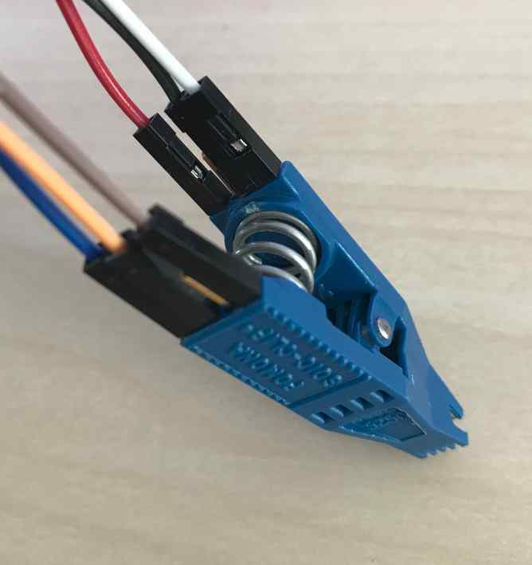
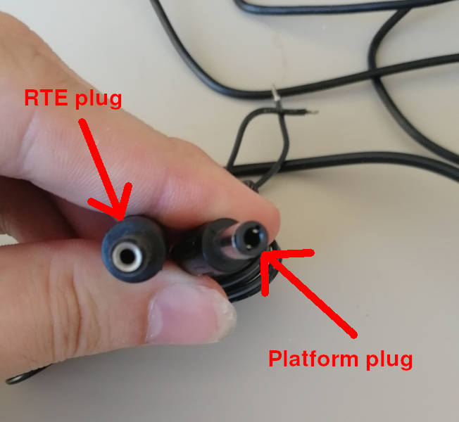

# Generic testing stand preparation

## Introduction

This document aims to provide a comprehensive, generic guide to setting up a
Remote Testing Environment for Dasharo platforms. As you follow along, please
cross-examine with the motherboard's datasheets and our platform-specific
recovery documentation, for example:

* [Novacustom laptops recovery](../unified/novacustom/recovery.md)
* [Dell OptiPlex recovery](../variants/dell_optiplex/recovery.md)
* [Asus KGPE-D16 recovery](../variants/asus_kgpe_d16/recovery.md)
* [Raptor CS Talos II recovery](../variants/talos_2/recovery.md)
* [Protectli platforms recovery](../unified/protectli/recovery.md)
* [MSI desktops recovery](../unified/msi/recovery.md)
* [Supermicro X11 recovery](../variants/supermicro_x11_lga1151_series/recovery.md)
* [PC engines platforms recovery](../variants/pc_engines/recovery.md)

!!! Note

    This list is subject to change and extension. You can find all of
    our supported platforms and their respective sections on the
    [Supported hardware](../variants/overview.md) page.

## Detailed description of the process

If you are dealing with a new platform, you might want to first dump logs from
it for future reference. We suggest using the dedicated functionality of
[DTS](../dasharo-tools-suite/overview.md).

### Compiling a list of peripherals

Before starting to set up the platform in the rack, make sure you plan it
carefully. It is worth first determining what connections should be made on the
stand, and then what equipment we need to be able to do it. When we put the
device in a rack, we want to have remote access to it. Mainly used devices,
depending on the functionalities needed:

!!! Note

    This documentation is based on RTE v1.1, which introduced
    [significant changes](../transparent-validation/rte/revision-history.md)
    over previous revisions. Using an earlier revision is not recommended, and
    may be problematic if not impossible with some platforms (e.g, **if their
    flash chip requires 1.8V VCC!**)

* [Prepared RTE](../transparent-validation/rte/v1.1.0/quick-start-guide.md) -
  if we need low voltage control, switching on or off the platform, serial
  connection and external flashing.
    - SOIC-8 Pomona clip (if applicable, i.e. if there are no SPI flashing
      headers)
    - 6x female-female wire cables
* Sonoff - if we need line voltage control.
* PiKVM - if it is not possible to read the device via serial or it is limited,
  it is possible to simulate the keyboard and read the image from HDMI.

Once we've collected everything, we can move on to setting up the equipment.

!!! Remember

    Two important rules while making connections and placing stand
    in the rack:

    * **Use ESD Strap**: When assembling and connecting equipment in the lab,
      it is essential to use ESD straps. These straps help to prevent
      electrostatic discharge and protect sensitive electronic components from
      damage. Make sure you wear a strap every time you make a connection, and
      if someone is helping you, they have to also wear an ESD strap.
    * **Cut off the power supply**: Before making any connections and ensure
      that the platform, RTE and any other components are disconnected from
      power. This precautionary measure reduces the risk of electrical
      accidents and protects both the equipment and you.

### RTE setup

You need to examine the platform's motherboard and its manual to determine
whether it has dedicated **SPI headers**, or will you have to use a Pomona clip
to connect to the flash chip. If headers are present, they are preferred over
Pomona connection for stability reasons.

For exact chip/header locations, see the platform-specific recovery guides in
the corresponding
[Supported Hardware](../variants/overview.md) subsections,
as mentioned in the [introduction](#introduction) above.

This guide should cover for most of
available platforms, however there are unique exceptions - for example
[MSI boards](../unified/msi/recovery.md) where we use the
JTPM headers and a FlashBIOS button. Here, we will use Protectli VP46XX as a
general example.

Before you proceed, make sure your RTE is prepared in accordance with
[this guide](../transparent-validation/rte/v1.1.0/quick-start-guide.md).

#### Connections

If your motherboard **does not** have SPI headers available, follow this guide
for setting up a Pomona clip connection:

##### Pomona

1. Connect the wire cables to the **Pomona clip**.

    
    

1. Connect the Pomona clip to the [SPI header](../transparent-validation/rte/v1.1.0/specification.md)
   on RTE.

    | SPI header | Pomona clip  |
    |:----------:|:------------:|
    | Vcc        | pin 5 (Vcc)  |
    | GND        | pin 4 (GND)  |
    | CS         | pin 1 (CS)   |
    | SCLK       | pin 7 (CLK)  |
    | MISO       | pin 2 (MISO) |
    | MOSI       | pin 8 (MOSI) |

    

!!! Note

    In earlier RTE revisions, the VCC pin of the SPI header was not connected.
    In such case, you need to use a different 3.3V pin on the RTE instead.

1. Open the platform cover and locate the **SPI flash chip**.

    

1. Match **pin 1(CS)** on the Pomona clip with the first pin of the flash chip,
   marked with a small dot engraved on the chip.

    
    

##### SPI headers

If your platform has dedicated SPI flash headers like the Protectli VP66XX,
consider yourself lucky and simply connect corresponding pins with Dupont
wires:


| SPI header | RTE          |
|:----------:|:------------:|
| Vcc        | Vcc          |
| GND        | GND          |
| CS         | CS           |
| SCLK       | CLK          |
| MI**SO**   | MI**SO**     |
| MO**SI**   | MO**SI**     |

!!! Note

    In earlier RTE revisions, the VCC pin of the SPI header was not connected.
    In such case, you need to use a different 3.3V pin on the RTE instead.

##### Remaining pins

1. Locate **CMOS headers** and wire them to GPIO pins on the RTE. You usually
need to reset the CMOS after flashing for a successful firmware update.


    | RTE       | DUT                        |
    |:---------:|:--------------------------:|
    | J11 pin 8 | CLR_CMOS                   |
    | Any GND   | GND                        |

1. Locate the power and reset button pins. A motherboard will usually have a
dedicated set of headers where the power and reset button wires are connected.
Connect them to proper pins on the RTE. In extreme cases you might need to use
clips to grab pins of soldered-in power and reset buttons.

    | RTE       | DUT                           |
    |:---------:|:-----------------------------:|
    | J11 pin 5 | PWR_ON#                       |
    | J11 pin 6 | RST#                          |
    | J15 pin 1 | GND                           |

Reference schematic:
[RTE v1.1.0 PDF](https://github.com/3mdeb/rte-schematics/blob/rte_v1.1.0/rte.pdf)

!!! Note

    In RTE v1.0, pins 8 and 9 are used for RST and PWR respectively.
    Reference schematic:
    [RTE v1.0.0 PDF](https://github.com/3mdeb/rte-schematics/blob/rte_v1.0.0/rte.pdf)

#### DC voltage supply control

If your device runs on DC voltage up to 24V, power management should be
executed via RTE. Otherwise, skip to [Sonoff setup](#sonoff-setup).

Connect 12-24V power supply to RTE J13 connector, then RTE J12 connector to
DC connector. Do not use any DC jack adapters as these seem to introduce
power losses and noises, making the power connection unstable.

Picture of the improper cable:


Picture of the proper cable:


You have to solder the good cable with the half of bad cable to form a full
cable. Cut the bad cable in half and strip the isolation. Take the red wire
and solder it to the proper cables' white striped wire, this is the hot
wire with positive voltage. Isolate the connection with a tape. Take the
second black wire from the improper cable and solder it to the unstriped
wire of the proper cable. Use tape to isolate and strengthen the whole
connection. The cable is ready. Be sure to use plugs in the following way:



### Sonoff setup

If you require line voltage control, follow our guide for [Sonoff preparation](../transparent-validation/sonoff/sonoff_preparation.md).

### PiKVM setup

If serial connection to the DUT is known to be problematic, follow our guide
for [PiKVM preparation](../transparent-validation/pikvm/assembly-and-validation.md).

### Access to the DUT

Access to the DUT should be realized by connecting the serial port on the DUT
to the serial port on RTE. The location of the serial port should be determined
based on the platform's documentation. Documentation describing this process and
including connections with various cables can be found
[here](../transparent-validation/rte/v1.1.0/serial-port-connection-guide.md).

Follow the steps below to configure `ser2net` on RTE, which will allow you to
access the DUT via serial using the telnet console. In this example scenario, a
micro USB-USB converter is used to connect the DUT with RTE.

1. Connect to RTE via ssh.
1. Run the `dmesg -w` command.
1. Disconnect and connect a micro USB-USB converter.
1. On the `dmesg -w` command output look for the attached converter, in this
   case:

    ```sh
    [  164.136255] usb 8-1: f81232 converter now attached to ttyUSB0
    ```

1. Then use vim to modify settings in `/etc/ser2net.yaml` according to the port
   received from the `dmesg -w` command, in this case(`ttyUSB0`):

    ```sh
    connection: &con1
        accepter: telnet, tcp, 13541
        connector: serialdev, /dev/ttyUSB0, 115200n81, local
    ```

    ```sh
    connection: &con2
        accepter: telnet, tcp, 13542
        connector: serialdev, /dev/debug_uart_converter, 115200n81, local
    ```

1. Check access to the DUT using the `telnet <IP> <port>` command.

In case you have multiple ttyUSB devices, you may want to assign persistent
names to them. In that case you need to define udev rules that will create the
device nodes. Create them in `/etc/udev/rules.d/51-usb-converters.rules`:

```sh
SUBSYSTEM=="tty" ACTION=="add", ATTRS{idVendor}==<vid>, ATTRS{idProduct}==<pid>, SYMLINK+="debug_uart_converter_<name>"
```

Replace `<vid>` and `<pid>` with the converter's vendor ID and product ID.

Then, specify the name in `ser2net` config:

```yaml
connection: &con3
  accepter: telnet, tcp, <port>
  connector: serialdev, /dev/debug_uart_converter_<name>, 115200n81, local
```

You may need to change `&con3` to another number, if 3 is already taken.

After making the changes you should reload udev rules and restart the `ser2net`
service:

```bash
udevadm control --reload-rules && udevadm trigger && systemctl restart ser2net
```

In case it is not possible to read the device via serial, set up PiKVM and
properly connect to the platform. PiKVM setup documentation can be found
[here](../transparent-validation/pikvm/assembly-and-validation.md).

#### Platform external flashing

Platform external flashing is needed for two reasons:

* it enables quick changes to the firmware,
* it enables the process of unbricking the platform.

The flashing operation usually consists of several commands, involving crucial
power management, so it is advisable to use our
[osfv-cli tool](https://github.com/Dasharo/osfv-scripts/blob/main/osfv_cli/README.md)
, providing support for most of Dasharo platforms.

**Example use:**

```sh
λ osfv_cli rte --rte_ip 192.168.10.244 flash probe
DUT model retrieved from snipeit: VP4630
Probing flash...
Executing command: flashrom -p linux_spi:dev=/dev/spidev1.0,spispeed=16000 -c MX25L12835F/MX25L12845E/MX25L12865E
flashrom v1.2 on Linux 5.4.69 (armv7l)
flashrom is free software, get the source code at https://flashrom.org

Using clock_gettime for delay loops (clk_id: 1, resolution: 1ns).
Found Macronix flash chip "MX25L12835F/MX25L12845E/MX25L12865E" (16384 kB, SPI) on linux_spi.

No operations were specified.
```

```sh
λ osfv_cli rte --rte_ip 192.168.10.244 flash read --rom vp4630-read.rom
DUT model retrieved from snipeit: VP4630
Reading from flash...
Executing command: flashrom -p linux_spi:dev=/dev/spidev1.0,spispeed=16000 -c MX25L12835F/MX25L12845E/MX25L12865E -r /tmp/read.rom
flashrom v1.2 on Linux 5.4.69 (armv7l)
flashrom is free software, get the source code at https://flashrom.org

Using clock_gettime for delay loops (clk_id: 1, resolution: 1ns).

Found Macronix flash chip "MX25L12835F/MX25L12845E/MX25L12865E" (16384 kB, SPI) on linux_spi.

Reading flash...
done.

Read flash content saved to vp4630-read.rom
```

> Flashing with flashrom takes about 1 minute.

Note that the first boot of the platform after proceeding with above procedure
can take much longer than usual.

### Stand Setup

Before placing the stand in the lab, it is recommended to set it up first at
your desk to verify its functionality. After compiling the stand, the
connections that we have made should be checked. The necessary thing to do the
check is the IP address of RTE which we can get by connecting to RTE via serial
using minicom and using the `ip a` command.

After this, we have an IP to connect via ssh. This process should suit
every position:

1. Connect to RTE via ssh.
1. Check access to the DUT using the `telnet <IP> <port>` command from RTE or
   log in to PiKVM by entering its IP address in your browser.
1. Check that the commands responsible for the power control are working
   properly:

    ```sh
    osfv_cli rte --rte_ip 192.168.10.244 rel tgl
    ```

    ```sh
    osfv_cli rte --rte_ip 192.168.10.244 pwr on
    ```

    ```sh
    osfv_cli rte --rte_ip 192.168.10.244 pwr off
    ```

    ```sh
    osfv_cli rte --rte_ip 192.168.10.244 pwr reset
    ```

1. Check the flashing connections using a prepared flashing script.
1. Check for additional connections.

### Placement in the Lab

After testing the functionalities of the stand, follow these guidelines to place
it in the lab:

1. Select an appropriate location in the rack cabinet for the stand. Consider
   safety, accessibility, and proper fastening of the station elements.
1. Ensure that the cables are routed through trays and securely tied to prevent
   them from sticking out or becoming tangled.
1. Label the cables and elements of the stand with their IP addresses for easy
   identification.
1. Once the stand is in place, recheck the connections, ensuring that all cables
   are properly connected and secured.
1. Complete the setup by checking remote access to the stand via SSH and ensure
   that all functions are working correctly.

### Additional steps

You might want to assign a static IP address for the RTE to avoid connection
problems in the future. It can also prove useful to make a documentation of
your entire test setup and enlist it in an IT asset management system, such as
SnipeIT - providing such information in an issue report might turn out to be
crucial.
