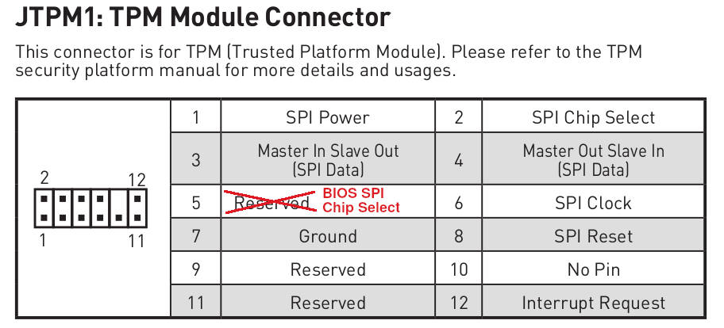

# Recovery

## Intro

This project is in early development phase. On certain
hardware configurations, the Dasharo firmware may not boot correctly (i.e.
we will have "bricked" the platform). In such a case, the recovery procedure can
reinstall the original firmware from the board manufacturer.

There are two documented recovery methods: using a [CH341A programming kit](https://shop.3mdeb.com/shop/modules/ch341a-flash-bios-usb-programmer-kit-soic8-sop8/)
or an [RTE](https://shop.3mdeb.com/shop/open-source-hardware/rte/).

Since Dasharo v1.1.2 (PRO Z690-A) / v0.9.0 (PRO Z790-P) release it is also
possible to use MSI FlashBIOS button feature to recover using an image placed
in the USB stick.

## Using MSI FlashBIOS button

1. Format an empty USB drive with FAT32 filesystem.
2. Place Dasharo release binary or official MSI binary on the drive's root
   directory and name it `MSI.ROM`.
3. Put the drive in the rear USB 2.0 port marked as `FlashBIOS`.
4. Be sure that your machine is powered off (ATX supply must be still
   connected).
5. Press the FlashBIOS button near the `FlashBIOS` port.
6. After a few seconds the machine should power on the ATX supply and begin
   flashing (the red diode will be blinking).
7. Wait approximately 5 minutes for the process to finish. The board will
   automatically restart and boot.

Here is a [video showing the process](https://www.youtube.com/watch?v=iTkXunUAriE).

### External flashing with programmer

#### RTE

In this case, using external programmer is necessary. We are using
[RTE](https://3mdeb.com/open-source-hardware/#rte)
here.

* Connect programmer to the flash chip as shown in the
  [Hardware connection / SPI](development.md#hardware-connection) section of
  the `Development` documentation.

* Download official BIOS from vendor's website (this is the newest version, you
  may choose an older one too or in the best case use your firmware backup):

```bash
wget https://download.msi.com/bos_exe/mb/7D25v13.zip
unzip 7D25v13.zip
```

* Flash via external programmer:

The MS7D25 is known to have one of two different flash chips:
Winbond W25Q256JWEIQ (Markings: 25Q256JWEQ) and Macronix MX25U25673GZ4I40.
The W25Q256JWEIQ is only supported since flashrom upstream v1.3 or the dasharo
fork since v1.2. The Macronix chip has been supported for much longer, albeit
under a different name.

> The command line will be different, depending on the programmer you use.
See the flashrom documentation for more details.

```bash
flashrom -p linux_spi:dev=/dev/spidev1.0,spispeed=16000 -w 7D25v13/E7D25IMS.130
```

* First boot after the recovery process is significantly longer

### CH341A

#### Prerequisites

The full set is now available at our [online shop](https://shop.3mdeb.com/shop/modules/ch341a-flash-bios-usb-programmer-kit-soic8-sop8/).

1. CH341A kit with 1.8V level-shifter. Can be bought on e.g. [Amazon](https://www.amazon.com/programmer-ch341a-Programmer-Adapter-Converter/dp/B07WP9FKZ2)

    

2. Female-female 2.54mm to 2mm dupont wires.
3. USB2.0 Female-Male extension cord 0.5m or longer (optional)

    

4. Machine with Linux and flashrom.

#### Connection

First start with assembling the CH341A and the 1.8V adapter. Pay attention to
which holes you attach the adapter. You should use the holes marked as 25XX
(closer to the USB plug):


Place the 1.8V adapter in the holes and lock it with the lever. Be sure that
the arrow on the adapter is facing the black lever (opposite side of USB plug):


Now take the breakout board with pin headers:


and plug it into the other 1.8V adapter, be sure that numbers 1-4 on the
breakout board match the numbers 1 and 4 on the adapter:


Numbers should be visible on the upper side after assembling:


Next, take the dupont wires and connect them to the brekaout board and
mainboard's JTPM1 header. The JTPM1 pin5 is actually BIOS SPI CS pin (marked
as reserved in the board manual).



| CH341a breakout board | MSI Z690-A/Z790-P                                    |
|:---------------------:|:----------------------------------------------------:|
| pin 1 (CS)            | JTPM1 pin 5 (RESERVED / BIOS SPI CS pin)             |
| pin 2 (MISO)          | JTPM1 pin 3 (MISO)                                   |
| pin 4 (GND)           | JTPM1 pin 7 (GND)                                    |
| pin 5 (MOSI)          | JTPM1 pin 4 (MOSI)                                   |
| pin 6 (SCLK)          | JTPM1 pin 6 (SPI Clock)                              |
| pin 8 (Vcc)           | JTPM1 pin 1 (SPI Power)                              |

Now the connection is ready. Time to probe for the flash chip with flashrom.

#### Flashing

Now on the Linux machine check if the flash is detected using a sample command:

```bash
sudo flashrom -p ch341a_spi
```

You should see something like this:

```bash
flashrom v1.2-567-gf4eb405 on Linux 5.19.9-200.fc36.x86_64 (x86_64)
flashrom is free software, get the source code at https://flashrom.org

Using clock_gettime for delay loops (clk_id: 1, resolution: 1ns).
Found Winbond flash chip "W25Q256.W" (32768 kB, SPI) on ch341a_spi.
No operations were specified.
```

If the flash is detected as above invoke the real flashing command
(e.g. if your original/working firmware backup is saved as
`firmware_backup.bin`):

```bash
sudo flashrom -p ch341a_spi -w firmware_backup.bin
```

Note that USB programmers are pretty slow, the whole operation make take
several minutes (can be 10-15 minutes in worst case). At the end of operation
you should see:

```bash
flashrom v1.2-567-gf4eb405 on Linux 5.19.9-200.fc36.x86_64 (x86_64)
flashrom is free software, get the source code at https://flashrom.org

Using clock_gettime for delay loops (clk_id: 1, resolution: 1ns).
Found Winbond flash chip "W25Q256.W" (32768 kB, SPI) on ch341a_spi.
Reading old flash chip contents... done.
Erasing and writing flash chip... Erase/write done.
Verifying flash... VERIFIED.
```

## SMBIOS unique data recovery

### Serial number format and recovery

[SMBIOS specification](https://www.dmtf.org/sites/default/files/standards/documents/DSP0134_3.4.0.pdf)
sections 7.2 and 7.3 defines two spaces for serial number: the system serial
number and baseboard serial number. The original MSI PRO Z690-A firmware
provides only the baseboard serial number.

In case you have lost your serial number in the process of flashing Dasharo or
newer MSI firmware, there is a way to retrieve it. The board has a QR code
printed on the mainboard between the chipset heatsink and dPGU PCIe slot:


If you read the QR code with your smartphone you will get the full serial
number. The serial number has the format `07D25xx_LyzEaaaaaa` where:

* `07D25` - is the board model, i.e. MS-7D25 for this particular board
* `xx` is the mainboard revision which should match the revision imprinted
  between the M2_1 slot and dGPU slot. E.g. `xx=11` means VER:1.1
* `yz` is the manufacturing date in hex, i.e. `y` is the month, `z` is the
  year, for example `A1` means **October** 202**1**, `12` means **January**
  202**2**
* `aaaaaa` is the unique 6-digit number which is imprinted under the serial
  number QR code

### System UUID format and recovery

[SMBIOS specification](https://www.dmtf.org/sites/default/files/standards/documents/DSP0134_3.4.0.pdf)
section 7.2 defines a field for unique system identification with a special
number called UUID (Universally Unique IDentifier). UUID is specified by
[RFC 4122](https://datatracker.ietf.org/doc/html/rfc4122). MSI firmware
provides the system UUID in the SMBIOS system information structure.

The problem with UUID is that it cannot be recovered if the backup binary or
SMBIOS logs are lost. You can backup the SMBIOS information with our
[Dasharo Tools Suite bootablestick](https://docs.dasharo.com/dasharo-tools-suite/documentation#bootable-usb-stick).
The `dmidecode.log` will have all the necessary information. Things we know
about MSI system UUID:

* UUID format is as follows: `33221100-5544-7766-8899-AABBCCDDEEFF`, the hex
  numbers represent the order of bytes in memory for the little-endian format
  as required by SMBIOS
* MSI UUIDs do not conform to any of the RFC 4122 UUID variants/versions (the
  bits responsible for UUID version and variant identification are not constant
  across multiple boards)
* the last octet group `AABBCCDDEEFF` is equal to the MAC address of the
  on-board Intel i225 Ethernet, so **be sure to NOT share the UUID** with
  anybody as it contains system sensitive information
* the first four groups are either random numbers or some cryptographically
  acquired value from e.g. combination of some board data, unfortunately it is
  not known by us

The MAC address is printed on a sticker placed on the 2x2 SATA connector:


### SMBIOS data migration

For Dasharo simply follow the [Initial Deployment](initial-deployment.md) how
to migrate the data.

For MSI firmware you will probably need an AMI DMI/SMBIOS editor to save those
values back if you do not have a backup binary.
