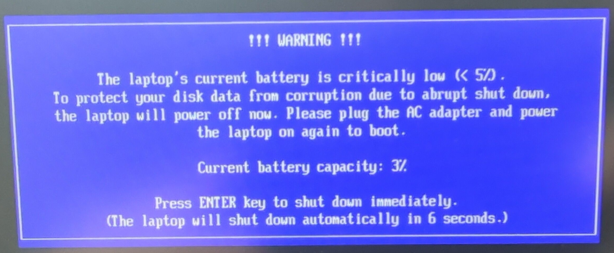
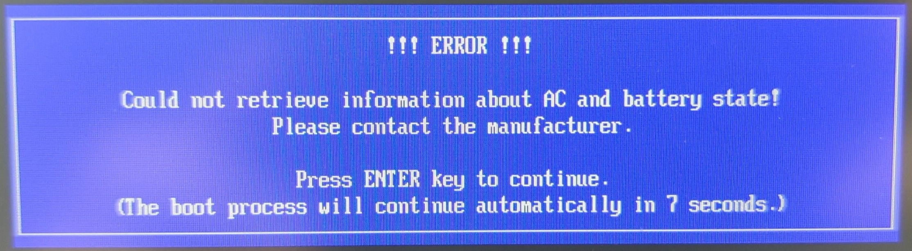

# Special features

This document describes special firmware features specific to NovaCustom
laptops.

=== "Laptops"

	## Battery charge management

	NovaCustom laptops equipped with Dasharo firmware provide several battery
	management mechanisms to optimize the user experience and prolong the battery's
	lifespan.

	### Low battery boot prevention

	To prevent corruption of the bootloader, which may occur due to a sudden power
	loss during the OS boot process, booting the OS is blocked when the battery
	level is below 5%. When trying to boot the OS with the battery level below the
	defined threshold, the following message will be shown on the screen:

	

	### Disconnected battery warning

	When the firmware encounters problems with detecting the battery, the following
	message will appear suggesting checking the physical connection between the
	battery and mainboard:

	

	### Power information error

	When the firmware encounters problems with retrieving information about AC and
	battery state, the following error message will be displayed:

	

	### Charge thresholds

	Dasharo firmware implements battery charge thresholds, which aim to extend the
	lifespan of the battery:

	- charging will only start when the battery level is below the lower threshold
	(default: 95%)

	- charging will stop once the battery level reaches the upper threshold
	(default: 98%)

	Custom charge thresholds can be configured using the Dasharo setup menu.

	### Battery bypass mode

	The device can be powered in three modes:

	- Battery Mode - the device is powered using the battery only. This mode is
	active only if the device is not connected to a power adapter.
	- Charging Mode - when the device is connected to a proper power adapter
	it is powered directly from the adapter and the battery is not used.
	Only if the current charge level is below the lower charge threshold
	will the battery start being charged. When the upper threshold
	is achieved, the battery stops charging and again no current
	is flowing through it, preventing excessive wear.
	    + If you are using the device like a desktop computer, having it
	constantly connected to the power adapter, consider lowering the
	charge thresholds to about 70-80%. By keeping the battery at a lower
	charge level the battery wear overtime can be reduced.
	- Hybrid Power Boost mode - the device is powered from the battery and the
	power adapter at the same time. This mode activates only when the power
	adapter can't provide enough power to the system. The battery will start
	charging only if the current charge falls below the lower charge threshold
	and stop once the upper threshold is achieved.

	## RGB keyboard

	Some models feature an RGB backlit keyboard. Dasharo implements driverless
	backlight control using only the hotkeys on the keyboard.

	### Usage

	The backlight can be controlled using the hotkeys on the numeric keypad:

	- `Fn` + `/` - Next color
	- `Fn` + `*` - Toggle On / Off
	- `Fn` + `-` - Brightness down
	- `Fn` + `+` - Brightness up

	The backlight has the following color modes:

	- White (default)
	- Red
	- Green
	- Blue
	- Yellow
	- Magenta
	- Cyan

	## Fn Lock hotkey

	By default, the `Function Keys` (++f1++ - ++f12++) must be used with a
	combination of ++fn++ key to change display brightness, keyboard illumination,
	etc. The `Fn lock` capability provides a way of using these actions without the
	necessity of using the ++fn++ key.

	### Enabling

	Press the ++fn+caps-lock++ keys combination.

	### Disabling

	Press the ++fn+caps-lock++ keys combination again.

	## Power switch watchdog

	In the rare events where the Embedded Controller experiences a crash
	or gets
	stuck, the EC can be forcefully reset by simply holding the power
	button for
	more than 10 seconds.

	## ACPI driver

	The ACPI Driver is a Linux kernel module that utilizes the hwmon
	interface to monitor the hardware. This interface is based on the sysfs
	file system, enabling reading of the real-time data about the hardware
	status.

	The driver provides support for sensors that report values
	of temperature, fan speeds and fan PWM for CPU and GPU
	(if supported by the platform).

	To install this feature follow: [Dasharo ACPI README](https://github.com/Dasharo/dasharo-acpi-dkms/tree/develop).

	## Graphics Card Modes

	**V5xxTNX** models offer multiple graphics modes, accessible via
	**Hybrid Graphics**, allowing users to optimize for performance,
	battery life, or a balance of both.

	### NVIDIA Optimus (iGPU & dGPU)

	A **hybrid mode** that dynamically switches between the iGPU and dGPU
	for **a balance of performance and efficiency**. Best for general use
	with external display support.
	- Automatic switching optimizes power and performance.
	- Full external display support.
	- Shorter battery life than iGPU Only.
	- Possible performance inconsistencies and Linux compatibility issues.

	### iGPU Only

	Designed for **maximum battery life**, this mode uses only the
	integrated GPU. It significantly reduces power consumption but comes
	with limitations.
	- Maximizes battery life (up to **100%** longer than dGPU mode).
	- No access to HDMI or second USB-C DisplayPort.

	### dGPU Only

	Ideal for **gaming and high-performance tasks**, this mode connects
	the internal display directly to the dedicated GPU, ensuring
	**consistent maximum performance**.
	- Delivers the highest performance.
	- Increased power consumption.

=== "NUC BOX"

## CPU throttling threshold

The user can set a custom temperature (in °C), above which the CPU will start
throttling itself. By default, the threshold is set to 80°C.

The available values range from TjMax - 63 to TjMax, where TjMax is the maximum
allowed temperature for a particular CPU. That is, for instance, 100°C for TGL
and ADL, and 110°C for MTL.

The option can be set in EDK2, under `Dasharo System Features >
Power Management Options > CPU Throttling Threshold`.

## Fan profiles

There are two fan profiles implemented. The profiles can be selected via the
[Power Management Options](../../dasharo-menu-docs/dasharo-system-features.md#power-management-options)
menu in the Setup Menu.

Fan profiles are defined as follows:

=== "Silent"

	Releases newer than v1.4.0 11th Gen and v1.6.0 12th Gen

	| Temperature [°C] | Fan speed [%] |
	|------------------|---------------|
	| 0                | 20            |
	| 65               | 25            |
	| 75               | 35            |
	| 85               | 100           |

	Releases v1.4.0 11th Gen and v1.6.0 12th Gen or older

	| Temperature [°C] | Fan speed [%] |
	|------------------|---------------|
	| 0                | 25            |
	| 65               | 30            |
	| 75               | 35            |
	| 100              | 100           |

=== "Performance"

	Releases newer than v1.4.0 11th Gen and v1.6.0 12th Gen

	| Temperature [°C] | Fan speed [%] |
	|------------------|---------------|
	| 0                | 25            |
	| 55               | 35            |
	| 75               | 60            |
	| 85               | 100           |

	Releases v1.4.0 11th Gen and v1.6.0 12th Gen or older

	| Temperature [°C] | Fan speed [%] |
	|------------------|---------------|
	| 0                | 25            |
	| 55               | 35            |
	| 75               | 60            |
	| 100              | 100           |

> Values in-between curve points are interpolated linearly.

