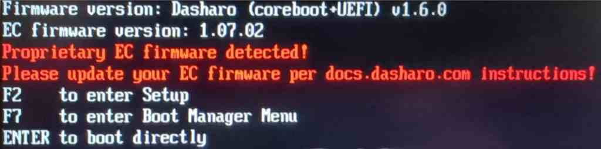

# Initial Deployment

## Intro

This document is a guide for the initial installation of Dasharo on a supported
device. It assumes some knowledge about external flashing and is primarily aimed
at technicians performing the initial installation and not for end users of the
devices.

## Installing Dasharo

### Preparation

On your host computer, install flashrom from sources:

!!! note

    Building from source is required, because the latest flashrom release
    as of the time of writing does not have support for the flash chip model
    present in these devices.

1. Install build dependencies

=== "APT package manager"

    ```bash
    apt update
    apt upgrade
    apt install git build-essential debhelper pkg-config libpci-dev libusb-1.0-0-dev libftdi1-dev meson
    ```
=== "DNF package manager"

    ```bash
    dnf group install c-development development-tools
    dnf install git debhelper pkgconf-pkg-config pciutils-devel libusb-compat-0.1-devel libftdi-devel meson
    ```

1. Clone the flashrom repository:

    ```bash
    git clone https://review.coreboot.org/flashrom.git
    ```

1. Build and install flashrom:

    ```bash
    cd flashrom
    meson build
    ninja -C build
    sudo ninja -C build install
    ```

### Initial Installation

=== "Laptops"

    === "14th Gen (Meteor Lake)"
        Due to flash protection and Intel ME configuration present in vendor
        firmware, initial deployment must be performed externally (using a chip
        programmer like CH341a).

        ### EC installation

        Steps for installing Dasharo Embedded Controller Firmware:

        1. On the target laptop,
           [boot into Dasharo Tools Suite from a USB stick](../../dasharo-tools-suite/documentation/running.md#bootable-usb-stick)

        1. Ensure power adapter is plugged into the laptop

        1. Press `S` to drop to shell

        1. Download the EC firmware from the Releases page for your device with
           `wget`

        1. Install the EC firmware:

            ```bash
            flashrom -p ite_ec:boardmismatch=force,romsize=128K -w path/to/ec.rom
            ```

        ### BIOS installation

        Steps for installing Dasharo BIOS:

        1. Remove the bottom cover of the laptop.
        2. Disconnect the primary battery.
        3. Disconnect the CMOS battery.

            !!! warning

                Disconnecting the CMOS battery will result in the internal date being reset.

        4. Attach a WSON-8 probe to the SPI flash chip.
        5. Backup the current firmware, in case you want to be able to restore it
            at some point:

            ```bash
            flashrom -p ch341a_spi -r bios_backup.rom
            ```

        6. Install Dasharo BIOS, replacing `[path]` with the path to the firmware
            image you want to flash, e.g. `novacustom_v540tu_v0.9.0.rom`:

            - Step 1: Flash descriptor:

                ```bash
                flashrom -p ch341a_spi -w [path] --ifd -i fd
                ```

            - Step 2: BIOS and CSME:

                ```bash
                flashrom -p ch341a_spi -w [path] --ifd -i me -i bios
                ```

        7. Detach the WSON-8 probe.
        8. Connect the primary battery and reconnect the CMOS battery.
        9. Power on the laptop. The laptop may shut down once after training the memory.

    === "12th Gen (Alder Lake)"
        During the initial installation of Dasharo, you should deploy the supported
        Intel ME version (and configuration) on the device. Since vendor firmware
        has enabled Intel Boot Guard and BIOS Guard, it is not possible to do this
        from within the operating system and external flashing of the whole flash
        chip using a programmer like the CH341a is required.

        ### BIOS installation

        Steps for installing Dasharo BIOS:

        1. Remove the bottom cover of the laptop.

            === "NS5x / NS7x"
                

            === "NV4x"
                

        2. Disconnect the primary battery. (1)
        3. Disconnect the CMOS battery. (2)

            !!! warning

                Disconnecting the CMOS battery will result in the internal date being reset.
        4. Attach a WSON-8 probe to the SPI flash chip. (3)

            > For TGL devices use SOIC clip instead of WSON

        5. Backup the current firmware, in case you want to be able to restore it
            at some point:

            ```bash
            flashrom -p ch341a_spi -r bios_backup.rom
            ```

        6. Install Dasharo BIOS, replacing `[path]` with the path to the firmware
            image you want to flash, e.g. `novacustom_ns5x_adl_full_v1.4.0.rom`

            ```bash
            flashrom -p ch341a_spi -w [path]
            ```

        7. Detach the WSON-8 probe.
        8. Connect the primary battery and reconnect the CMOS battery.
        9. Power on the laptop. The laptop may shut down once after training the memory.

        ### EC firmware installation

        Currently, the latest flashrom release lacks support for flashing ITE
        embedded controllers such as the ones present in NovaCustom laptops. Because
        of this, we need to build flashrom from source. Run the following commands
        on the target laptop:

        1. Install build dependencies:

            === "APT package manager"

                ```bash
                apt update
                apt upgrade
                apt install git build-essential debhelper pkg-config libpci-dev libusb-1.0-0-dev libftdi1-dev meson
                ```

            === "DNF package manager"

                ```bash
                dnf group install c-development development-tools
                dnf install git debhelper pkgconf-pkg-config pciutils-devel libusb-compat-0.1-devel libftdi-devel meson
                ```

        2. Obtain source code:

            ```bash
            git clone https://github.com/dasharo/flashrom.git
            cd flashrom
            ```

        3. Build flashrom:

            ```bash
            make
            sudo make install
            ```

        4. Make a backup of the EC firmware:

            > Remember to store the backup on the separate device in case flashing
            > fails.

            ```bash
            flashrom -p ite_ec -r ec_backup.rom
            ```

        5. Install the EC firmware:

            > Warning: After running this command, the internal keyboard and power
            > button will stop responding until the device is power cycled (all
            > power must be removed, including the internal battery). Be prepared
            > to disconnect the battery after updating the EC.
            >
            > Alternatively, you can boot up the laptop without the battery
            > connected and power it from an AC adapter. Then, once the EC update
            > is complete, disconnect the AC adapter to power off the laptop.

            Run the following command, replacing `[path]` with the path to the EC
            firmware you want to flash, e.g. `novacustom_ns5x_adl_ec_v1.4.0.rom`

            ```bash
            flashrom -p ite_ec -w [path]
            ```

        Successful installation of Dasharo EC finishes the initial deployment
        process.

    === "11th Gen (Tiger Lake)"

        ### Initial deployment

        To ensure a smooth deployment process, it is recommended to use the latest
        version of DTS available from the [releases
        page](../../dasharo-tools-suite/releases.md). Once you have obtained it, you can
        then proceed with following the [Dasharo zero-touch initial deployment
        section](../../dasharo-tools-suite/documentation/features.md#dasharo-zero-touch-initial-deployment)
        procedure. This will help you set up Dasharo effectively and without manual
        intervention.

        If something went wrong or EC installation was not done, the firmware will
        print an error string during boot:

        { class="center" }

        OR

        { class="center" }

        In such case please follow the EC firmware update instructions for a specific
        board variant.

=== "NUC BOX"

    Initial flashing of Dasharo firmware can be done from Linux using flashrom with
    the internal programmer.

     This document describes the process of building, installing and running
    flashrom on Ubuntu 24.04.

    ### Flashing Dasharo

    To flash Dasharo on the platform, execute the following command - replace `[path]`
    with the path to the Dasharo image you want to flash, e.g. `novacustom_nuc_box_v0.9.0.rom`.

    ```bash
    sudo flashrom -p internal -w [path]
    ```

    After successful operation, power off the platform, unplug power from the
    platform, plug it back in and power the platform back on.

## coreboot + Heads

The supported method for initial deployment of the coreboot + Heads variant is
to follow [installing Dasharo](#installing-dasharo), and then
[transition from Dasharo UEFI to Heads variant](firmware-transition.md#switching-from-dasharo-uefi-to-heads).
