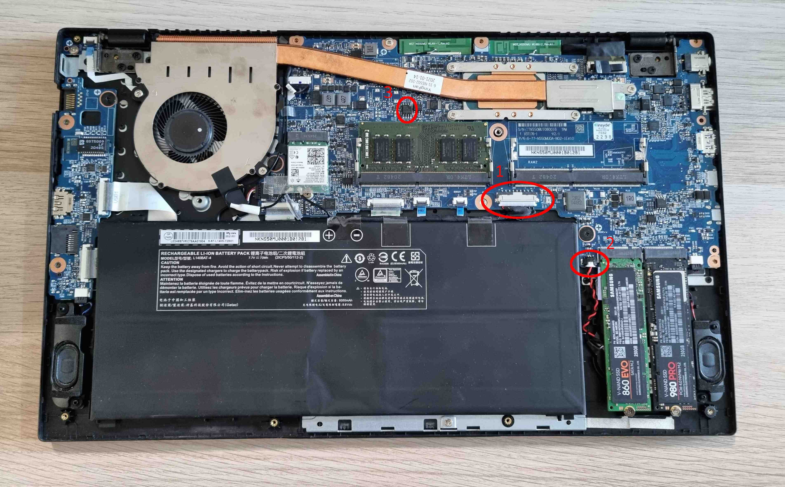

# Initial Deployment

## Intro

This document is a guide for the initial installation of Dasharo on a supported
device. It assumes some knowledge about external flashing and is primarily aimed
at technicians performing initial installation and not for end users of the
devices.

## Installing Dasharo

### Initial Installation

=== "12th Gen (Alder Lake)"

During the initial installation of Dasharo, you should deploy the supported
Intel ME version (and configuration) on the device. Since vendor firmware
has enabled Intel Boot Guard and BIOS Guard, it is not possible to do this
from within the operating system and external flashing of the whole flash
chip using a programmer like the CH341a is required.

> Publicly released binaries do not contain ME binary. If you need an Intel ME
> update for your device, contact us via already established commercial support
> channel.

### Preparation

Install flashrom:

```bash
apt update
apt upgrade
sudo apt -y install flashrom
```

### BIOS installation

Steps for installing Dasharo BIOS:

1. Remove the bottom cover of the laptop.

=== "NS5x / NS7x"
    

=== "NV4x"
    

1. Disconnect the primary battery. (1)
1. Disconnect the CMOS battery. (2)
1. Attach a WSON-8 probe to the SPI flash chip. (3)
1. Backup the current firmware, in case you want to be able to restore it
at some point:

```bash
flashrom -p ch341a_spi -r bios_backup.rom
```

1. Install Dasharo BIOS, replacing `[path]` with the path to the firmware
image you want to flash, e.g. `novacustom_ns5x_adl_full_v1.4.0.rom`

```bash
flashrom -p ch341a_spi -w [path]
```

1. Detach the WSON-8 probe.
1. Connect the primary battery and reconnect the CMOS battery
1. Power on the laptop. The laptop may shut down once after training the memory.

### EC firmware installation

Currently, the latest flashrom release lacks support for flashing ITE
embedded controllers such as the ones present in NovaCustom laptops. Because
of this, we need to build flashrom from source. Run the following commands
on the target laptop:

1. Install build dependencies:

```bash
apt update
apt upgrade
apt install git build-essential debhelper pkg-config libpci-dev libusb-1.0-0-dev libftdi1-dev meson
```

1. Obtain source code:

```bash
git clone https://github.com/dasharo/flashrom.git
cd flashrom
```

1. Build flashrom:

```bash
make
sudo make install
```

1. Make a backup of the EC firmware:

> Remember to store the backup on the separate device in case flashing
> fails.

```bash
flashrom -p ite_ec -r ec_backup.rom
```

1. Install the EC firmware:

> Warning: After running this command, the internal keyboard and power
> button will stop responding until the device is power cycled (all
> power must be removed, including the internal battery). Be prepared
> to disconnect the battery after updating the EC.
>
> Alternatively, you can boot up the laptop without the battery
> connected and power it from an AC adapter. Then, once the EC update
> is complete, disconnect the AC adapter to power off the laptop.

Run the following command, replacing `[path]` with the path to the EC
firmware you want to flash, e.g. `novacustom_ns5x_adl_ec_v1.4.0.rom`

```bash
flashrom -p ite_ec -w [path]
```

Successful installation of Dasharo EC finishes the initial deployment
process.

=== "11th Gen (Tiger Lake)"

### Automatic deployment

   For 11th Gen Intel Core based models, Dasharo Tools Suite zero-touch initial
   deployment is available. Follow instructions over at
   [DTS documentation](https://docs.dasharo.com/dasharo-tools-suite/documentation/#dasharo-zero-touch-initial-deployment)
   to deploy Dasharo on your machine.
