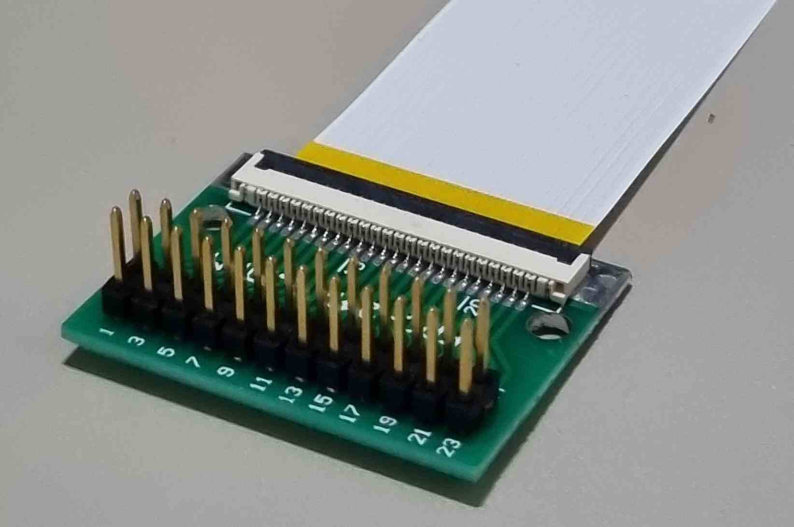
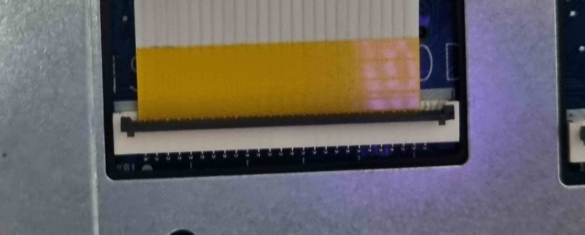
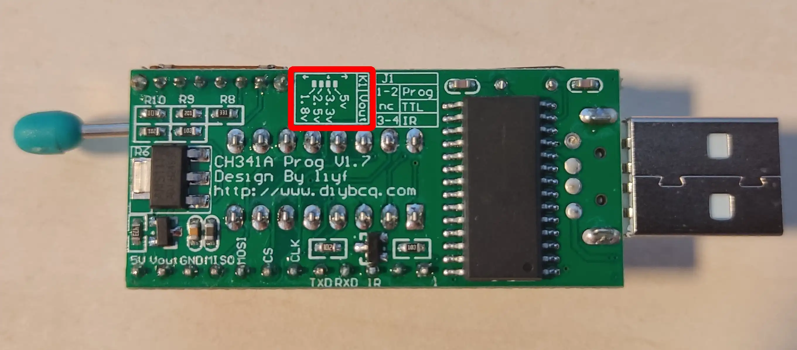
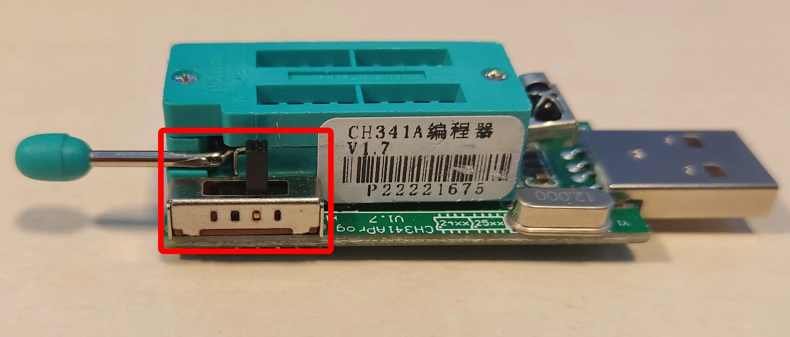

# Recovery

## Introduction

The following documentation describes the process of recovering NovaCustom
platforms from the brick state. This procedure can be used to restore both
Dasharo and previous Insyde/AMI firmware.
This procedure can be used to restore both Dasharo and previous Insyde/AMI
firmware.

=== "Laptops"

    ## Prerequisites

    !!! warning

        To proceed with the recovery procedure, the backup with the vendor firmware or
        vendor EC firmware will be necessary eg. `bios_backup.rom`, `ec_backup.rom`.

        The backup file should be generated before making any changes to the device
        flash chip according to the following documentation sections:

        - [Firmware backup](initial-deployment.md#bios-installation)
        - [EC firmware backup](initial-deployment.md#ec-firmware-installation)

    > Restoring vendor BIOS requires restoring a compatible version of EC firmware.
      There is currently no way to do this internally.

    ### Necessary components

    === "BIOS"

        === "11th Gen models"
            You will need:

            - a CH341a programmer with 3.3V support
            - a SOIC-8 (Pomona) clip

        === "12th Gen models"
            You will need:

            - a CH341a programmer with 3.3V support
            - a WSON-8 probe

        === "14th Gen models"
            You will need:

            - a CH341a programmer with 1.8V support
            - a WSON-8 probe

        A complete set containing everything you need is available from
        [our shop](https://shop.3mdeb.com/shop/modules/ch341a-flash-bios-usb-programmer-kit-soic8-sop8/).

        Follow the [Initial deployment](initial-deployment.md#initial-installation)
        section to perform the external flash. When running the flashrom commands, use a
        backup file you've prepared previously, like `bios_backup.rom`.

    === "EC"

        === "NS5x / NS7x"
            You will need:

            - an Arduino Mega 2560
            - a 24-pin FFC cable with a 1.0mm pitch, same-sided (connectors on the same side
                on both ends of the cable)
            - a 24-pin FFC breakout board with a 1.0mm pitch FFC connector and a 2.54mm
                 pitch pin header
            - USB-A to USB-B cable to connect the Arduino to the host
            - USB-C cable for grounding with power blocker

        === "NV4x"
            You will need:

            - an Arduino Mega 2560
            - a 24-pin FFC cable with a 0.5mm pitch, same-sided (connectors on the same side
              on both ends of the cable)
            - a 24-pin FFC breakout board with a 0.5mm pitch FFC connector and a 2.54mm
              pitch pin header
            - USB-A to USB-B cable to connect the Arduino to the host
            - USB-C cable for grounding with power blocker

        === "V540"
            You will need:

            - an Arduino Mega 2560
            - a 24-pin FFC cable with a 0.5mm pitch, same-sided (connectors on the same side
              on both ends of the cable)
            - a 24-pin FFC breakout board with a 0.5mm pitch FFC connector and a 2.54mm
              pitch pin header
            - USB-A to USB-B cable to connect the Arduino to the host
            - USB-C cable for grounding with power blocker

        === "V560"
            You will need:

            - an Arduino Mega 2560
            - a 24-pin FFC cable with a 1.0mm pitch, same-sided (connectors on the same side
              on both ends of the cable)
            - a 24-pin FFC breakout board with a 1.0mm pitch FFC connector and a 2.54mm
              pitch pin header
            - USB-A to USB-B cable to connect the Arduino to the host
            - USB-C cable for grounding with power blocker

        The full set for EC firmware recovery is available at our
        [online shop](https://shop.3mdeb.com/shop/open-source-hardware/ec-flashing-kit/).

    ## EC firmware recovery

    The procedure will be slightly different depending on the model of your laptop.

    !!! danger

        Ensure you choose the correct FFC cable, as they can be easily damaged.
        [Needed components](https://docs.dasharo.com/unified/novacustom/recovery/#ns5x--ns7x)

    !!! important

        Make sure your battery is connected for this process.

    ### Prerequisites

    - Clone the EC repository:

    ```bash
    git clone https://github.com/Dasharo/ec.git
    cd ec
    git submodule update --init --checkout
    ```

    - Install dependencies:

    ```bash
    ./scripts/deps.sh
    ```

    - If `rustup` was installed as part of the previous step, run:

    ```bash
    source $HOME/.cargo/env
    ```

    - Connect the Arduino to the computer using a USB-A to USB-B cable

    - Build and flash firmware for the Arduino, which will serve as the flasher:

    ```bash
    make BOARD=arduino/mega2560
    make BOARD=arduino/mega2560 flash
    ```

    ### Recovery steps

    #### Removing Screws

    === "V560"

        1. For the V560 laptops you will need to remove two stretch-release pull tabs
        that are holding keyboard in place.

            

        1. Second pull tab is located under the heat sink.

            
        

    === "Other models"

        1. Remove the two screws holding the keyboard in place. They are indicated on the
        bottom cover with a keyboard symbol:

            

    #### Connecting

    1. Pry the keyboard away from the laptop. Use a plastic spudger to release the
       tabs holding it in place, starting from the top.

        

        !!! warning

            Be extra careful when removing the keyboard to avoid damaging the fragile
            keyboard cable!

    1. Unplug the keyboard connector by lifting up the tab holding it in place:

        

    1. Connect the FFC cable to the FFC breakout board

        

        !!! warning

            In the example above, the FFC connector on the breakout has the pins on
            the **bottom** side of the connector and is located on the **same** side
            as the pins connecting to the Arduino. If your breakout is different,
            you may need an FFC cable with connectors on the **opposite** sides.

    1. Insert the breakout into Arduino's digital pin header, pins 22-45, with the
       FFC connector facing outwards

        

    1. Connect the other end of the FFC cable to the keyboard connector on the
       laptop, taking care to align pin 1 of the FFC cable to pin 1 (leftmost) pin
       of the connector

        
        *FFC cable with a 1mm pitch*

        
        *FFC cable with a 0.5mm pitch*

    1. Connect the Arduino to the host using the USB-A to USB-B cable

    1. Connect the USB-C cable together with power blocker from your host
       computer to the laptop.

        

        

        !!! warning

            This extra cable is for grounding. It's required, because there is no
            ground signal on the keyboard connector. If you are not using using
            [Power Blocker](https://shop.3mdeb.com/shop/adapters/usb-power-blocker/)
            Ensure the power pin on the cable is taped over to
            prevent the Embedded Controller chip from getting powered.

    #### Flashing

    1. Build the flashing utility:

        ```bash
        cargo build --manifest-path ecflash/Cargo.toml --example isp --release
        ```

    1. Flash the firmware:

        ```bash
        sudo ecflash/target/release/examples/isp [path to EC binary]
        ```

        The output will contain:

        ```bash
        Buffer size: 128
        ID: 5570 VER: 2
        ```

        If it contains other ID value or the connection times out, check all
        connections, using the photos above for reference.

    1. Reassemble the laptop: disconnect the Arduino from the laptop, disconnect the
       USB-C grounding cable, reinstall the keyboard, reinstall keyboard screws.

    ??? "EC Recovery troubleshooting tips"

        Flashing the EC firmware is highly unstable and many small and hard to
        pinpoint factors might influence it causing the process to fail.
        Here is a list of known tips and tricks, that are not a part of the
        official recovery steps, but under some circumstances might help if
        the flashing fails.

        ### Repeat

        Sometimes just repeating the flashing might help and no other steps
        would be necessary. To make it easier you can use a bash loop like this
        one:

        ```
        while ! sudo ecflash/target/release/examples/isp ec.rom; do sleep 1; done
        ```

        Don't overdo it. If flashing did not succeed after a couple minutes,
        waiting any longer likely won't help.

        ### Connections

        Make sure that everything is connected correctly.
        Try unplugging and plugging back every cable while running the flashing
        loop in background.

        ### Repeat all the steps from the beginning

        It's easy to skip some essential step like building and flashing the
        Arduino firmware, or forgetting to use a power blocker or to connect
        the grounding cable altogether. Before trying any optional tips, please
        verify that all the baseline instructions were performed with care.

        ### Grounding

        Turns out, that sometimes blocking the `5V` line on a USB cable is not
        enough to keep the laptop not powered. The data lines (D+, D-) can carry
        a little bit of current and make the flashing fail.

        {width=50%}

        If blocking them is not feasible, try to only slightly lean the
        connector against the USB-C port on the laptop. Just so that the outer
        metal part of the connector touches the outer metal part of the charging
        port. This way the data lines will stay unconnected while a ground
        connection will be possible to maintain using the metal housing.

        {width=50%}

        ### Connecting power

        These methods can be risky, so leave this option as a last resort when
        nothing works.

        It was found out experimentally, that in some scenarios, when nothing
        else helps, connecting the internal battery or an AC charger can make
        the flashing to succeed. Try to flash the EC with the battery connected,
        and then with an AC charger connected.

        A related trick you can try at this point is to connect the AC charger
        before running the flashing utility, and disconnecting it during the
        execution. Try to do that a couple times at different moments.


    ## BIOS Flashing

    Components Necessary to perform BIOS Recovery:
    [Needed components](https://docs.dasharo.com/unified/novacustom/recovery/#ns5x--ns7x)

    ### Prerequisites

    - Flashrom installed on a Linux host
    - BIOS image file to flash

    ### Flashing

    === "11th Gen"

        1. Attach the SOIC-8 Pomona clip to the programmer. Take care to align CS pin
           with pin 1 on the programmer:

            

            !!! danger

                If your CH341a programmer has a voltage switch, make sure it's at 3.3V.
                Improper voltage selection may result in hardware damage.

            
            

        2. Plug the programmer into your host computer.

        3. Remove bottom cover from the laptop.

            === "NS5x/7x 11th Gen"
                

            === "NV4x 11th Gen"
                

        4. Unplug the battery (1)

            !!! warning

                Disconnecting the CMOS battery will result in the internal date being reset.

        5. Place the SOIC-8 Pomona clip on the BIOS chip, taking care to align the CS pin with the
           white dot on the BIOS chip:

            === "NS5x/7x 11th Gen"
                
                

            === "NV4x 11th Gen"

                
                

        6. Attach the SOIC-8 Pomona clip firmly in place and execute the following command
           on your host computer:

            ```bash
            sudo flashrom -p ch341a_spi -w path/to/firmware.bin
            ```

        7. Power on the laptop to verify the recovery passed. First boot may take a
           while, so be patient.

    === "12th Gen"

        8. Attach the WSON probe to the programmer. Take care to align pin 1 indicated
           on the probe's breakout board with pin 1 on the programmer:

            

            !!! danger

                If your CH341a programmer has a voltage switch, make sure it's at 3.3V.
                Improper voltage selection may result in hardware damage.

            
            

        9. Plug the programmer into your host computer.

        10. Remove bottom cover from the laptop.

            === "NS5x/7x 12th Gen"

                

            === "NV4x 12th Gen"

                

        11. Unplug the battery (1)

            !!! warning

                Disconnecting the CMOS battery will result in the internal date being reset.

        12. Place the WSON probe on the BIOS chip, taking care to align the dot on the
           WSON probe with the white dot on the BIOS chip:

            === "NS5x/7x 12th Gen"

                
                

            === "NV4x 12th Gen"

                
                

        13. Hold down the WSON probe firmly in place and execute the following command
           on your host computer:

            ```bash
            sudo flashrom -p ch341a_spi -w path/to/firmware.bin
            ```

        14. Power on the laptop to verify the recovery passed. First boot may take a
           while, so be patient.

    === "14th Gen"

        15. Attach the WSON probe to the programmer. Take care to align pin 1 indicated
           on the probe's breakout board with pin 1 on the programmer:

            

            !!! danger

                If your CH341a programmer has a voltage switch, make sure it's at 1.8V.
                Improper voltage selection may result in hardware damage.

            
            

        16. Plug the programmer into your host computer.

        17. Remove bottom cover from the laptop.

            === "V540TND 14th Gen"

                

            === "V540TU 14th Gen"

                

            === "V560TND 14th Gen"

                

            === "V560TU 14th Gen"

                

            === "V560TNE 14th Gen"

                

        18. Unplug the battery (1)

            !!! warning

                Disconnecting the CMOS battery will result in the internal date being reset.

        19. Place the WSON probe on the BIOS chip, taking care to align the dot on the
           WSON probe with the white dot on the BIOS chip:

            === "V540TND 14th Gen"

                
                

            === "V540TU 14th Gen"

                
                

            === "V560TND 14th Gen"

                
                

            === "V560TU 14th Gen"

                
                

            === "V560TNE 14th Gen"

                
                

        20. Hold down the WSON probe firmly in place and execute the following
            commands on your host computer:

            ```bash
            sudo flashrom -p ch341a_spi --ifd -i fd -w [backup.bin] && \
            sudo flashrom -p ch341a_spi --ifd -i me -i bios -w [backup.bin]
            ```

            _Note: The commands will first flash FD region, followed by ME and
            BIOS regions. The reason is all regions are FD dependent, therefore,
            it must be ensured the FD gets flashed first._

        21. Power on the laptop to verify the recovery passed. First boot may take a
            while, so be patient.

    ### Troubleshooting

    If the device is not booting, despite following these instructions, follow
    the troubleshooting steps below:

    #### Replace the ram modules

    Try replacing the RAM modules and booting again.

    #### CMOS Reset

    Try performing a CMOS reset:

    1. Disconnect the power supply

    1. Disconnect the system battery and the CMOS battery

    1. Press the power button repeatedly to discharge any remaining charge

    1. Leave the laptop disconnected from power for one minute

    1. Plug everything back in and power on the laptop

    #### Flash erase + CMOS reset

    Try to boot the laptop with the flash erased once, and perform a CMOS reset:

    1. Using flashrom, erase the entire flash chip:

       ```bash
       sudo flashrom -p ch341a_spi --erase
       ```

    1. Power on the laptop

    1. Disconnect the system battery and the CMOS battery

    1. Leave the laptop disconnected from power for one minute

    1. Flash the correct firmware for the platform

       ```bash
       sudo flashrom -p ch341a_spi -w path/to/firmware.bin
       ```

    1. Plug everything back in and power on the laptop

=== "NUC BOX"

    The NovaCustom NUC BOX-155H platform utilizes a socket-mounted WSON8 flash
    memory device to store its system firmware. Owing to the package's lack of
    exposed signal pins, conventional in-circuit programming tools such as
    Pomona clips are inapplicable. Instead, firmware provisioning must occur
    via physical extraction and external reprogramming of the WSON8 module.

    > ⚠️ **Caution**: The mechanical tolerances of the socket and the fragility
      of the chip necessitate careful handling. Excessive insertions and
      removals may result in socket fatigue or irreversible damage to the
      flash device. This procedure is inherently manual and is ill-suited for
      deployment in automated or continuous integration workflows.

    ---

    ### Required Equipment and Software Dependencies

    | Component                     | Functionality Description                                                                     |
    | ----------------------------- | --------------------------------------------------------------------------------------------- |
    | **CH341A USB SPI Programmer** | Facilitates external SPI flash interfacing and programming                                    |
    | **WSON8-to-SOIC8 Adapter**    | Converts the WSON8 package to a pin-compatible SOIC8 form factor for programmer compatibility |
    | **Validated Firmware Binary** | Target image to be written to the flash device                                                |
    | **`flashrom` Utility**        | Cross-platform, command-line tool for direct SPI flash manipulation                           |

    ---

    ### Firmware Restoration Protocol

    1. Ensure the NUC BOX-155H is **fully powered down** and **disconnected
    from all electrical sources**.

    2. Employ ESD-safe tools to **carefully extract the WSON8 flash chip** from
    its socketed interface.

    3. Insert the chip into the WSON8-to-SOIC8 adapter, ensuring **correct
    pin-1 orientation** based on device markings.

    4. Mount the adapter into the CH341A programmer and connect it to the host
    workstation via USB.

    5. Execute the flashing sequence using the following command:

       ```bash
       flashrom -p ch341a_spi -w /path/to/firmware.bin
       ```

    6. Upon successful write verification, detach the chip from the programming
    assembly and **reinstall it into the motherboard socket**, verifying
    alignment and insertion depth.

    7. Reconnect the power supply and other system interfaces, and initiate
    a power-on cycle.

    8. Be advised that initial boot time may be extended as the platform
    performs low-level firmware initialization routines.

    Following this procedure, the system should transition into normal
    operational state.
