# OPNsense 25.1 installation guide for Protectli Vault series

## Introduction & installer pre-seed

This document describes prepearation and usage of OPNsense Serial Installer
in Dasharo testing environment. For start, USB stick with OPNsense serial
installer is required. All OSFV test IDs and names are referring to the following
test suite:

```bash
dasharo-compatibility/os-opnsense.robot
```

### Installation media preparation

Such an item may be prepared using `dd` program. Example:

```bash
sudo dd if=~/Downloads/OPNsense-25.1-serial-amd64.img of=/dev/sdX bs=1M status=progress

```

After `dd` command finished, execute:

```bash
sync
```

And after that, use `fatlabel` program, to rename ESP partition of USB stick.

```bash
sudo fatlabel /dev/sdX1 OPNEFI
```

Label "OPNEFI" is required by test cases OPN001.503.

### Semi-manual bsdinstall modification

Further preparation of OPNsense installation media requires an access to bootable
FreeBSD-compatible operating system, running on hardware with usable USB port.

Following script: [preseed_opnsense.sh](https://github.com/Dasharo/open-source-firmware-validation/blob/develop/scripts/freebsd/preseed_opnsense.sh)
must be transferred to this system, and installation media must be connected
to USB port.

Open the script in text editor and adjust the value of variable
INSTALLER_ROOT_PARTITION, so it points correctly on installer's root partition.

???+ tip
    FreeBSD-specific command `gpart show` may help with partition identification.

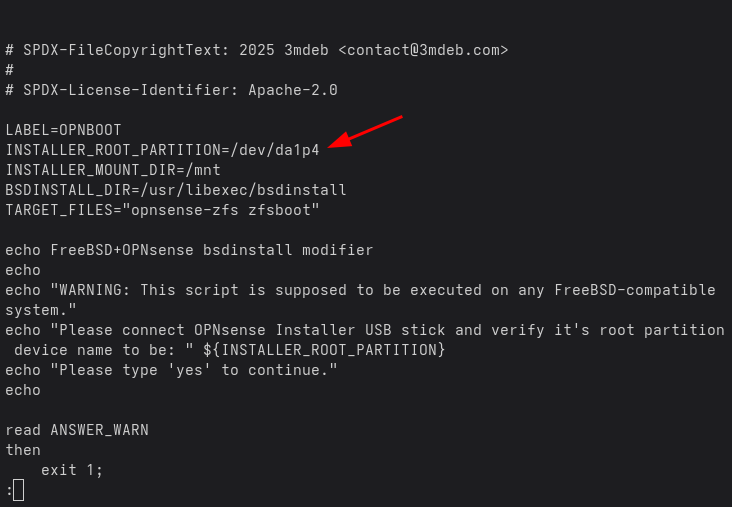{: style="width:480px"}

Save eventual changes and execute the script. Verify device name and confirm it
with `yes` and `ENTER`.

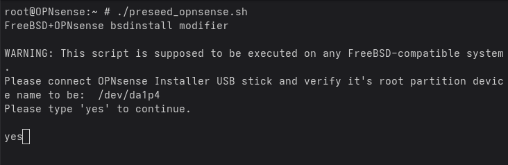{: style="width:480px"}

From now, any modified `bsdinstall` part would be listed and differencec would be
shown. Accept any change with `yes` and `ENTER`.

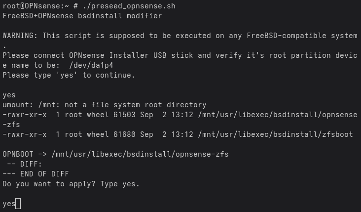{: style="width:480px"}

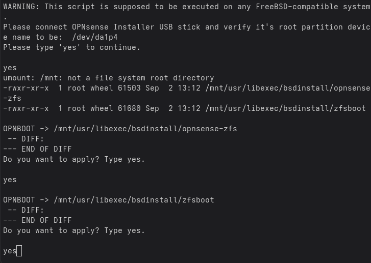{: style="width:480px"}

???+ notice
    DIFFs on the screenshots are empty, example execution has been done on
    already modified bsdinstall.

Script should exit without any errors:

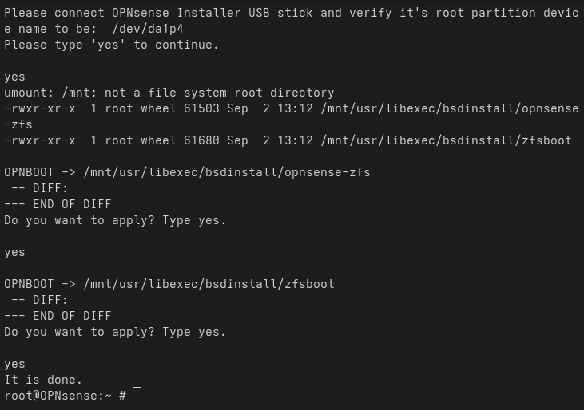{: style="width:480px"}

???+ success
    Installation media is now ready for further operation.

## Installation procedure

With installation media connected to DUT via USB and target drive connected to DUT
via SATA, run following test case:

```bash
OPN001.503 Install operating system on disk (OPNsense)
```

and wait for following dialog message:
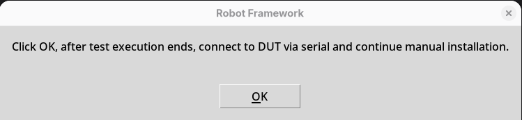{: style="width:480px"}

Confirm with `OK`, wait for test suite to finish, and connect to DUT via serial.

If nothing is displayed, try arrow keys, do not press `ENTER` at this point.

You should be asked for installer credentials. Log in with:

```bash
login: installer
Password: opnsense
```

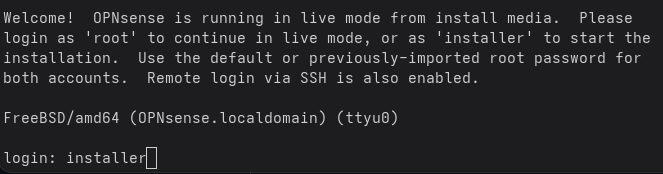{: style="width:480px"}

Now select keymap, or navigate to `Select` and confirm default with `ENTER`.

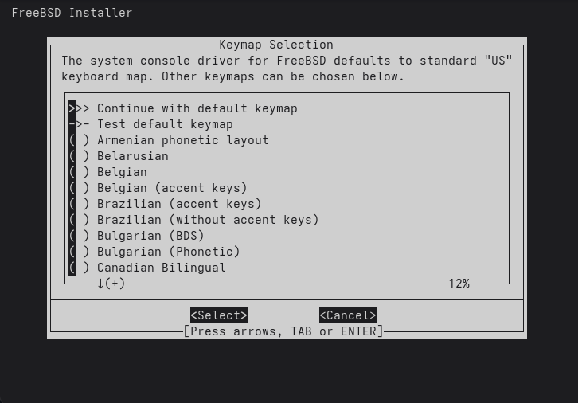{: style="width:480px"}

To begin installation, select `Install (ZFS)`, navigate to `OK` and press `ENTER`.

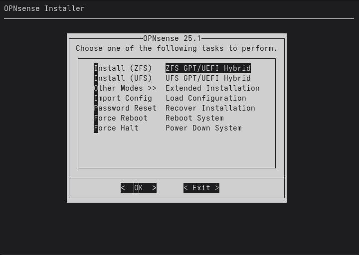{: style="width:480px"}

Now, the ZFS pool name question may appear:

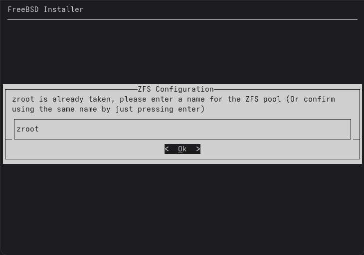{: style="width:480px"}

Confirm with `ENTER`.

Choose `stripe`, navigate to `OK` and press `ENTER`.

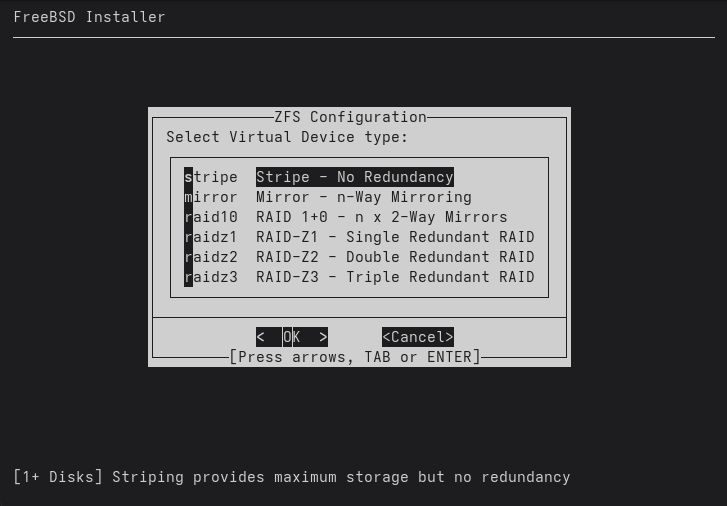{: style="width:480px"}

Mark `ada0` drive (this is first SATA drive) using `SPACE`, navigate to `OK`
using `TAB` and press `ENTER`:

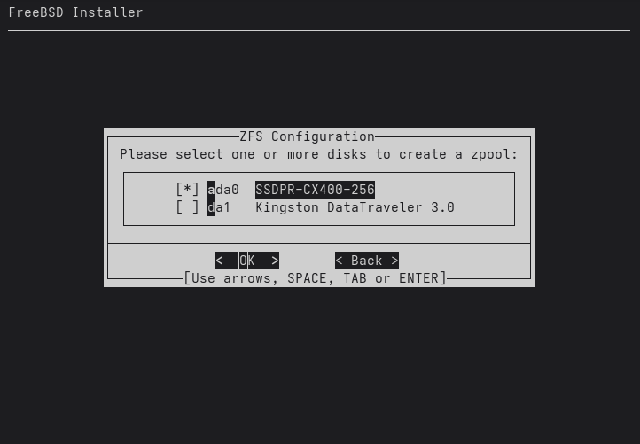{: style="width:480px"}

???+ warning
    Select installation target drive carefully. You will be asked for
    confirmation once again, right now.

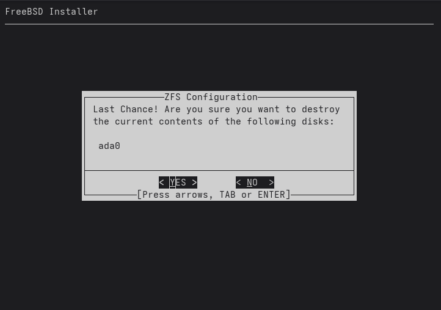{: style="width:480px"}

Installation now begins.

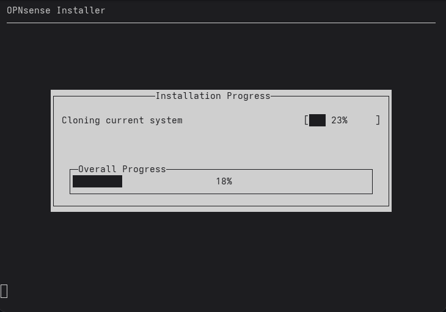{: style="width:480px"}

After installation finished, navigate to `Complete Install` and press `ENTER`.

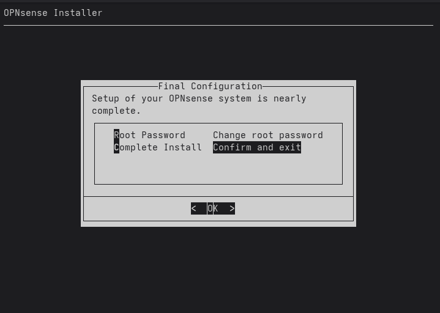{: style="width:480px"}

On next screen, select `Halt now` and press `ENTER`.

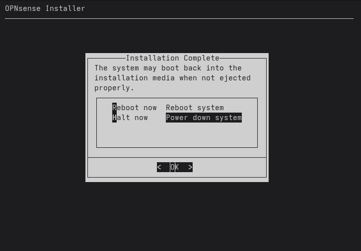{: style="width:480px"}

???+ success
    OPNsense installation is now finished. Testing environment will be able to boot
    this by OS searching for `OPNBOOT` ESP partition.

## Testing

To verify testing readiness of finished installation, OS boot test may be executed.
Run:

```bash
OPN002.503 Boot operating system from disk (OPNsense)
```

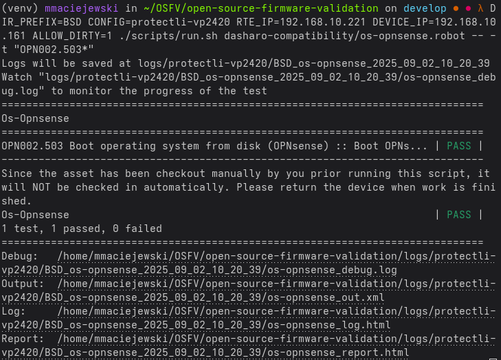{: style="width:480px"}
