# pfSense 2.7.2 installation guide for Protectli Vault series

## Introduction & installer pre-seed

This document describes preparation and usage of pfSense Serial Installer
in Dasharo testing environment. For start, an USB stick with pfSense serial
installer is required. All OSFV test IDs and names are referring to the following
test suite:

```bash
dasharo-oses/os-pfsense.robot
```

### Installation media preparation

Such an item may be prepared using `dd` program. Example:

```bash
sudo dd if=~/Downloads/pfSense-CE-memstick-serial-2.7.2-RELEASE-amd64.img of=/dev/sdX bs=1M status=progress

```

After `dd` command finished, execute:

```bash
sync
```

And after that, use `fatlabel` program, to rename ESP partition of USB stick.

```bash
sudo fatlabel /dev/sdX1 PFEFI
```

Label "PFEFI" is required by test cases PFS001.502, PFS006.502 & PFS007.502.

### Automated bsdinstall modification

Please run test case: `PFS006.502`

Follow the dialogs, confirm steps with `PASS`:

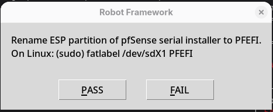{: style="width:320px"}

If already renamed the ESP, now move USB stick to DUT USB port:

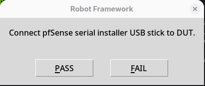{: style="width:320px"}

Confirm with `PASS` and wait for test to finish positively:
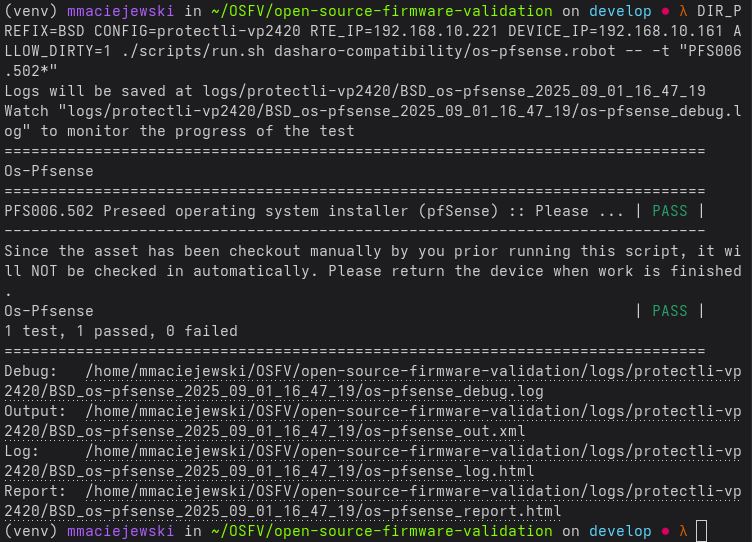{: style="width:480px"}

???+ success
    Installation media is now ready for further operation.

## Installation procedure

With installation media connected to DUT via USB and target drive connected to DUT
via SATA, run following test case:

```bash
PFS001.502 Install operating system on disk (pfSense)
```

and wait for following dialog message:
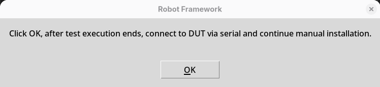{: style="width:480px"}

Confirm with `OK`, wait for test suite to finish, and connect to DUT via serial.

If nothing is displayed, try arrow keys, do not press `ENTER` at this point.

You will be asked for terminal type, confirm VT100 with `ENTER`:

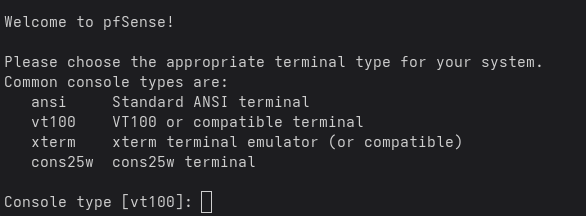{: style="width:480px"}

Then accept legal notice with `ENTER`:

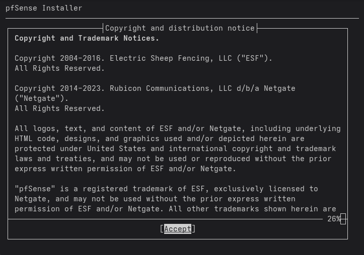{: style="width:480px"}

Then, in main menu select `Install pfSense`, navigate to `OK` and press `ENTER`.
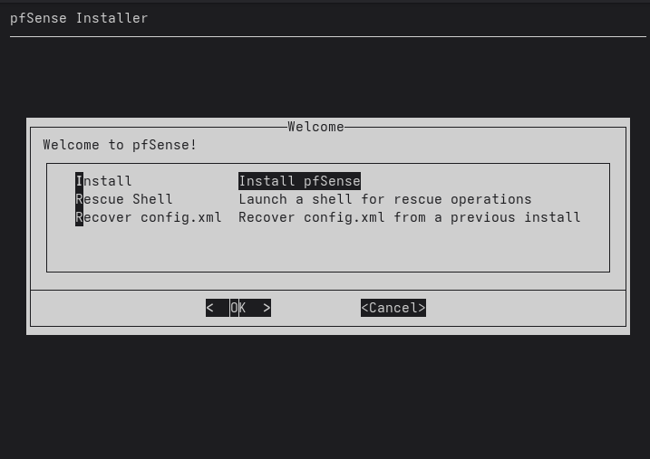{: style="width:480px"}

Now, the ZFS pool name question may appear:
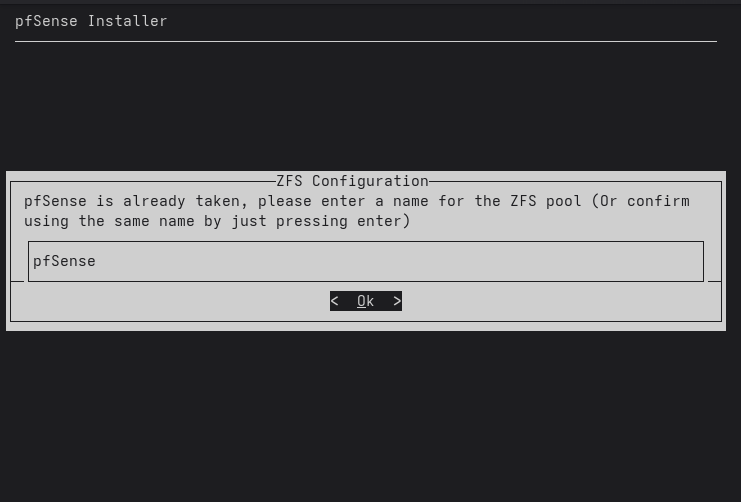{: style="width:480px"}

Confirm with `ENTER`.

Now select 'Pool Type/Disks' and press `ENTER`:
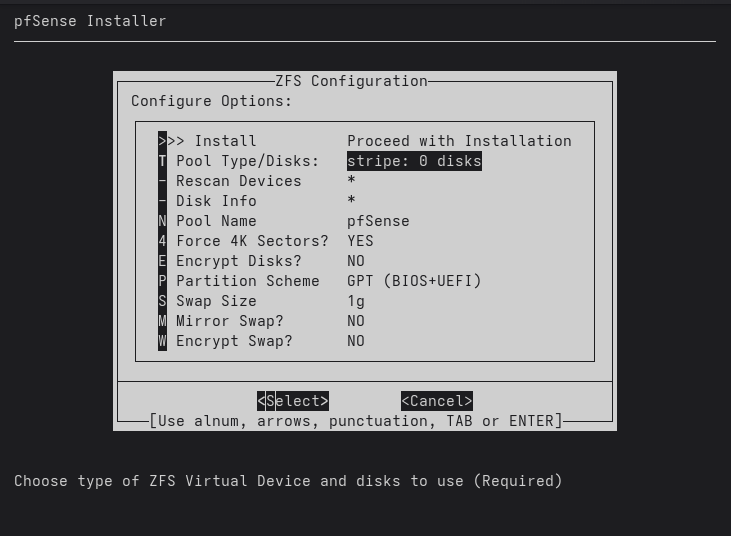{: style="width:480px"}

Select stripe, navigate to `OK` with `TAB` and press `ENTER`:
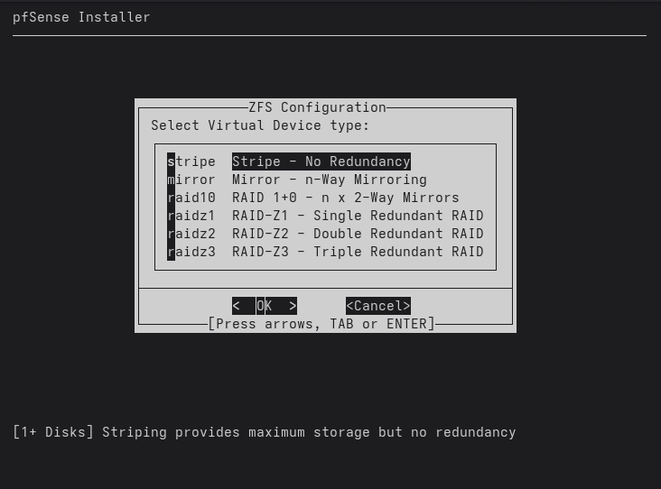{: style="width:480px"}

Mark `ada0` drive (this is first SATA drive) using `SPACE`, navigate to `OK`
using `TAB` and press `ENTER`:

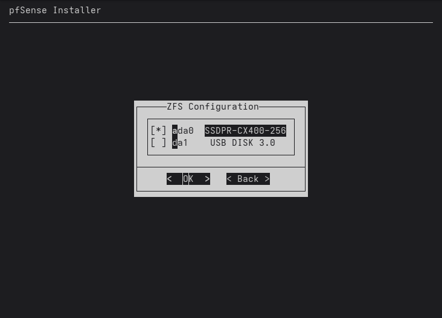{: style="width:480px"}

???+ warning
    Select installation target drive carefully. You will be asked for
    confirmation once again, before actual installation start.

On previous screen, select `Proceed with Installation` using arrow keys, navigate
to `Select` using `TAB` and press `ENTER`:

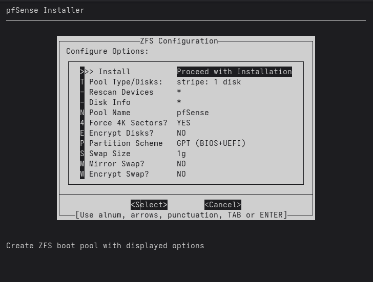{: style="width:480px"}

Asked for data destruction and `ada0`, select `YES` and press `ENTER`:
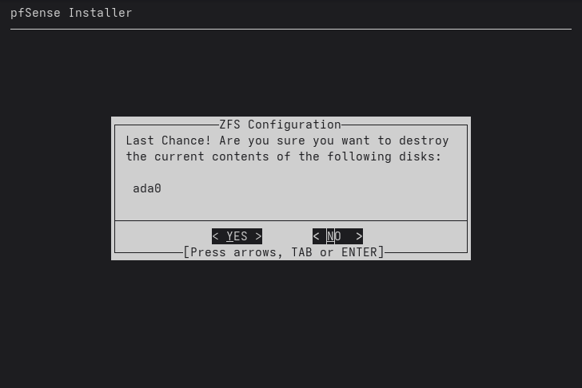{: style="width:480px"}

Installation now begins.

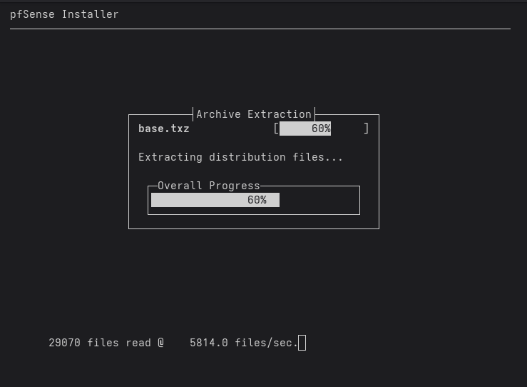{: style="width:480px"}

After installation finished, navigate to `Reboot` and press `ENTER`:
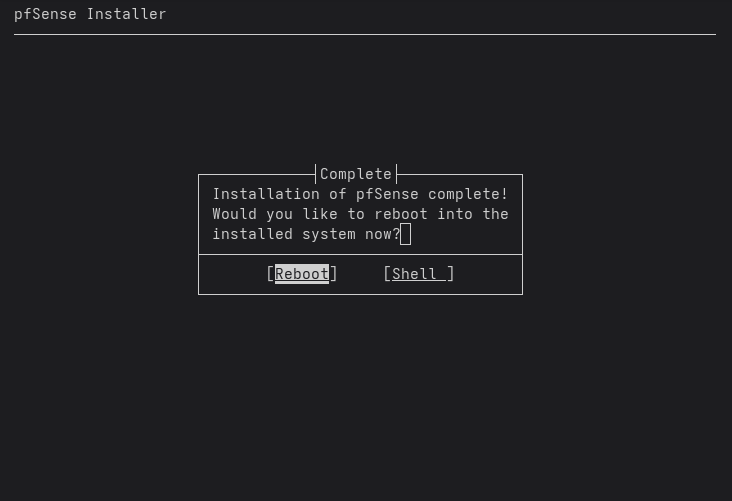{: style="width:480px"}

???+ tip
    Do not disconnect serial terminal connection yet!

## First boot

???+ tip
    To boot into installed OS, use Dasharo `Boot From File` functionality and
    navigate to ESP partition labeled `PFBOOT`.

After first reboot, you have to configure WAN network interface name manually.
Type in the name of network interface which is connected to lab network, usually
first on the list in the brackets, and press `ENTER`.
Do not enter LAN interface name, press `ENTER` again.
Confirm interfaces assignment with `y` and press `ENTER`.

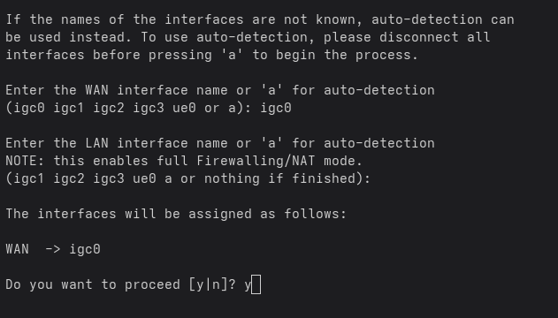{: style="width:480px"}

Wait until pfSense main menu appears, choose to either halt or reboot,
confirm with `Y`:
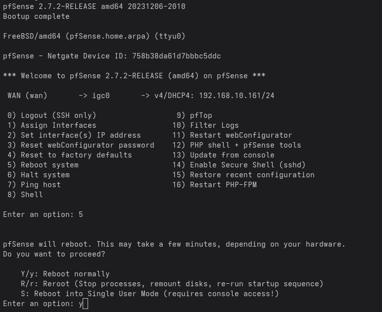{: style="width:480px"}

???+ success
    pfSense installation & configuration is now finished. The testing environment
    will be able to boot this OS by searching for `PFBOOT` ESP partition.

## Testing

To verify testing readiness of finished installation, OS boot test may be executed.
Run:

```bash
PFS002.502 Boot operating system from disk (pfSense)
```

and check test output, expecting PASS:

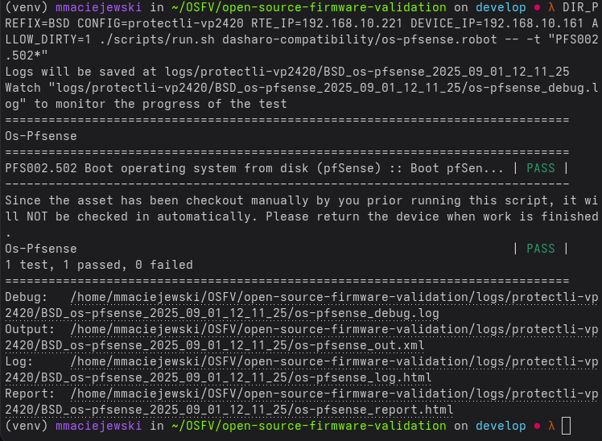{: style="width:480px"}
