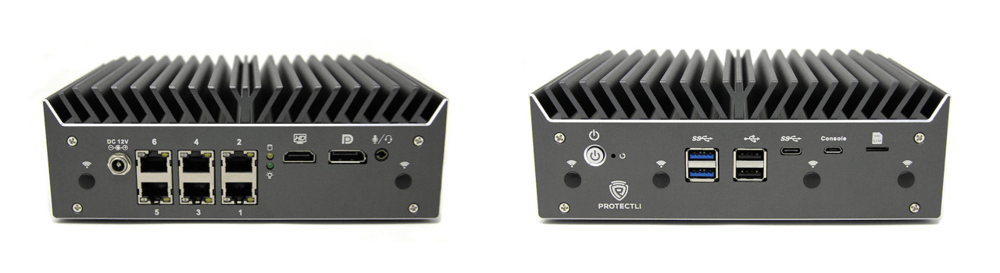
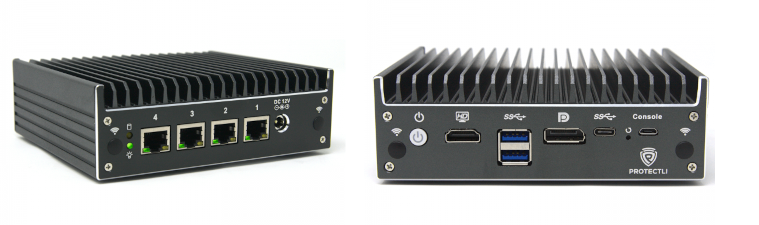
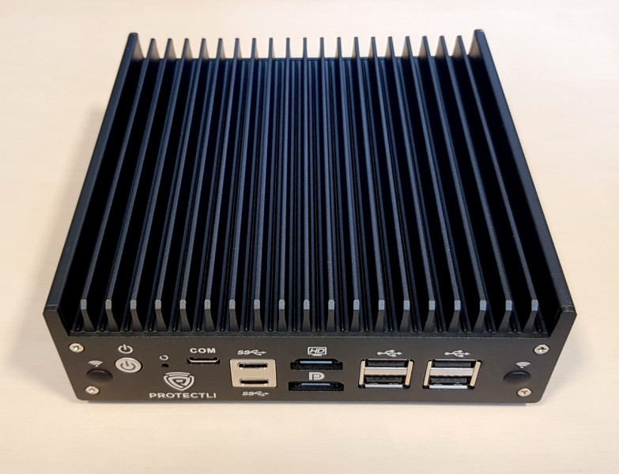

# Overview

## Unified documentation

* [Building manual](./building-manual.md) - how to build Dasharo for Protectli
    platforms
* [Initial deployment](./initial-deployment.md) - initial Dasharo deployment
    methods (i. e. flashing new firmware) for Protectli platforms
* [Firmware update](./firmware-update.md) - explains supported Dasharo firmware
    update methods
* [Recovery](./recovery.md) - how to recover a platform from a potential
    failure (brick)
* [Post-installation setup](./post-install.md)
* [Test matrix](./test-matrix.md) - validation scope for Protectli platforms

## Available models

=== "FW6"

    * [Releases](../../variants/protectli_fw6/releases.md) - list of all releases
    * [Hardware configuration matrix](../../variants/protectli_fw6/hardware-matrix.md)
        \- definition of hardware configuration used during validation

=== "V1000-series"
    The Vault is a small form network appliance built for use as a firewall /
    router, virtualization platform, a daily-driven personal computer, and more.
    The V1000 series feature an Intel Jasper Lake CPU, soldered down LPDDR4X
    memory, Intel i225-V/i226-V 2.5G Ethernet ports, 4x USB-A 3.x ports, eMMC,
    PCIe NVMe storage, M.2 WIFI and WWAN slots, serial console over USB-C and
    a firmware TPM.

    * V1210 - Intel® Celeron® N5105, 2x i225/i226, 4GB LPDDR4X
    * V1211 - Intel® Celeron® N5105, 2x i225/i226, 8GB LPDDR4X
    * V1410 - Intel® Celeron® N5105, 4x i225/i226, 8GB LPDDR4X
    * V1610 - Intel® Pentium® Silver N6005, 6x i225/i226, 16GB LPDDR4X

    ## Documentation sections

    * [Releases](
        ../../variants/protectli_v1000-series/releases.md)
      - groups information about all releases.
    * [Hardware configuration matrix](
        ../../variants/protectli_v1000-series/hardware-matrix.md)
        - describes the platform's hardware configuration used during the
        Dasharo firmware validation procedure.

=== "VP4630/VP4650/VP4670"
    The Vault is a small form network appliance built for use as a firewall /
    router, virtualization platform, a daily-driven personal computer, and more.
    The VP46XX is the second platform of the Vault Pro series with higher
    performance and newer technology than the original FW6 series.

    

    The VP46XX features an Intel 10th Generation CPU, 2x DDR4 DIMM modules, 6x
    Intel i225-V 2.5G Ethernet ports, PCIe x4/SATA NVMe storage, LPC TPM, M.2
    WIFI and WWAN slots.

    * VP4630 - Intel Core i3-10110U
    * VP4650 - Intel Core i5-10210U
    * VP4670 - Intel Core i7-10810U (both v1 and v2 versions, see the
    [Intel FSP repo for details](
        https://github.com/intel/FSP/tree/master/CometLakeFspBinPkg#differentiating-cometlake1-and-cometlake2))

    > Starting with Dasharo [v1.0.19](../../variants/protectli_vp46xx/releases.md#v1019-2022-12-08)
    > Intel ME (Management Engine) is
    > [soft-disabled](../../osf-trivia-list/me.md#soft-disabling-me).

    For more information please refer to the references below.

    ## References

    * [Buy VP4630 in Protectli shop](https://protectli.com/product/vp4630/)

    ## Documentation sections

    * [Releases](../../variants/protectli_vp46xx/releases.md) - groups
        information about all releases.
    * [Hardware configuration matrix](
        ../../variants/protectli_vp46xx/hardware-matrix.md) -
        describes the
        platform's hardware configuration used during the Dasharo firmware
        validation procedure.

=== "VP2410"
    The Vault Pro is a small form network appliance built for use as a firewall
    / router, virtualization platform, a daily-driven personal computer,
    and more. The VP2410 is based on a 4 network port design that leverages
    a low power, but versatile Intel Celeron J4125 CPU.

    

    The VP2410 can accommodate up to 16GB DDR4 RAM and 2TB m.2 SATA SSD
    storage drive. The built-in 8GB eMMC module can be used for booting a
    light-weight OS for example, or for use as optional storage.

    VP2410 specification:

    * Intel Celeron® J4125 Quad Core at 2 GHz (Burst up to 2.7 GHz)
    * 4 Intel® Gigabit Ethernet NIC ports
    * 8GB eMMC module on board
    * Intel® AES-NI support
    * Fanless and Silent
    * Included 12v Power Supply, VESA mount kit, Serial Console Cable,
      SATA data and power cables for internal SSD, Quick Start Guide

    > On VP2410 Intel ME (Management Engine) is not supported by coreboot
    > causing Intel ME to enter recovery mode giving similar results to
    > disabled ME.

    For more information please refer to the references below.

    ## References

    * [Protectli knowledge base](https://kb.protectli.com/)
    * [Buy VP2410 in Protectli shop](https://eu.protectli.com/product/vp2410)

    ## Documentation sections

    * [Releases](../../variants/protectli_vp2410/releases.md) - groups
        information about all releases.
    * [Hardware configuration matrix](
        ../../variants/protectli_vp2410/hardware-matrix.md) -
        describes the platform's hardware configuration used during the Dasharo
        firmware validation procedure.

=== "VP2420"
    The Vault Pro is a small form network appliance built for use as a firewall
    / router, virtualization platform, a daily-driven personal computer,
    and more. The VP2420 is based on a 4 x 2.5 G network port design that
    leverages a low power, but versatile Intel Celeron J6412 CPU.

    

    The VP2420 can accommodate up to 32 GB DDR4 RAM and 2 TB M.2 SATA SSD
    storage drive (Note: The VP2420 supports M.2 SATA drives, not NVMe
    drives). The built-in 8 GB eMMC module can be used for booting a
    light-weight OS for example, or for use as optional storage.

    VP2420 specification:

    * Intel Celeron® J6412 Quad Core at 2 GHz (Burst up to 2.6 GHz)
    * 4 Intel® 2.5 Gigabit Ethernet NIC ports
    * M.2 SATA SSD Slot (Note: This device does not support NVMe drives)
    * 8 GB eMMC module on board
    * Intel® AES-NI support
    * Fanless and Silent
    * Included 12v Power Supply, VESA mount kit, Serial Console Cable,
      SATA data and power cables for internal SSD, Quick Start Guide

    > Starting with Dasharo [v1.2.0](../../variants/protectli_vp2420/releases.md#v120-2024-05-16), Intel ME
    > (Management Engine) is
    > [soft-disabled](../../osf-trivia-list/me.md#soft-disabling-me) by
    > default.

    For more information please refer to the references below.`

    ## References

    * [Protectli knowledge base](https://kb.protectli.com/)
    * [Buy VP2420 in Protectli shop](https://eu.protectli.com/product/vp2420/)

    ## Documentation sections

    * [Releases](../../variants/protectli_vp2420/releases.md) - groups
        information about all releases.
    * [Hardware configuration matrix](
        ../../variants/protectli_vp2420/hardware-matrix.md) -
        describes the platform's hardware configuration used during the Dasharo
        firmware validation procedure.

=== "VP2430"
    The VP2430 is a small form network appliance built for use as a firewall
    / router, virtualization platform, a daily-driven personal computer,
    and more. A major difference setting it apart from its predecessors is the
    CPU. While the 2410 and 2420 models both utilize a J-series Intel Celeron,
    the VP2430 comes equipped with a more recent Alder Lake N-series CPU. This
    means a significant improvement in performance, at a comparable power
    consumption level. It also features 4 x 2.5G i226 ethernet ports.

    

    The VP2430 can accommodate up to 16 GB DDR5 RAM and and a M.2 NVMe SSD
    storage drive. The built-in 32 GB eMMC module can be used for booting a
    light-weight OS for example, or for use as optional storage.

    VP2430 specification:

    * Intel® Processor N150 Quad Core, 6M Cache, up to 3.4 GHz
    * 4 Intel® 2.5 Gigabit Ethernet NIC ports
    * M.2 NVMe SSD Slot
    * 32 GB eMMC module on board
    * Fanless and Silent
    * Included 12v Power Supply, VESA mount kit, Serial Console Cable,
      SATA data and power cables for internal SSD, Quick Start Guide

    * [Protectli knowledge base](https://kb.protectli.com/)
    * [Buy VP2430 in Protectli shop](https://eu.protectli.com/product/vp2430/)

    ## Documentation sections

    * [Releases](../../variants/protectli_vp2430/releases.md) - groups
        information about all releases.
    * [Building manual](./building-manual.md) -
        describes how to build Dasharo for Protectli 2430.
    * [Initial deployment](
        ./initial-deployment.md) -
        describes initial Dasharo deployment methods (i. e. flashing new
        firmware) for Protectli VP2430.
    * [Recovery](./recovery.md) - gathers
        information on how to recover the platform from potential failure.
    * [Hardware configuration matrix](
        ../../variants/protectli_vp2430/hardware-matrix.md) -
        describes the platform's hardware configuration used during the Dasharo
        firmware validation procedure.
    * [Test matrix](./test-matrix.md) - describes
        validation scope used during Dasharo firmware validation procedure.

=== "VP6630/VP6650/VP6670"
    The Vault is a small form network appliance built for use as a firewall /
    router, virtualization platform, a daily-driven personal computer, and more.
    The VP6630/VP6650/VP6670 feature an Intel Alder Lake-P CPU, 2x DDR5 SODIMM
    memory, Intel i225-V/i226-V 2.5G Ethernet ports, 2x SFP Intel X710, 4x USB-A
    ports (1x 3.1, 3x 2.0), one internal USB-A 3.1, 1x USB-C with PD, PCIe NVMe
    storage, M.2 WIFI and WWAN slots, 2x serial console over USB-C and RJ45, SPI
    TPM, 2 CPU fans.

    * VP6630 - Intel® Core™ i3 -1215U
    * VP6650 - Intel® Core™ i5 -1235U
    * VP6670 - Intel® Core™ i7 -1255U

    > On VP66XX Intel ME (Management Engine) is disabled by using the
    > [HAP bit](../../osf-trivia-list/me.md#hap-altmedisable-bit-aka-disabling-me).

    ## Documentation sections

    * [Releases](../../variants/protectli_vp66xx/releases.md) - groups
        information about all releases.
    * [Hardware configuration matrix](
        ../../variants/protectli_vp66xx/hardware-matrix.md) -
        describes the platform's hardware configuration used during the Dasharo
        firmwarevalidation procedure.

=== "VP3210/VP3230"
    The Vault Pro is a small form network appliance built for use as a firewall
    / router, virtualization platform, a daily-driven personal computer,
    and more. The VP3210/VP3230 is based on a 2 x 2.5 G network port
    design that leverages a low power, but versatile Alder Lake-N SoCs.

    

    The VP3210/VP3230 can accommodate up to 48 GB DDR5 RAM and 4 TB M.2
    NVMe SSD storage drive. The built-in 32 GB eMMC module can be used for
    booting a light-weight OS for example, or for use as optional storage.

    VP3210/VP3230 specification:

    * VP3210: Intel® N100 4 Core / 4 Thread (up to 3.4Ghz)
    * VP3230: Intel® i3-N305 8 Core / 8 Thread (up to 3.8Ghz)
    * 2 Intel® 2.5 Gigabit Ethernet NIC ports
    * 2x M.2 NVMe SSD Slot (one with x4 link and second with x1 link)
    * 32 GB eMMC module on board
    * Intel® AES-NI support
    * Fanless and Silent
    * 4x 2.5″ SSD connectors and mounts
    * Included 12V/90W (VP3230) or 12V/60W (VP3210) Power Supply, Serial
      Console Cable, USB-C Cable, SATA data and power cables for internal SSDs,
      Quick Start Guide

    > Intel ME (Management Engine) is
    > [soft-disabled](../../osf-trivia-list/me.md#soft-disabling-me) by default.

    For more information please refer to the references below.

    ## References

    * [Protectli knowledge base](https://kb.protectli.com/)
    * [Buy VP3210 in Protectli shop](https://eu.protectli.com/product/vp3210/)
    * [Buy VP3230 in Protectli shop](https://eu.protectli.com/product/vp3230/)

    ## Documentation sections

    * [Releases](../../variants/protectli_vp32xx/releases.md) - groups
        information about all releases.
    * [Building manual](./building-manual.md) -
        describes how to build Dasharo for Protecli VP3210/VP3230.
    * [Initial deployment](
        ./initial-deployment.md) -
        describes initial Dasharo deployment methods (i. e. flashing new
        firmware) for Protectli VP3210/VP3230.
    * [Recovery](./recovery.md) - gathers
        information on how to recover the platform from potential failure.
    * [Hardware configuration matrix](
        ../../variants/protectli_vp32xx/hardware-matrix.md) -
        describes the platform's hardware configuration used during the Dasharo
        firmware validation procedure.
    * [Test matrix](./test-matrix.md) - describes
        validation scope used during Dasharo firmware validation procedure.
