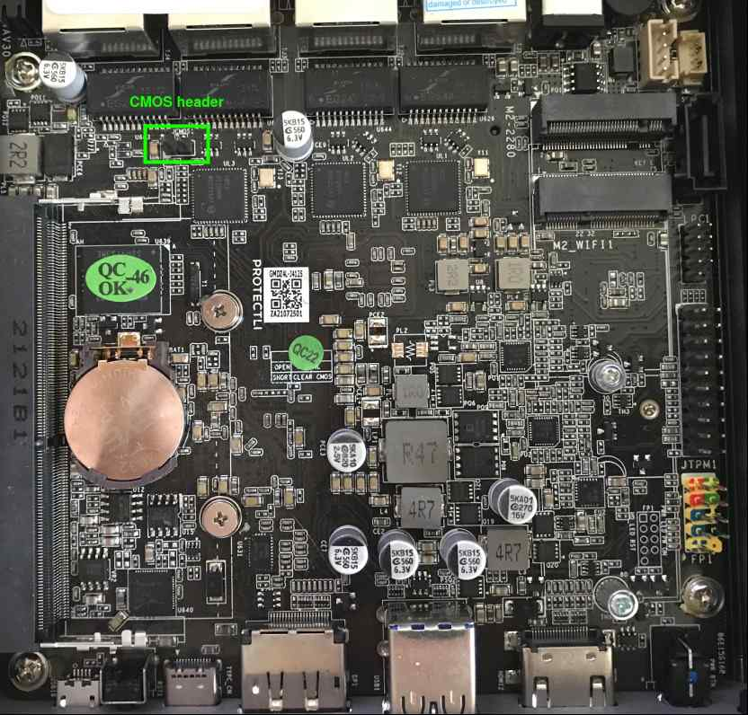
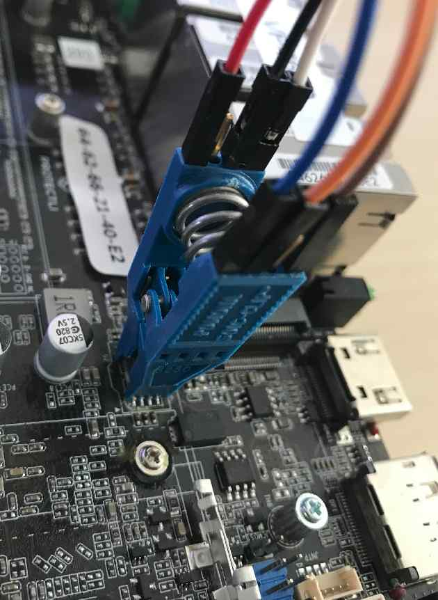

# Recovery

## Intro

The following documentation describes the process of recovering hardware from
the brick state using an [RTE](../../transparent-validation/rte/introduction.md)
and Dasharo open-source firmware.

=== "v1000-series"

    ## Prerequisites

    * [Prepared RTE](../../transparent-validation/rte/v1.1.0/quick-start-guide.md)
    * 6x female-female wire cables

    ## Connections

    To prepare the stand for flashing follow the steps described below:

    1. Open the platform cover.
    2. Connect the 6-pin flash header to the
    [SPI header](../../transparent-validation/rte/v1.1.0/specification.md)
    on RTE.

        | SPI header | 6 pin header |
        |:----------:|:------------:|
        | Vcc        | pin 1 (Vcc)  |
        | GND        | pin 2 (GND)  |
        | CS         | pin 4 (CS)   |
        | SCLK       | pin 6 (CLK)  |
        | MISO       | pin 5 (MISO) |
        | MOSI       | pin 3 (MOSI) |

        ```txt
                    ______
                >  |      |
        Vcc 3.3V  ----1  2----  GND
                    |      |
            MOSI  ----3  4----  CS
                    |      |
            MISO  ----5  6----  CLK
                    |______|
        ```

    ## Firmware flashing

    To flash firmware follow the steps described below:

    1. Login to RTE via `ssh` or `minicom`.
    2. Turn on the platform by connecting the power supply.
    3. Wait at least 5 seconds.
    4. Turn off the platform by using the power button.
    5. Wait at least 3 seconds.
    6. Set the proper state of the SPI by using the following commands on RTE:

        ```bash
        # set SPI Vcc to 3.3V
        echo 1 > /sys/class/gpio/gpio405/value
        # SPI Vcc on
        echo 1 > /sys/class/gpio/gpio406/value
        # SPI lines ON
        echo 1 > /sys/class/gpio/gpio404/value
        ```

    7. Wait at least 2 seconds.
    8. Disconnect the power supply from the platform.
    9. Wait at least 2 seconds.
    10. Flash the platform by using the following command:

        ```bash
        flashrom -p linux_spi:dev=/dev/spidev1.0,spispeed=16000 -w [path_to_binary]
        ```

        > Flashing with flashrom takes about 1 minute.

    11. Change back the state of the SPI by using the following commands:

        ```bash
        echo 0 > /sys/class/gpio/gpio404/value
        echo 0 > /sys/class/gpio/gpio406/value
        ```

    12. Turn on the platform by connecting the power supply.

    The first boot of the platform after proceeding with the above procedure can
    take much longer than standard.

=== "vp46xx"

    ## Connections

    Set up the connections required for external flashing as described in
    [Generic Testing Stand Setup](../../unified-test-documentation/generic-testing-stand-setup.md).
    Protectli VP46XX are flashed using the Pomona clip connection variant. Use
    the pictures below to easily locate essential components on the mainboard.

    ### SPI flash chip location

    

    ### CMOS header location

    

    ## Firmware flashing

    To flash firmware, follow the steps described in
    [Generic Testing Stand Setup](../../unified-test-documentation/generic-testing-stand-setup.md)
    , noting that:
    * The chip voltage for this platform is **3.3V**
    * The proper flashrom parameters for this platform are:

        ```bash
        flashrom -p linux_spi:dev=/dev/spidev1.0,spispeed=16000 -c "MX25L12835F/MX25L12845E/MX25L12865E" -w [path_to_binary]
        ```

=== "vp66xx"

    ## Prerequisites

    * [Prepared RTE](../../transparent-validation/rte/v1.1.0/quick-start-guide.md)
    * 6x female-female wire cables

    ## Connections

    To prepare the stand for flashing follow the steps described below:

    1. Open the platform cover.
    2. Connect the J1 and J2 flash headers to the [SPI
    header](../../transparent-validation/rte/v1.1.0/specification.md) on RTE.

        | SPI header | VP66xx J2    |
        |:----------:|:------------:|
        | Vcc        | pin 1 (Vcc)  |
        | SCLK       | pin 3 (CLK)  |
        | MOSI       | pin 4 (MOSI) |

        | SPI header | VP66xx J1    |
        |:----------:|:------------:|
        | GND        | pin 4 (GND)  |
        | CS         | pin 1 (CS)   |
        | MISO       | pin 2 (MISO) |

    ## Firmware flashing

    To flash firmware follow the steps described below:

    3. Login to RTE via `ssh` or `minicom`.
    4. Turn on the platform by connecting the power supply.
    5. Wait at least 5 seconds.
    6. Turn off the platform by using the power button.
    7. Wait at least 3 seconds.
    8. Set the proper state of the SPI by using the following commands on RTE:

        ```bash
        # set SPI Vcc to 3.3V
        echo 1 > /sys/class/gpio/gpio405/value
        # SPI Vcc on
        echo 1 > /sys/class/gpio/gpio406/value
        # SPI lines ON
        echo 1 > /sys/class/gpio/gpio404/value
        ```

    9. Wait at least 2 seconds.
    10. Disconnect the power supply from the platform.
    11. Wait at least 2 seconds.
    12. Flash the platform by using the following command:

        ```bash
        flashrom -p linux_spi:dev=/dev/spidev1.0,spispeed=16000 -w [path_to_binary]
        ```

        > Flashing with flashrom takes about 1 minute.

    13. Change back the state of the SPI by using the following commands:

        ```bash
        echo 0 > /sys/class/gpio/gpio404/value
        echo 0 > /sys/class/gpio/gpio406/value
        ```

    14. Reset the CMOS battery (short JCMOS1 header for a couple of seconds).
    15. Turn on the platform by connecting the power supply.

    The first boot of the platform after proceeding with the above procedure can
    take much longer than standard.

=== "vp2410"

    ## Connections

    Set up the connections required for external flashing as described in
    [Generic Testing Stand Setup](../../unified-test-documentation/generic-testing-stand-setup.md)
    Protectli VP2410 are flashed using the Pomona clip connection variant. Use
    the pictures below to easily locate essential components on the mainboard.

    ### SPI flash chip location

    Completely remove the motherboard from the platform cover.

    
    

    > If there is little thermal paste on the CPU, apply it before reassembling
    > the motherboard to the platform cover.

    ### CMOS header location

    

    ## Firmware flashing

    To flash firmware, follow the steps described in
    [Generic Testing Stand Setup](../../unified-test-documentation/generic-testing-stand-setup.md)
    , noting that:
    * The chip voltage for this platform is **1.8V**
    * The proper flashrom parameters for this platform are:

        ```bash
        flashrom -p linux_spi:dev=/dev/spidev1.0,spispeed=16000 -c "MX25U6435E/F" -w [path_to_binary]
        ```

=== "vp2420"

    ## Prerequisites

    * [Prepared RTE](../../transparent-validation/rte/v1.1.0/quick-start-guide.md)
    * SOIC-8 Pomona clip
    * 6x female-female wire cables

    ## Connections

    Set up the connections required for external flashing as described in
    [Generic Testing Stand Setup](../../unified-test-documentation/generic-testing-stand-setup.md).
    Protectli VP2420 are flashed using the Pomona clip connection variant. Use
    the pictures below to easily locate essential components on the mainboard.

    ### SPI flash chip

    
    
    

    ### CMOS header

    

    ## Firmware flashing

    To flash firmware, follow the steps described in
    [Generic Testing Stand Setup](../../unified-test-documentation/generic-testing-stand-setup.md)
    , noting that:
    * The chip voltage for this platform is **3.3V**
    * The proper flashrom parameters for this platform are:

        ```bash
        flashrom -p linux_spi:dev=/dev/spidev1.0,spispeed=16000 -c "MX25L12835F/MX25L12845E/MX25L12865E" -w [path_to_binary]
        ```
