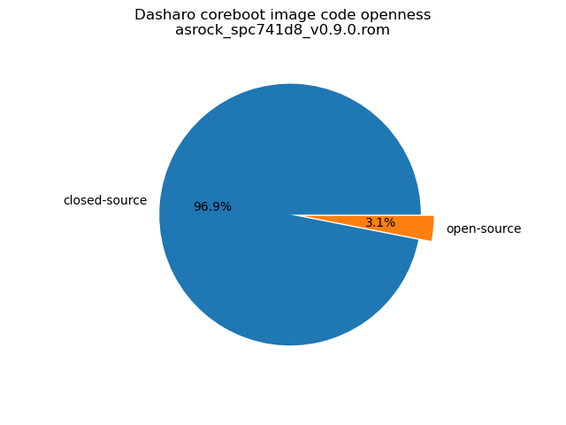
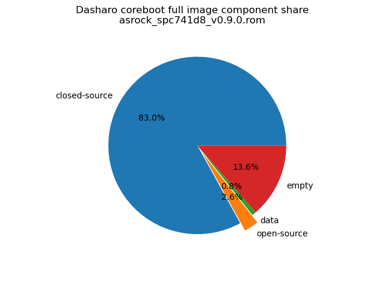

# Dasharo Openness Score

This page contains the [Dasharo Openness
Score](../../glossary.md#dasharo-openness-score) for ASRock Rack
SPC741D8-2L2T/BCM Dasharo releases. The content of the page is generated with
[Dasharo Openness Score utility](https://github.com/Dasharo/Openness-Score).

## v0.9.0

Openness Score for asrock_spc741d8_v0.9.0.rom

Open-source code percentage: **3.1%**
Closed-source code percentage: **96.9%**

* Image size: 67108864 (0x4000000)
* Number of regions: 12
* Number of CBFSes: 2
* Total open-source code size: 1765610 (0x1af0ea)
* Total closed-source code size: 55703536 (0x351f7f0)
* Total data size: 505110 (0x7b516)
* Total empty size: 9134608 (0x8b6210)

> Numbers given above already include the calculations from CBFS regions
> presented below

### FMAP regions

| FMAP region | Offset | Size | Category |
| ----------- | ------ | ---- | -------- |
| SI_ME | 0x1000 | 0x2fef000 | closed-source |
| SI_DESC | 0x0 | 0x1000 | data |
| RW_MRC_CACHE | 0x3000000 | 0x10000 | data |
| SMMSTORE | 0x3010000 | 0x40000 | data |
| FMAP | 0x3150000 | 0x800 | data |
| RW_VPD | 0x3150800 | 0x4000 | data |
| RO_VPD | 0x3154800 | 0x4000 | data |
| CONSOLE | 0x3158800 | 0x20000 | data |

### CBFS BOOTSPLASH

* CBFS size: 1048576
* Number of files: 1
* Open-source files size: 0 (0x0)
* Closed-source files size: 0 (0x0)
* Data size: 28 (0x1c)
* Empty size: 1048548 (0xfffe4)

> Numbers given above are already normalized (i.e. they already include size
> of metadata and possible closed-source LAN drivers included in the payload
> which are not visible in the table below)

| CBFS filename | CBFS filetype | Size | Compression | Category |
| ------------- | ------------- | ---- | ----------- | -------- |
| (empty) | null | 1048548 | none | empty |

### CBFS COREBOOT

* CBFS size: 15235072
* Number of files: 18
* Open-source files size: 1765610 (0x1af0ea)
* Closed-source files size: 5375984 (0x5207f0)
* Data size: 7418 (0x1cfa)
* Empty size: 8086060 (0x7b622c)

> Numbers given above are already normalized (i.e. they already include size
> of metadata and possible closed-source LAN drivers included in the payload
> which are not visible in the table below)

| CBFS filename | CBFS filetype | Size | Compression | Category |
| ------------- | ------------- | ---- | ----------- | -------- |
| fallback/payload | simple elf | 1497612 | none | open-source |
| fallback/romstage | stage | 49192 | none | open-source |
| fallback/ramstage | stage | 141656 | LZMA | open-source |
| fallback/dsdt.aml | raw | 18414 | none | open-source |
| fallback/postcar | stage | 30064 | none | open-source |
| bootblock | bootblock | 28672 | none | open-source |
| cpu_microcode_blob.bin | microcode | 1782784 | none | closed-source |
| fspm.bin | fsp | 3375104 | none | closed-source |
| fsps.bin | fsp | 185328 | LZ4 | closed-source |
| fspt.bin | fsp | 32768 | none | closed-source |
| cbfs_master_header | cbfs header | 32 | none | data |
| intel_fit | intel_fit | 80 | none | data |
| config | raw | 4515 | LZMA | data |
| revision | raw | 855 | none | data |
| build_info | raw | 107 | none | data |
| (empty) | null | 3492 | none | empty |
| (empty) | null | 8013028 | none | empty |
| (empty) | null | 69540 | none | empty |
