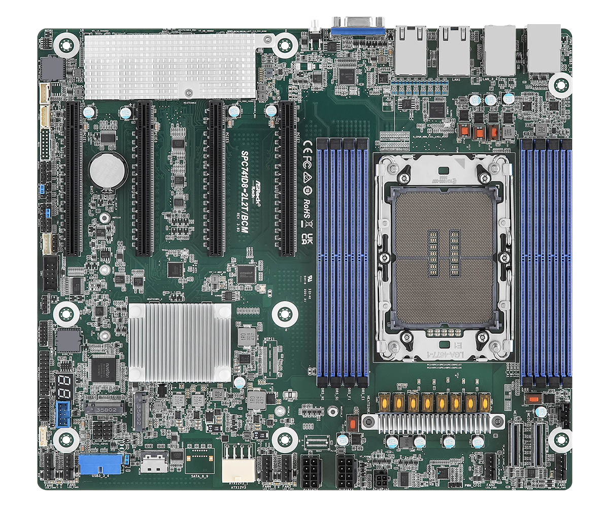

# Overview

## ASRock Rack SPC741D8-2L2T/BCM

ASRock Rack SPC741D8-2L2T/BCM is a full-fledged single socket server board
supporting Intel Sapphire Rapids processors.

We gratefully acknowledge the [https://os.itec.kit.edu](https://os.itec.kit.edu)
(Operating Systems Group) at Karlsruhe Institute of Technology (Fabian Meyer,
Felix Zimmer, Yussuf Khalil) for their contribution in initiating the coreboot
port for this platform and supporting open-source firmware development.

## Documentation

- [Releases](./releases.md) - Groups information about all releases.
- [Building Manual](./building-manual.md) - Describes how to build Dasharo
  compatible with the ASRock Rack SPC741D8-2L2T/BCM.
- [Initial Deployment](./initial-deployment.md) - Describes initial Dasharo
  deployment methods (i. e. flashing new firmware) compatible with ASRock Rack
  SPC741D8-2L2T/BCM.
- [Recovery](./recovery.md) - Gathers information on how to recover the platform
    from potential failure.
- [Hardware Configuration Matrix](./hardware-matrix.md) - Describes the
    platform's hardware configuration used during the Dasharo firmware
    validation procedure.
- [Test Matrix](./test-matrix.md) - Describes validation scope used during
    Dasharo firmware validation procedure.
