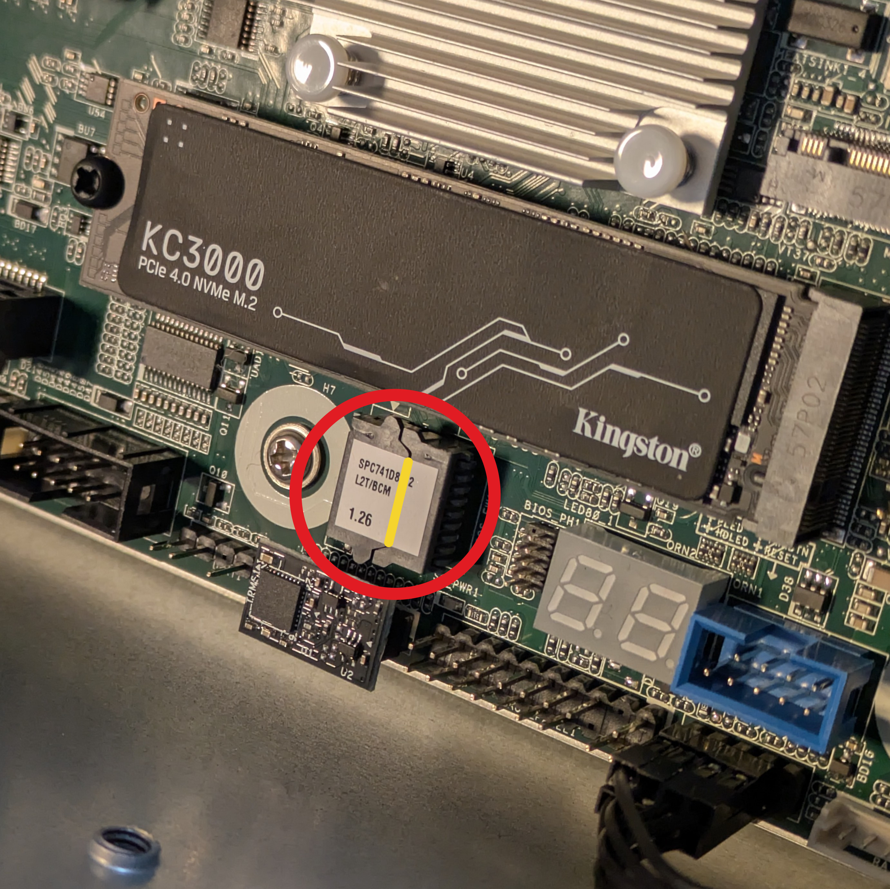
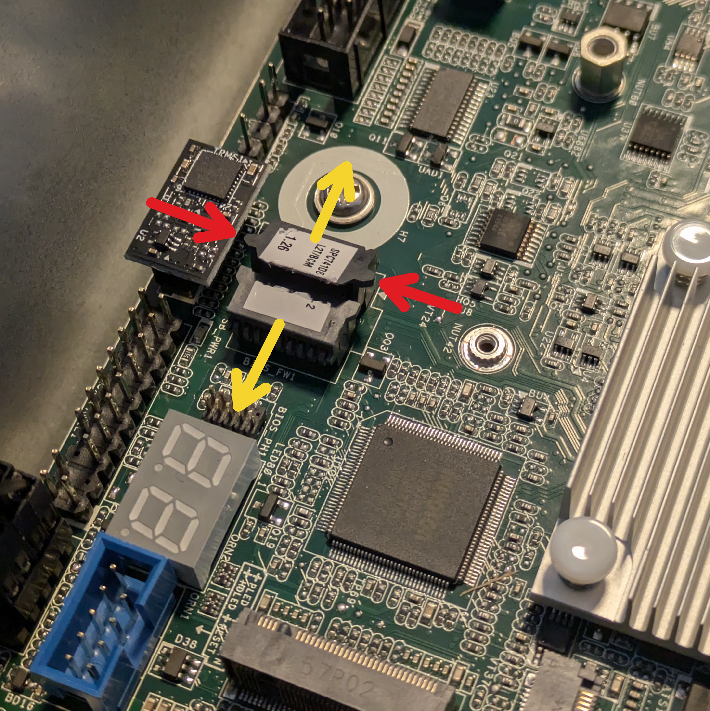
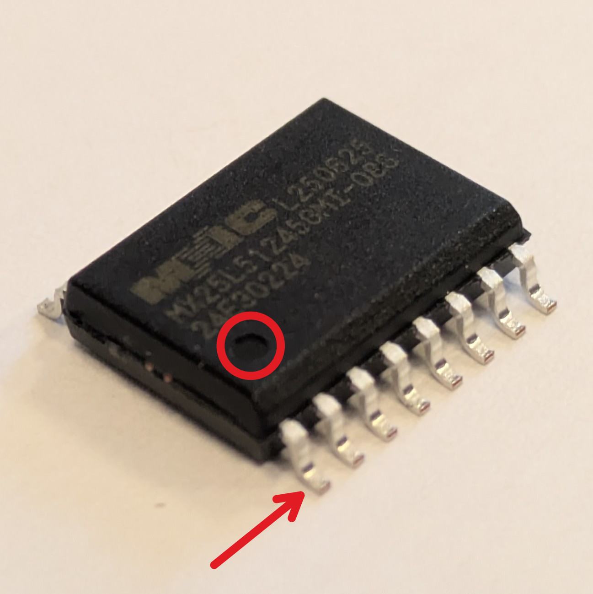
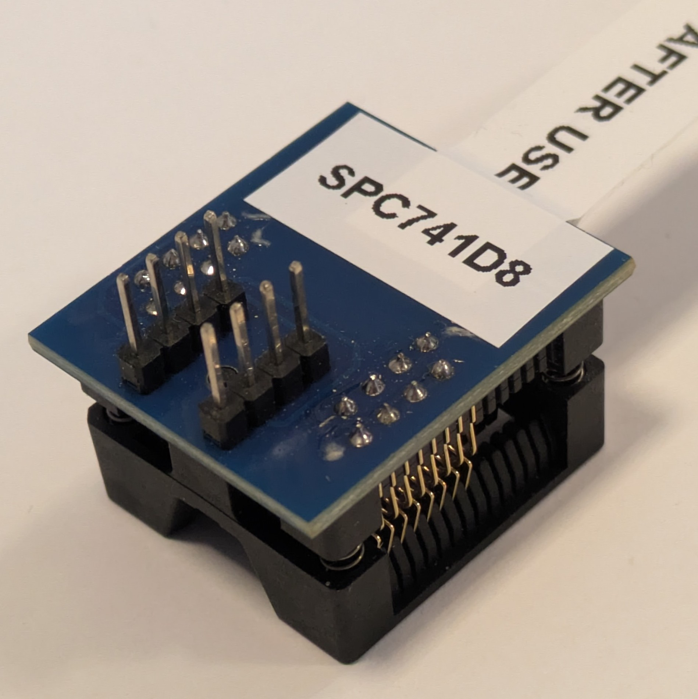
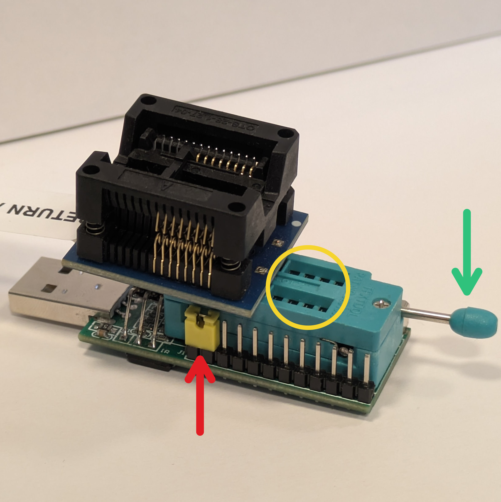
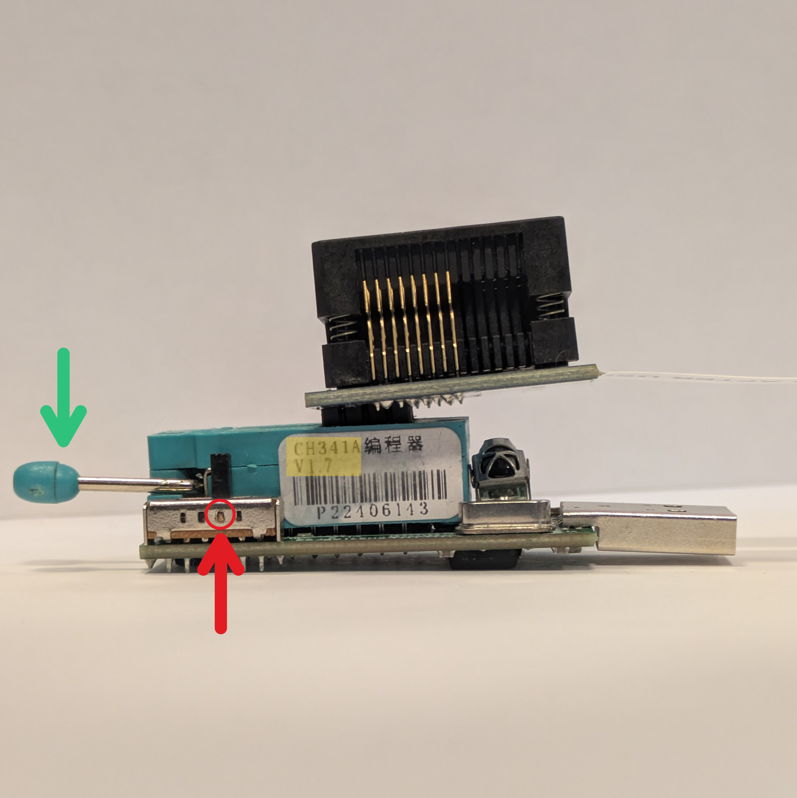
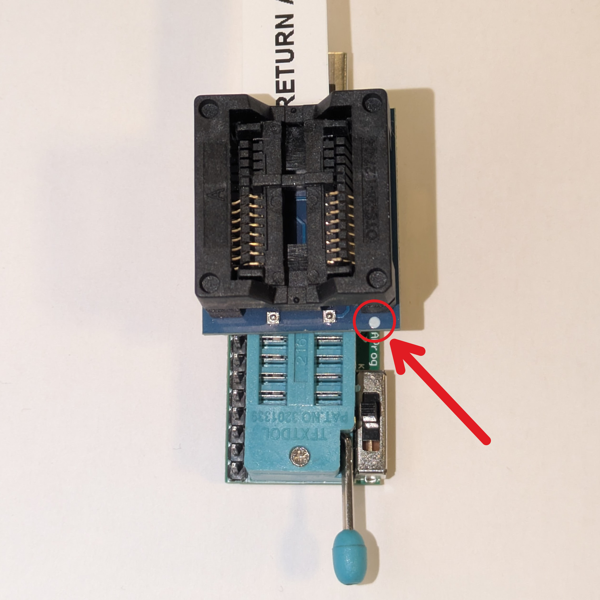
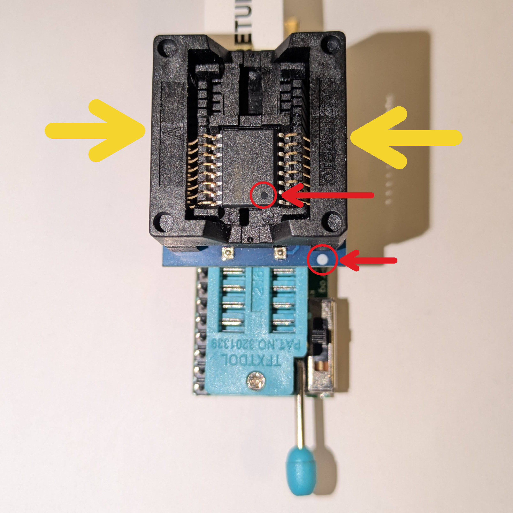
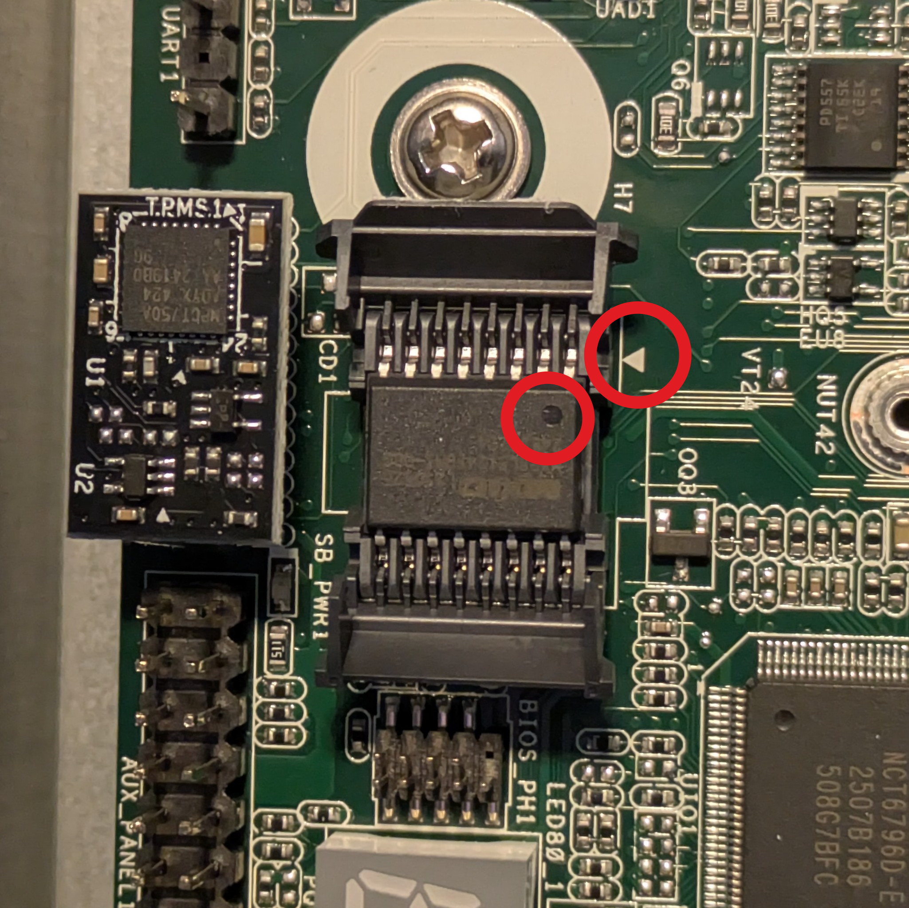

# Recovery

## Intro

The following documentation describes the process of recovering hardware from
the brick state using an external SPI programmer and Dasharo open-source
firmware. Instead of connecting to the on-board SPI header, the BIOS flash chip
is removed from its socket and flashed in a dedicated adapter connected to a
CH341A programmer.

## External flashing

### Prerequisites

* CH341A (v1.7) USB to SPI programmer (the one with the green PCB)
* SOIC-16 adapter matching the BIOS flash chip
* Small, pointy tweezers and optionally a small knife
* Firmware binary for the platform

### Removing the flash chip

The Dasharo firmware is flashed externally by removing the memory chip from the
socket and using a dedicated adapter to flash it via the CH341A (v1.7)
programmer. Follow the steps below to remove the chip.

1. **Ensure the platform is disconnected from the power source!**
1. Locate the BIOS flash memory socket. The flash memory socket is located at
    the very bottom of the motherboard, below the NVMe drive (or socket if the
    drive is not yet mounted). The following picture showcases the socket
    location.

    

1. Open the flash memory socket. To open the flash memory socket, it is advised
    to remove the NVMe drive, as there is very little space to grab the socket
    door. Moreover, the socket door is sealed with a paper-like seal; one can
    use pointy tweezers or a small knife to gently cut the seal along the door
    edges as marked in the picture above. Once the previously mentioned things
    were done, open up the socket by pulling up the tabs on the bigger door of
    the chip memory socket. Once the bigger door is freed, one should be able to
    perform the same operation for the smaller door. The partially opened socket
    and the hinge direction have been showcased in the picture below.

    

1. Remove the memory from the socket. To remove the memory from the socket, one
    can slide tweezers underneath the memory chip to lift it up. This operation
    is much easier to perform with the NVMe drive removed. The picture below
    shows the removed flash memory and its orientation.

    

    The first pin of the chip is always marked with a dot (stamp) on the
    package. The dot and the first pin were highlighted by a red circle and
    arrow, respectively.

    _Note: While the picture shows a `Macronix 5MX25L51245G` memory chip, the
    platform might as well come with different chips like `Winbond W25Q512JV`,
    therefore a chip model can differ. While the chips can be different, they
    shall have the same specification, therefore settings on the programmer are
    common for all the chips._

### Preparing the programmer

1. Obtain the CH341A v1.7 programmer (the one with the green PCB) and the
    SOIC-16 adapter.

    

1. Set the programmer as follows:

    - set the voltage/logic level to 3.3V,
    - set the programmer to flashing mode,
    - put the adapter pins into the grooves and secure it.

    The above process has been shown in detail in the pictures below.

    

    The picture above showcases:

    - where to put the jumper (marked with a red arrow),
    - how to secure the adapter, by pulling the lever down when the pins are in
      the grooves (marked with a green arrow),
    - the yellow circle showcases the 8 grooves at the rear of the programmer
      shall be left unpopulated. The programmer uses the first 8 pins.

    

    The picture above showcases:

    - the lever in the lock position (marked with a green arrow),
    - the logic level switch set to 3.3V (marked with a red arrow),
    - the programmer type and version were highlighted in yellow.

    _Note: On the bottom of the PCB, the programmer features a pictogram showing
    how to set the voltage level switch. The two memory models that are known to
    be mounted in this platform operate at 2.7 to 3.6 volts; it is safe to
    assume all do, to be compatible with the motherboard logic levels._

    

    The picture above showcases the top view of the programmer and adapter
    combo. The red arrow and circle showcase how to locate the first pin in the
    socket. The rule is the same for memory chips; the dot means the first pin.
    Thus, when placing memory in the socket, both dots should be aligned.

1. Place the flash memory in the adapter (programmer). The picture below
    showcases the BIOS flash memory being socketed in the SOIC-16 adapter that's
    connected to the programmer.

    

    To socket the memory chip in an adapter, first place it freely in the
    adapter. Make sure the dot on the memory chip and the dot on the adapter PCB
    are aligned (are in the same corner). The dots were marked with red arrows
    and circles.

    Finally, push the border marked with the yellow arrows down and then release
    them. The memory chip shall fall into place and be locked.

1. Connect the programming combo to your computer.

    _Note: Use of a USB extension cable is advised._

### Firmware flashing

1. Open up the terminal and probe the flash chip. The command shown below does
    just that. It is safe to execute the command; no changes to the flash memory
    are made.

    ```bash
    sudo flashrom -p ch341a_spi
    ```

    The expected output should be similar to the one shown below.

    ```log
    λ sudo flashrom -p ch341a_spi
    flashrom 1.4.0 on Linux 6.17.8-300.fc43.x86_64 (x86_64)
    flashrom is free software, get the source code at https://flashrom.org

    Found Winbond flash chip "W25Q512JV" (65536 kB, SPI) on ch341a_spi.
    [...]
    ```

    It might so happen that, additionally, the following information will be
    printed.

    ```log
    This flash part has status UNTESTED for operations: WP
    The test status of this chip may have been updated in the latest development
    version of flashrom. [...]
    ```

    If that's the case, the message can be simply ignored.

1. Dump the memory chip contents. This step is performed to ensure the
    connection and memory operations are stable. The set of commands shown below
    does two memory dumps on the flash chip and prints the checksums of the
    dumped memory images. The commands are safe to perform, chip contents are
    **not** altered, but please note this might take a long amount of time
    (`8min+` per operation).

    ```bash
    sudo flashrom -p ch341a_spi -r backup_p1.bin # Perform the first read
    sudo flashrom -p ch341a_spi -r backup_p2.bin # Perform the second read
    md5sum backup_p* # Calculate and print checksums for dumped memory images
    ```

    If the dumping succeeds, the "`Reading flash... done.`" will be printed out.
    The operation is considered a success if both hashes returned by `md5sum`
    are the same.

1. Flash the memory chip with the recovery firmware. **NOTE THAT THIS ACTION IS
    DESTRUCTIVE. THE CURRENT FIRMWARE WILL BE ERASED!**

    _Note: In case flashing goes wrong, you shall still have copies of the
    original firmware from the previous step._

    ```bash
    sudo flashrom -p ch341a_spi -w [path_to_binary]
    ```

    _Note: The flashing can take `20min+`._

    ```log
    λ sudo flashrom -p ch341a_spi -w asrock_spc741d8_v0.9.0.rom
    flashrom 1.4.0 on Linux 6.17.8-300.fc43.x86_64 (x86_64)
    flashrom is free software, get the source code at https://flashrom.org

    Found Winbond flash chip "W25Q512JV" (65536 kB, SPI) on ch341a_spi.
    [...]
    Reading old flash chip contents... done.
    Erase/write done from 0 to 3ffffff
    Verifying flash... VERIFIED.
    ```

    If the "`Verifying flash... VERIFIED`" is printed out, the flashing has
    succeeded.

### Putting the flash chip back

1. Put the memory chip back into the motherboard. **First, disconnect the
    programmer from the computer**, and then remove the flash memory from the
    adapter. Use small tweezers to put the memory chip back into the socket.

    

    The picture above shows the proper orientation of the chip in the socket.
    Pin 1 on the chip shall be the closest one to the arrow on the silkscreen of
    the PCB. The dot showcasing chip orientation (pin one), and the arrow on the
    silkscreen were marked with red circles.

1. Close the socket doors, starting with the smaller one, followed by the bigger
    one.
1. Mount the NVMe drive back if it was removed.
1. Supply the power to the platform.
