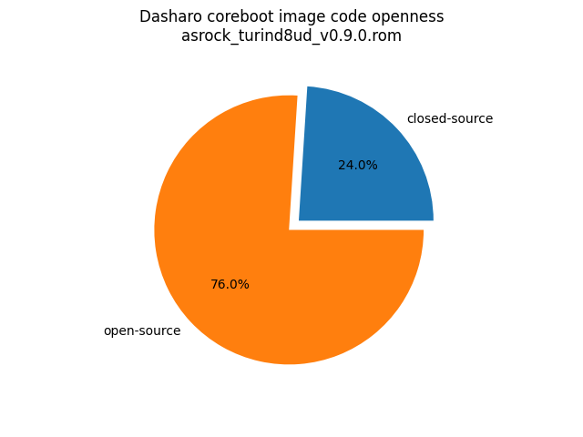
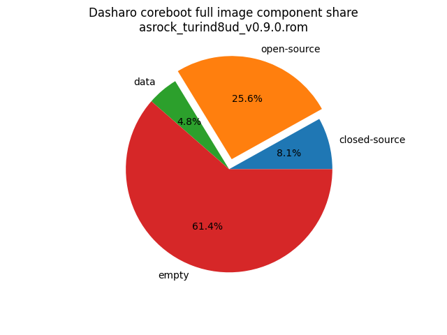

# Dasharo Openness Score

This page contains the [Dasharo Openness
Score](../../glossary.md#dasharo-openness-score) for ASRock Rack
TURIND8UD-2T/X550 Dasharo releases. The content of the page is generated with
[Dasharo Openness Score utility](https://github.com/Dasharo/Openness-Score).

> Under construction

<!-- TODO: once a release binary exists, generate the Openness Score with the
     Dasharo Openness Score utility and paste the report here, adding the
     generated chart images to this directory. See
     gigabyte_mz33-ar1/openness-score.md for the expected format. -->

## v0.9.0

Report has been generated with Openness Score utility version v0.2-3-gb68f58db8217

Openness Score for asrock_turind8ud_v0.9.0.rom

Open-source code percentage: **76.0%**
Closed-source code percentage: **24.0%**

* Image size: 33554432 (0x2000000)
* Number of regions: 9
* Number of CBFSes: 1
* Total open-source code size: 8604191 (0x834a1f)
* Total closed-source code size: 2715840 (0x2970c0)
* Total data size: 1620633 (0x18ba99)
* Total empty size: 20613768 (0x13a8a88)

> Numbers given above already include the calculations from CBFS regions
> presented below

### FMAP regions

| FMAP region | Offset | Size | Category |
| ----------- | ------ | ---- | -------- |
| HUBRIS_NVRAM | 0x0 | 0x10000 | data |
| CONSOLE | 0xe87000 | 0x20000 | data |
| FMAP | 0xea7000 | 0x1000 | data |
| PSP_SEV_NVRAM | 0xea8000 | 0x8000 | data |
| SMMSTORE | 0xeb0000 | 0x80000 | data |
| RW_MRC_CACHE | 0xf30000 | 0xd0000 | data |
| PAD | 0x1000000 | 0x1000000 | empty |

### CBFS COREBOOT

* CBFS size: 15167488
* Number of files: 20
* Open-source files size: 8604191 (0x834a1f)
* Closed-source files size: 2715840 (0x2970c0)
* Data size: 10905 (0x2a99)
* Empty size: 3836552 (0x3a8a88)

> Numbers given above are already normalized (i.e. they already include size
> of metadata and possible closed-source LAN drivers included in the payload
> which are not visible in the table below)

| CBFS filename | CBFS filetype | Size | Compression | Category |
| ------------- | ------------- | ---- | ----------- | -------- |
| fallback/payload | simple elf | 8332127 | none | open-source |
| fallback/romstage | stage | 33001 | LZ4 | open-source |
| fallback/ramstage | stage | 220490 | LZMA | open-source |
| fallback/dsdt.aml | raw | 18573 | none | open-source |
| cpu_microcode_b100.bin | microcode | 14368 | none | closed-source |
| cpu_microcode_b110.bin | microcode | 14368 | none | closed-source |
| cpu_microcode_b000.bin | microcode | 14368 | none | closed-source |
| cpu_microcode_b010.bin | microcode | 14368 | none | closed-source |
| apu/amdfw | amdfw | 2629632 | none | closed-source |
| cpu_microcode_b020.bin | microcode | 14368 | none | closed-source |
| cpu_microcode_b021.bin | microcode | 14368 | none | closed-source |
| cbfs_master_header | cbfs header | 32 | none | data |
| config | raw | 4108 | LZMA | data |
| revision | raw | 919 | none | data |
| build_info | raw | 118 | none | data |
| cmos_layout.bin | cmos_layout | 864 | none | data |
| sbom | raw | 3339 | none | data |
| header_pointer | cbfs header | 4 | none | data |
| (empty) | null | 1188 | none | empty |
| (empty) | null | 3835364 | none | empty |
