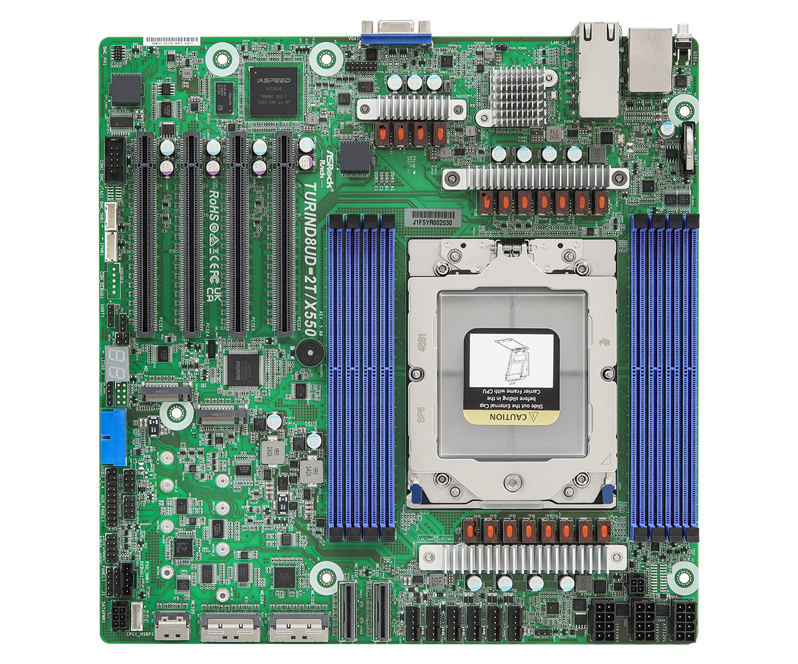

# Overview

## ASRock Rack TURIND8UD-2T/X550

ASRock Rack TURIND8UD-2T/X550 is a full-fledged single socket server board
supporting AMD EPYC 9005 "Turin" (socket SP5) server processors. Dasharo for
this platform is built with a [LinuxBoot](https://www.linuxboot.org/) payload.

## Documentation

- [Releases](./releases.md) - Groups information about all releases.
- [Building Manual](./building-manual.md) - Describes how to build Dasharo
  compatible with the ASRock Rack TURIND8UD-2T/X550.
- [Firmware update](./firmware-update.md) - explains supported Dasharo
  open-source firmware update methods.
- [Initial Deployment](./initial-deployment.md) - Describes initial Dasharo
  deployment methods (i. e. flashing new firmware) compatible with ASRock Rack
  TURIND8UD-2T/X550.
- [Recovery](./recovery.md) - Gathers information on how to recover the platform
    from potential failure.
- [Hardware Configuration Matrix](./hardware-matrix.md) - Describes the
    platform's hardware configuration used during the Dasharo firmware
    validation procedure.
- [Test Matrix](./test-matrix.md) - Describes validation scope used during
    Dasharo firmware validation procedure.
