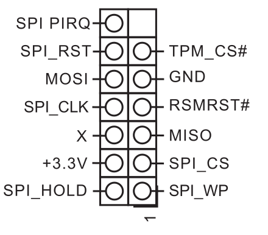

# Recovery

## Intro

The following documentation describes the process of recovering hardware from
the brick state using an [RTE](../../transparent-validation/rte/introduction.md)
and Dasharo open-source firmware.

## External flashing

The external programming and recovery from bricks caused by Dasharo can be
achieved by flashing the BIOS SPI flash chip through the on-board TPM header,
which exposes the SPI bus. No SOIC8 clip is required - the programmer is wired
directly to the TPM header with the TPM module removed.

<center>

</center>

=== "RTE"
    ### Prerequisites

    * [Prepared RTE](../../transparent-validation/rte/v1.1.0/quick-start-guide.md)
    * 6x female-female wire cables
    * TPM module removed

    ### Connections

    To prepare the stand for flashing follow the steps described in
    the [Generic test stand setup](../../unified-test-documentation/generic-testing-stand-setup.md#detailed-description-of-the-process).

    Remove the TPM module and connect the RTE to the TPM header according to
    the pinout above.

    ### Firmware flashing

    To flash firmware follow the steps described below:

    1. Login to RTE via `ssh` or `minicom`.
    2. Turn on the platform by connecting the power supply.
    3. Wait at least 5 seconds.
    4. Turn off the platform by using the power button.
    5. Wait at least 3 seconds.
    6. Set the proper state of the SPI by using the following commands on RTE:

        ```bash
        # set SPI Vcc to 3.3V
        echo 1 > /sys/class/gpio/gpio405/value
        # SPI Vcc on
        echo 1 > /sys/class/gpio/gpio406/value
        # SPI lines ON
        echo 1 > /sys/class/gpio/gpio404/value
        ```

        > Starting with RTE distro v0.8.x the GPIOS are 517, 518, 516.

    7. Wait at least 2 seconds.
    8. Disconnect the power supply from the platform.
    9. Wait at least 2 seconds.
    10. Check if the flash chip is connected properly

        ```bash
        flashrom -p linux_spi:dev=/dev/spidev1.0,spispeed=16000 -c W25Q256JV_Q
        ```

    11. Flash the platform by using the following command:

        ```bash
        flashrom -p linux_spi:dev=/dev/spidev1.0,spispeed=16000 -c W25Q256JV_Q \
            -w [path_to_binary]
        ```

    12. Change back the state of the SPI by using the following commands:

        ```bash
        echo 0 > /sys/class/gpio/gpio404/value
        echo 0 > /sys/class/gpio/gpio405/value
        echo 0 > /sys/class/gpio/gpio406/value
        ```

        > Starting with RTE distro v0.8.x the GPIOS are 516, 517, 518.

    13. Turn on the platform by connecting the power supply.

    The AMD board takes longer to boot due to memory training happening on the
    PSP side. Thus the first signs of life from open-source firmware may appear
    even after a couple of minutes (depends on amount of populated RAM).

=== "CH341A"

    ### Prerequisites

    * CH341A USB to SPI programmer
    * 6x female-female wire cables
    * TPM module removed

    ### Connections

    1. Remove the TPM module from the board.
    2. Wire the CH341A programmer to the TPM header according to the pinout
       above.

    ### Firmware flashing

    To flash firmware follow the steps described below:

    3. Disconnect the power supply from the platform.
    4. Wait at least 2 seconds.
    5. Check if the flash chip is connected properly

        ```bash
        flashrom -p ch341a_spi -c W25Q256JV_Q
        ```

    6.  Flash the platform by using the following command:

        ```bash
        flashrom -p ch341a_spi -c W25Q256JV_Q -w [path_to_binary]
        ```

    7. Disconnect the programmer from the TPM header.
    8. Turn on the platform by connecting the power supply.

    The AMD board takes longer to boot due to memory training happening on the
    PSP side. Thus the first signs of life from open-source firmware may appear
    even after a couple of minutes (depends on amount of populated RAM).
