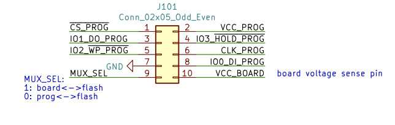
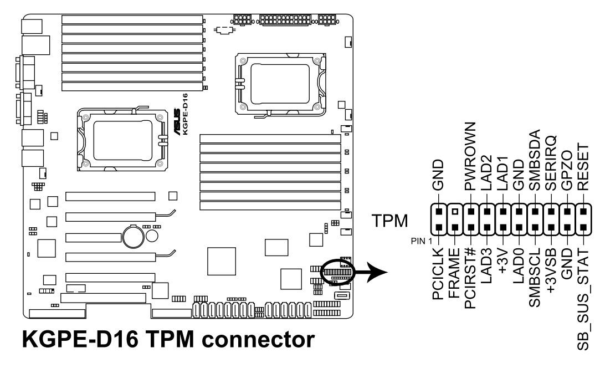
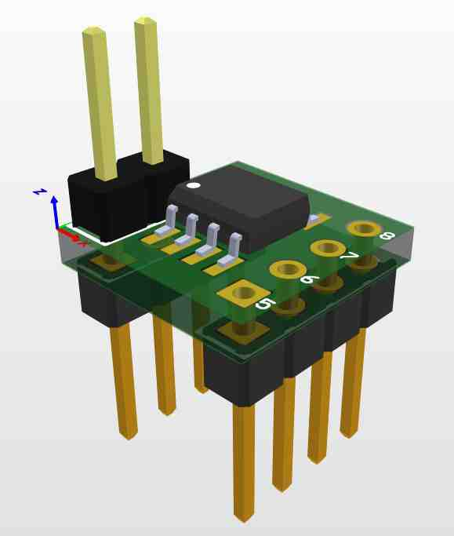
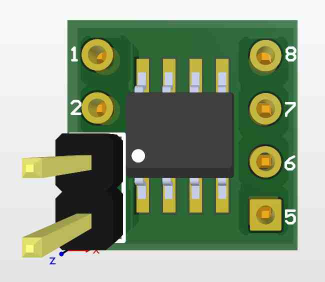
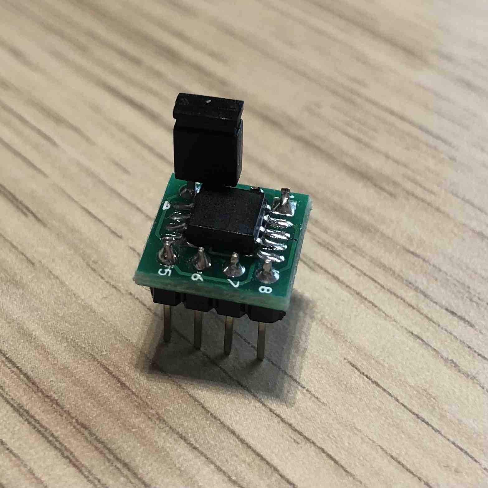
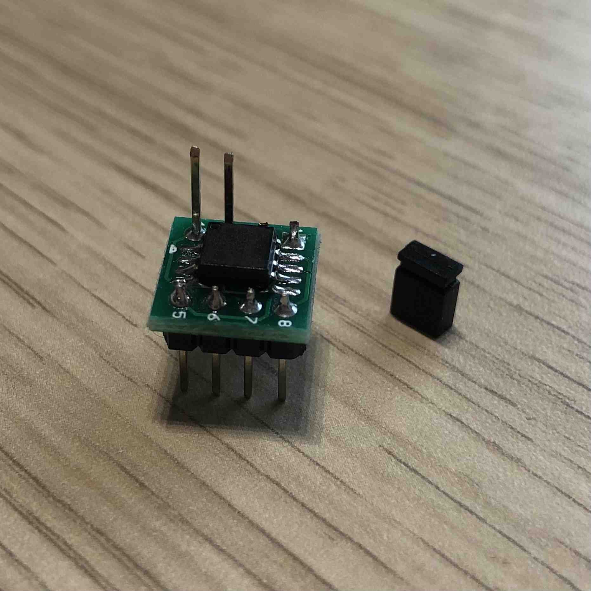
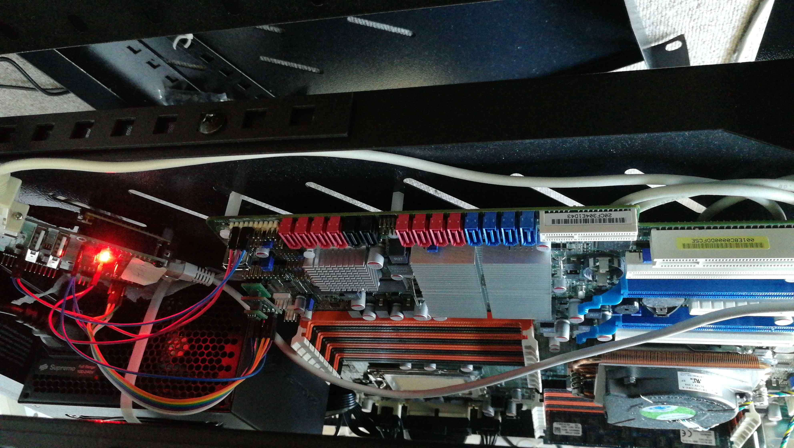
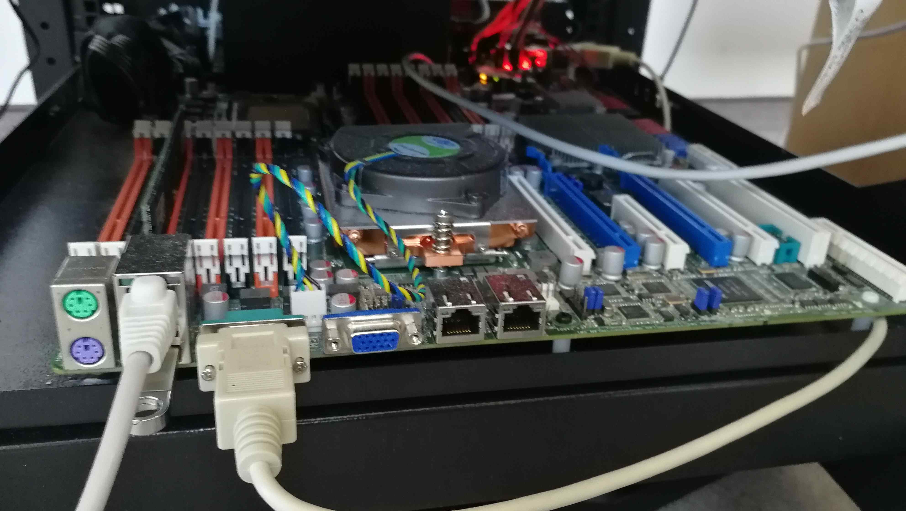

# RTE v.0.5.3 with ASUS KGPE-D16 connection


## Power supply

Power to the Asus KGPE-D16 is delivered by a common PC power supply. Simply
connect the power supply to ATX compatible connectors on the mainboard
(SSIPWR1, SSI12V1, SSI12V2).

## SPI

BIOS SPI flash is a socketed DIP-8. There is no simple way to attach to it with
any tools. That is why we have thought about the
[qspimux](https://github.com/felixheld/qspimux) made by Felix Held which can
attach to various SPI modules footprints and sockets. The DIP-8 adapter
is put into the DIP-8 socket on the mainboard, which allows attaching the
qspimux SPI multiplexer. The multiplexer is responsible for switching between
the external SPI lines and the mainboard lines routed to the external SPI flash
chip. The external flash chip is soldered on a SOIC8 adapter, which is
connected to the qspimux. The connection of the
[RTE](https://3mdeb.com/open-source-hardware/#rte) and qspimux is as follows:

 RTE header J7 pin | qspimux J101 pin
:-----------------:|:-------------------:
 1 (VCC)           | 2 (VCC_PROG)
 2 (GND)           | 7 (GND)
 3 (CS)            | 1 (CS_PROG#)
 4 (SCLK)          | 6 (CLK_PROG)
 5 (MISO)          | 8 (IO0_DI_PROG)
 6 (MOSI)          | 3 (IO1_DO_PROG)
 7 (NC)            | Not connected
 8 (NC)            | Not connected

Additionally, one has to tie the IO3_HOLD_PROG (qspimux pin 4) high, so connect
it to the 3.3V permanently. Another additional GPIO is required to control the
routing of SPI lines. The MUX_SEL (qspimux pin 9) decides whether
the programmer is allowed to access the SPI flash or the mainboard. One more
GPIO is used to control state of #WP of the flash chip by connecting GPIO to
IO2_WP_PROG.

The proposed connections used:

* [RTE](https://3mdeb.com/open-source-hardware/#rte) GPIO400 to control MUX_SEL
* [RTE](https://3mdeb.com/open-source-hardware/#rte) GPIO401 to control IO3_HOLD_PROG
* [RTE](https://3mdeb.com/open-source-hardware/#rte) GPIO402 to control IO2_WP_PROG

Simple flashing script looks as follows:

```bash
# select flash <-> programmer
echo "0" > /sys/class/gpio/gpio400/value
# deassert SPI HOLD#
echo "1" > /sys/class/gpio/gpio401/value

flashrom -w firmware.bin -p linux_spi:dev=/dev/spidev1.0,spispeed=16000

# select flash <-> board
echo "1" > /sys/class/gpio/gpio400/value
```

Controlling state of #WP:

```bash
# configure direction of the pin
echo "out" > /sys/class/gpio/gpio402/direction

# deassert WP pin to disable hardware protection of status registers
echo "1" > /sys/class/gpio/gpio402/value
# assert WP pin to enable hardware protection of status registers
echo "0"  > /sys/class/gpio/gpio402/value
```

 RTE header J10 pin | qspimux J101 pin
:------------------:|:-------------------:
 1 (GPIO400)        | 9 (MUX_SEL)
 2 (GPIO401)        | 4 (IO3_HOLD_PROG)
 3 (GPIO402)        | 5 (IO2_WP_PROG)




> qspimux schematic is available [here](https://github.com/felixheld/qspimux/blob/master/qspimux/qspimux.pdf)

## Serial

Asus KGPE-D16 has a DB9 serial connector for the debug UART. Connect it to the RTE
via RS232 DB9 cable.


## TPM

Asus KGPE-D16 has an LPC header for TPM or debugging. Since there is no other
option to connect a TPM, we use the header for that purpose.

IMPORTANT: Use only TPM modules which match their pinout with the board's
header! Using a spider web connection degrades the signal quality to the point
where CPU cannot properly talk to TPM via LPC bus. Tested with
[PC Engines TPM module](https://shop.3mdeb.com/shop/modules/tpm-2-0/) and failed
to succeed this way. Designing and producing proper TPM header and/or reliable
adapter, could solve this problem. The [TwPM
project](https://twpm.dasharo.com/) could help here in the future.



TPM modules that were tested and verified to work in 3mdeb lab with coreboot:

* ASUS TPM-L R2.0 module (chip Infineon SLB9665 TT 2.0)
* ASUS TPM 1.2 Rev 1.02h module (chip Infineon SLB9635 TT 1.2)

## Power management

Asus KGPE-D16 provides a front panel pin header (PANEL1):


| RTE header J11 pin     | Asus KGPE-D16             |
|:----------------------:|:-------------------------:|
| 8 (OC buffer output)   | PANEL1 pin 11 (PWR)       |
| 9 (OC buffer output)   | PANEL1 pin 17 (RESET)     |

Additionally, connect one of the PANEL1 ground pins to one of the ground pins on
RTE.

## Manunal

For more details about the KGPE-D16, refer to
[the manual](https://raw.githubusercontent.com/Dasharo/docs/master/pdf/E8847_KGPE-D16.pdf).

### Theory of operation

### Flashing

There are two RTEs connected to two Asus KGPE-D16 boards:

* 192.168.20.15
* 192.168.4.111

Both boards are equipped with the qspimux and a replaced flash chip (Winbond
W25Q64FV 8MB). The flash chip is attached to the qspimux with an adapter
available with qspimux. Flashing may be done via the commands shown earlier or
the flash script which is present in the root directory of the RTE:

> Note: the `flash.sh` script, used in this chapter, is available only in 0.8.1
> or newer RTE OS releases, check [meta-rte](https://github.com/3mdeb/meta-rte)
> for more inf..

```shell
./flash.sh coreboot.rom
```

The script will automatically power off the board and update flash chip
contents using flashrom. After the operation is finished the routing of SPI
signals is restored to the platform.

### The flash chip adapter

In order to provide an easy way to protect the SPI flash chip one may use a
DIP-8 to SOIC-8 adapter with a special long pin header for WP pin jumper. It
allows to use a SOIC-8 packaged flash in the DIP-8 socket and easily place a
jumper to protect the flash. In order to assembly the adapter you will need

* the target SPI flash chip (we use either Winbond W25Q64FV (8MB) or W25Q128JV
(16MB)),
* male pin headers 2.54 mm pitch (6 pins)
* male long pin headers 2.54 mm pitch (2 pins) for the WP jumper
* [SOIC-8 to DIP-8 adapter](https://www.digikey.com/en/products/detail/aries-electronics/LCQT-SOIC8-8/4754588)
* soldering station and the solder

The build shall look like this:

{: style="height:700px"}
{: style="height:515px"}
{: style="height:595px"}
{: style="height:595px"}

Such adapters are now available in our [online shop][flashchip-adapter] for
purchase. For more details how to enable SPI flash protection refer to [SPI
Flash protection page](spi-wp.md).

### Power management

[RTE](https://3mdeb.com/open-source-hardware/#rte) can control the power
of the board with the `RteCtrl` command-line application, or with the web GUI
([RteCtrl](https://github.com/3mdeb/RteCtrl)) available at RTE's IP address
port 8000. Possible commands are:

```shell
./RteCtrl -pon # power on the platform
./RteCtrl -poff # force 5seconds power button power off
./RteCtrl -reset # briefly assert platform reset pin to perform reset
```

It is also possible to control the ATX power supply by disconnecting it from
the power socket. For this special purpose, Sonoff S20 is used to remotely
control the power socket activity. Sonoff IP to RTE IP mapping:

* RTE IP 192.168.20.15 - Sonoff IP 192.168.4.125
* RTE IP 192.168.4.111 - Sonoff IP 192.168.4.146

Sonoffs respond to rest API requests to enable or disable the power socket.
Shell scripts have been added to RTE root directories to ease the control of
power of the KGPE-D16 platform:

```shell
#!/bin/bash

SONOFF_IP=192.168.4.125

if [[ "$1" == "off" ]]; then
    wget -q -O - http://$SONOFF_IP/switch/sonoff_s20_relay/turn_off --method=POST
elif [[ "$1" == "on" ]]; then
    wget -q -O - http://$SONOFF_IP/switch/sonoff_s20_relay/turn_on --method=POST
elif [[ "$1" == "show" ]]; then
    wget -q -O - http://$SONOFF_IP/switch/sonoff_s20_relay
    echo -e '\n'
else
    echo -e "\$1 == on|off|show|toggle\nEdit this script to set the sonoff ip."
    echo -e 'Current state:'
    wget -q -O - http://$SONOFF_IP/switch/sonoff_s20_relay
    echo -e '\n'
fi
```

To turn off the power from the platform `./sonoff.sh off` and to turn it on
`./sonoff.sh on`. Invoking the script without any argument will print the
current state of the switch.

### Serial console access

A serial port is very useful in debugging and as a remote console of the system
on the platform. The serial port of KGPE-D16 is connected to the RTE's serial
port which can be accessed on RTE with `/dev/ttyS1`. One may use minicom
directly or take advantage of the ser2net service running on RTE which exposes
the serial port over the network. The serial port can be accessed remotely like
this `telnet RTE_IP 13541`, e.g.:

```shell
telnet 192.168.20.15 13541
```

## Demo

A short demo presenting RTE capabilities with KGPE-D16:

<script id="asciicast-439834" src="https://asciinema.org/a/439834.js" async data-rows="25"></script>

### Remote access

If you are interested in developing coreboot on KGPE-D16 and have some spare
time, there is a possibility to obtain access to the hardware. Drop us an
email to [leads@3mdeb.com](mailto:leads@3mdeb.com) with a request.

## Newsletter

If you are interested in the Dasharo, you are welcome to subscribe
to the Dasharo Newsletter:

{{ subscribe_form("dbbf5ff3-976f-478e-beaf-749a280358ea",
"Subscribe to Dasharo Newsletter") }}

## Gallery





[flashchip-adapter]: https://shop.3mdeb.com/shop/adapters/flash-chip-adapters/asus-kgpe-d16-flash-chip-adapter/
