# Initial deployment

**Please read the [overview page](overview.md) first!**

Following documentation describe process of replacing original BIOS/UEFI
firmware with Dasharo open-source firmware. Following procedure is supported
for following models

<center>

| Vendor | Model |
:-------:|:-----:|
|Dell    | OptiPlex 7010 SFF |
|Dell    | OptiPlex 7010 DT |
|Dell    | OptiPlex 9010 SFF |
|Dell    | OptiPlex 9010 MT |

</center>

## Hardware preparation

### Flash descriptor security override

To perform any SPI NOR flash operations in the presence of ME, we have to put
it in the flash descriptor security override mode. Please follow the below
steps:

1. Open the case by lifting the handle on the case.

    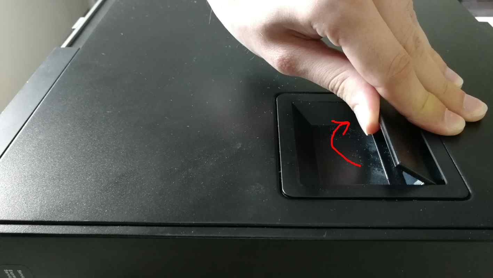

1. Lift the whole top cover and take it off.

    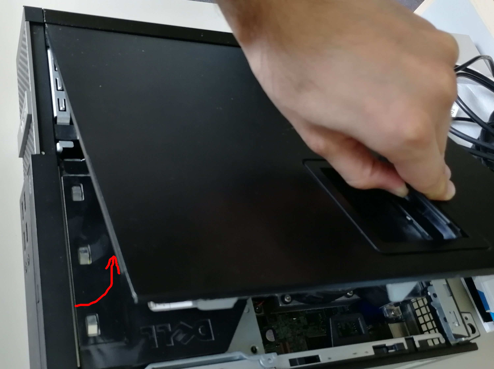

1. Now, it is time to release the disk dock. Lift the handle of the CD/DVD drive
   bay.

    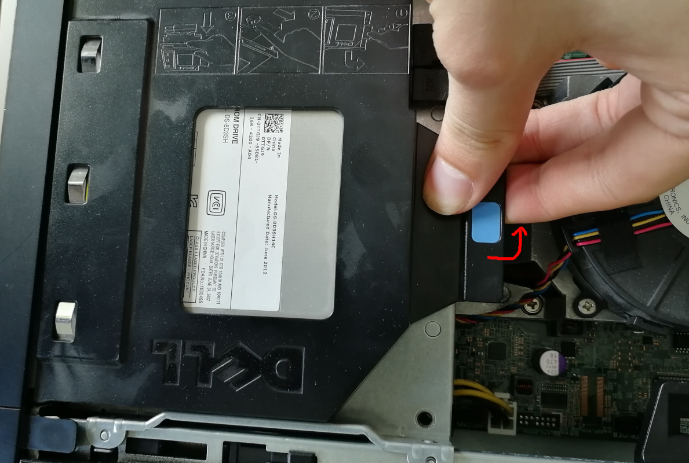

1. Pull the CD/DVD drive bay to the CPU fan side.

    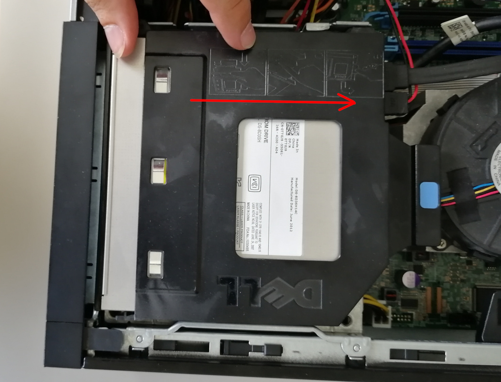

1. Move the blue disk dock handle to the CPU fan side.

    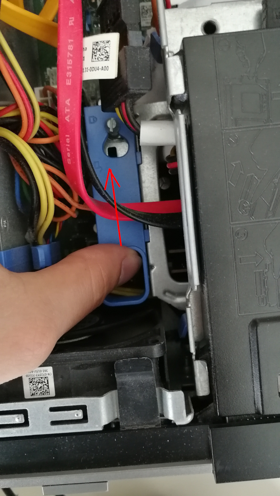

1. The screw should be at the giant hole now. Lift the whole dock to
   remove it.

    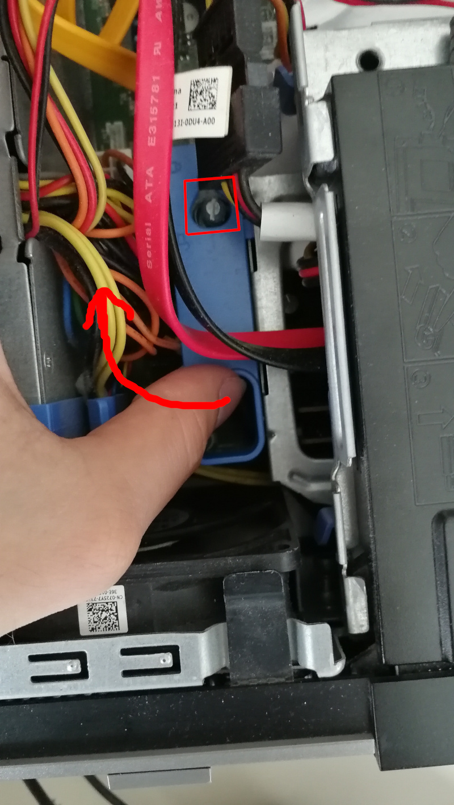

1. When the dock is removed, the service mode jumper should be visible.

    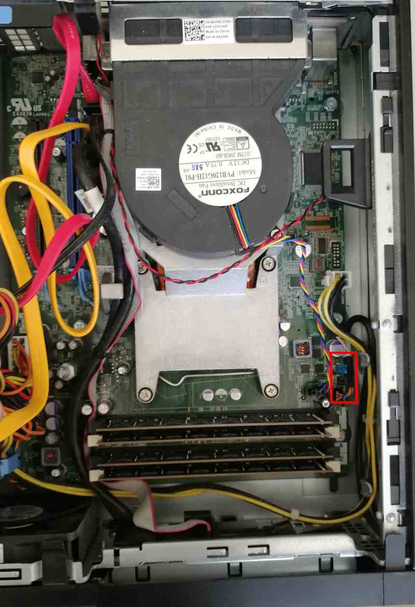

1. Place the jumper in the place marked by the red rectangle.

    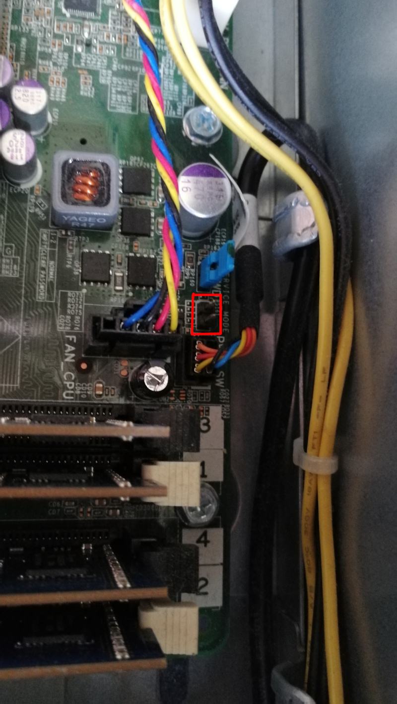

1. It should look like this.

    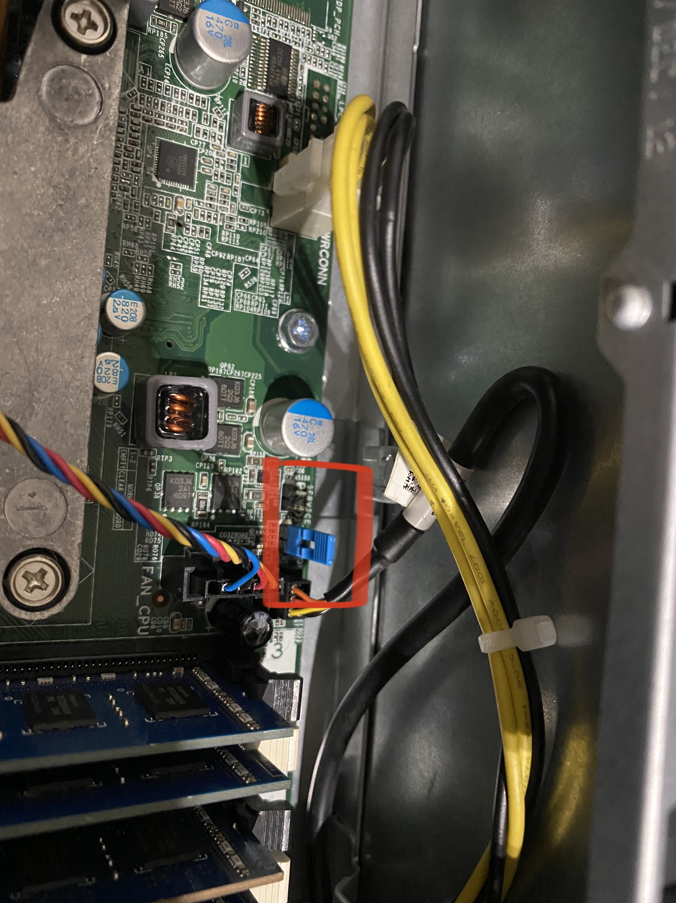

1. Power on the machine. You should see a warning that the service jumper is
active. Press F1 to proceed and boot to your Linux system.

    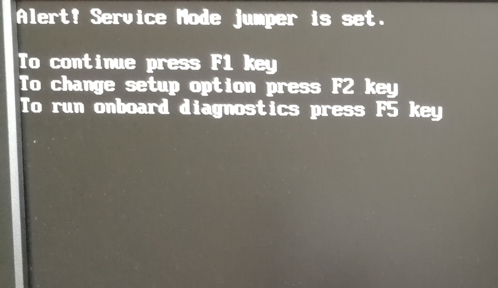

## Initial deployment

To ensure a smooth deployment process, it is recommended to use the latest
version of DTS available from the [releases
page](../../dasharo-tools-suite/releases.md). Once you have obtained it, you can
then proceed with following the [Dasharo zero-touch initial deployment
section](../../dasharo-tools-suite/documentation/features.md#dasharo-zero-touch-initial-deployment)
procedure. This will help you set up Dasharo effectively and without manual
intervention. However, if you wish to flash firmware you have built yourself,
you will need take an alternate route and go through firmware preparation.

## Firmware preparation

A fresh firmware binary built from source for this platform is not necessarily
complete and ready to be deployed on hardware.

If you have built it using the non-TXT config, you can safely go ahead and
flash, the platform will be fully operational - but due to lack of EC firmware,
the fans will always spin at full speed, which can be a nuisance.

However, if you have build the firmware with TXT support, without patching the
.rom with proprietary ACM blobs the platform might simply refuse to boot.

This brings us to patching the binary. This guide covers the process of
obtaining 3 firmware blobs necessary for a full-feature deployment on the
OptiPlex platform:

* `sch5545_ecfw.bin` - EC firmware
* `txt_bios_acm.bin` - Ivy Bridge BIOS ACM - **TXT support only**
* `txt_sinit_acm.bin` - Ivy Bridge SINIT ACM - **TXT support only**

It is recommended you perform this process booted into the Dasharo Tools Suite,
unless you are willing to install all of the reqiuired utilities yourself.

### Obtaining the blobs

The process consists of downloading the stock BIOS via an update link and
extracting all of its contents, to then salvage what we need for our firmware.

First, you will need to download the stock BIOS image from an update URL. As
of the moment of writing this guide, the working link for OptiPlex 7010/9010
is [this](https://dl.dell.com/FOLDER05066036M/1/O7010A29.exe).

Then, extract all of the components using `binwalk`:

```bash
binwalk -e O7010A29.exe -C .
```

Assuming the extraction process was successful, you should now have an
extracted UEFI image file, hidden under an unassuming name such as
`65C10`. Deeper down the rabbit hole, you will now have to extract the
blobs from this image using the `uefi-firmware` Python package, a set of scripts
for parsing, extracting, and recreating UEFI firmware volumes. To install:

```bash
apt install python3-venv python3-pip
python3 -m venv venv
source venv/bin/activate
pip install uefi-firmware==1.9
```

To extract the blobs (you may have to run the command twice):

```bash
uefi-firmware-parser -e "_O7010A29.exe.extracted/65C10" -O
```

Congratulations, you should now have access to the BIOS ACM and EC firmware
files. Now, let's copy them with more readable names for future reference:

* EC firmware -

```bash
cp _O7010A29.exe.extracted/65C10_output/pfsobject/\
    section-7ec6c2b0-3fe3-42a0-a316-22dd0517c1e8/volume-0x50000/\
    file-d386beb8-4b54-4e69-94f5-06091f67e0d3/section0.raw sch5545_ecfw.bin
```

* BIOS ACM file (only necessary for TXT support) -

```bash
cp _O7010A29.exe.extracted/65C10_output/pfsobject/\
    section-7ec6c2b0-3fe3-42a0-a316-22dd0517c1e8/volume-0x500000/\
    file-2d27c618-7dcd-41f5-bb10-21166be7e143/object-0.raw IVB_BIOSAC_PRODUCTION.bin
```

The SINIT file is fortunately available for download directly from Intel at
[this url](https://cdrdv2.intel.com/v1/dl/getContent/630744)
(again, only necessary for TXT support).

### Patching the binary

Now having prepared all of the ingredients, we can proceed with patching the
raw binary, to which I will refer as `coreboot.rom`. It is assumed that the
.rom is copied into the same directory as the extracted blobs.

If you didn't enable TXT support in your build, you only need to run

```bash
cbfstool coreboot.rom add -f sch5545_ecfw.bin -n sch5545_ecfw.bin -t raw
```

If you are using TXT, run

```bash
cbfstool coreboot.rom add -f IVB_BIOSAC_PRODUCTION.bin -n txt_bios_acm.bin -t raw -a 0x20000
cbfstool coreboot.rom add -f SNB_IVB_SINIT_20190708_PW.bin -n txt_sinit_acm.bin -t raw -c lzma
```

### Flashing

The prepared binary is now ready to be flashed onto the platform's mainboard,
using

```bash
flashrom -p internal -w coreboot.rom --ifd -i bios
```

## Verification

1. If everything went well (flashrom has verified the flash content),
1. Shut down the machine, move the jumper to the original place
1. Power on the machine.
1. After rebooting, you should see the Dasharo Workstation logo when booting.
   When the logo appears, you may press ++esc++ to select the boot device if
   you want to reboot from another source.

   

From that point you can use [firmware update](firmware-update.md) methods to
update your firmware.

## Troubleshooting

If you do not see the logo after a few seconds, something probably went wrong,
or you encountered a bug. If the LED on the power button shines white, that
means the platform booted correctly.

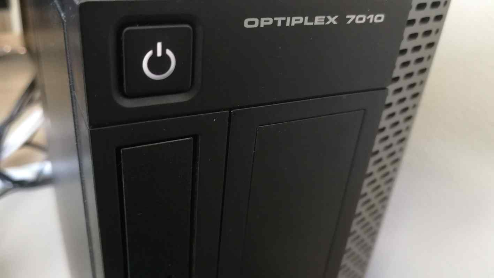

If the power button LED constantly shines in orange color, that means you have
hit an error. The LED will start blinking soon.

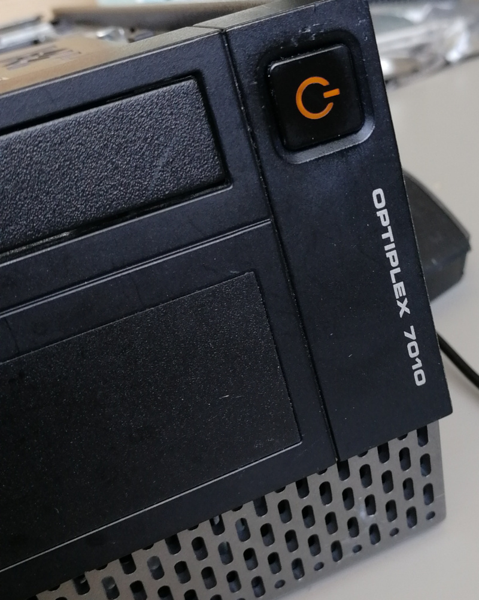
If you see the logo and after that system does not starts (black screen), please
take the following steps:

1. Put a bootable USB stick to the USB port.
1. Restart the computer using the power button.
1. Press the ++esc++ key to enter a boot menu.
1. Choose a USB drive from the list.
1. Re-install the operating system.

Common deployment problems you can find in [FAQ](../../osf-trivia-list/deployment.md).

### Ubuntu installation

Ubuntu legacy installers have problems with graphical setup mode. When you see
this error:

``` console
graphics initialization failed
Error setting up gfxboot
boot:_
```

You need a workaround to proceed with the installation. To boot the installer,
type `live-install` and press `ENTER`. It will boot to Ubuntu Live, and the
installer will launch automatically.

Version affected: Dasharo Workstation v0.1.

If you see blinking yellow LED and black screen after reboot:
1. Unplug the power supply cable
2. Wait for the 30s
3. Plug in the power supply again (machine should start automatically)

### Bug reporting

If you encountered an error or bug, please report it in the [Dasharo Issues repo](https://github.com/Dasharo/dasharo-issues/issues).
