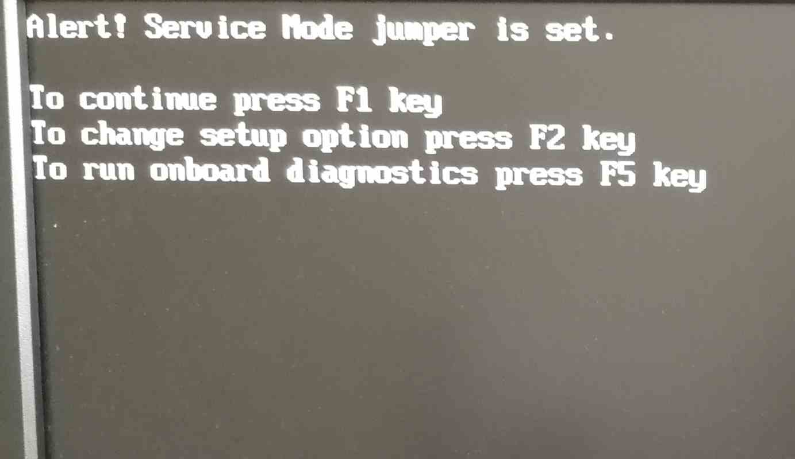

# Initial deployment

**Please read the [overview page](overview.md) first!**

Following documentation describe process of replacing original BIOS/UEFI
firmware with Dasharo open-source firmware. Following procedure is supported
for following models

<center>

| Vendor | Model |
:-------:|:-----:|
|Dell    | OptiPlex 7010 SFF |
|Dell    | OptiPlex 7010 DT |
|Dell    | OptiPlex 9010 SFF |

</center>

## Hardware preparation

### Flash descriptor security override

To perform any SPI NOR flash operations in the presence of ME, we have to put
it in the flash descriptor security override mode. Please follow the below
steps:

1. Open the case by lifting the handle on the case.

    

1. Lift the whole top cover and take it off.

    

1. Now, it is time to release the disk dock. Lift the handle of the CD/DVD drive
   bay.

    

1. Pull the CD/DVD drive bay to the CPU fan side.

    

1. Move the blue disk dock handle to the CPU fan side.

    

1. The screw should be at the giant hole now. Lift the whole dock to
   remove it.

    

1. When the dock is removed, the service mode jumper should be visible.

    

1. Place the jumper in the place marked by the red rectangle.

    

1. It should look like this.

    

1. Power on the machine. You should see a warning that the service jumper is
active. Press F1 to proceed and boot to your Linux system.

    

## Initiali deployment

For simplicity, we are using Dasharo Tools Suite OEM version booted from USB.
Access to DTS OEM is available only through [OEM/ODM private
beta](../../../ways-you-can-help-us/#for-oemodm-join-the-private-beta-program).

* DTS OEM v1.0.0 boots only in UEFI mode


* After booting to Dasharo Tools Suite OEM load OEM keys
* Make sure to submit [Dasharo HCL
  report](../../../common-coreboot-docs/dasharo_tools_suite#dasharo-hcl-report)
* Enter shell using option `9)`
* Deploy using:

```shell
deploy 2>&1 | tee deploy.log
```

**Note**: If you not saving Dasharo HCL report, please
[backup your vendor BIOS](../../..//osf-trivia-list/deployment/#how-to-use-flashrom-to-backup-vendor-bios).

**Note2**: Some Dell OptiPlex 7010/9010 SFF binary blobs have an unknown
license or questionable redistribution policy. To avoid potential issues,
`deploy` script transfer non-redistributable components from your original BIOS
to Dasharo compatible with Dell OptiPlex 7010/9010.

## Verification

1. If everything went well (flashrom has verified the flash content),
1. Shut down the machine, move the jumper to the original place
1. Power on the machine.
1. After rebooting, you should see the Dasharo Workstation logo when booting.
   When the logo appears, you may press ++esc++ to select the boot device if
   you want to reboot from another source.

   

From that point you can use [firmware update](../firmware-update) methods to
update your firmware.

## Troubleshooting

If you do not see the logo after a few seconds, something probably went wrong,
or you encountered a bug. If the LED on the power button shines white, that
means the platform booted correctly.


If the power button LED constantly shines in orange color, that means you have
hit an error. The LED will start blinking soon.


If you see the logo and after that system does not starts (black screen), please
take the following steps:

1. Put a bootable USB stick to the USB port.
1. Restart the computer using the power button.
1. Press the ++esc++ key to enter a boot menu.
1. Choose a USB drive from the list.
1. Re-install the operating system.

Common deployment problems you can find in [FAQ](../../osf-trivia-list/deployment.md).

### Ubuntu installation

Ubuntu legacy installers have problems with graphical setup mode. When you see
this error:

``` console
graphics initialization failed
Error setting up gfxboot
boot:_
```

You need a workaround to proceed with the installation. To boot the installer,
type `live-install` and press `ENTER`. It will boot to Ubuntu Live, and the
installer will launch automatically.

Version affected: Dasharo Workstation v0.1.

If you see blinking yellow LED and black screen after reboot:
1. Unplug the power supply cable
2. Wait for the 30s
3. Plug in the power supply again (machine should start automatically)

### Bug reporting

If you encountered an error or bug, please report it in the [Dasharo Issues repo](https://github.com/Dasharo/dasharo-issues/issues).
