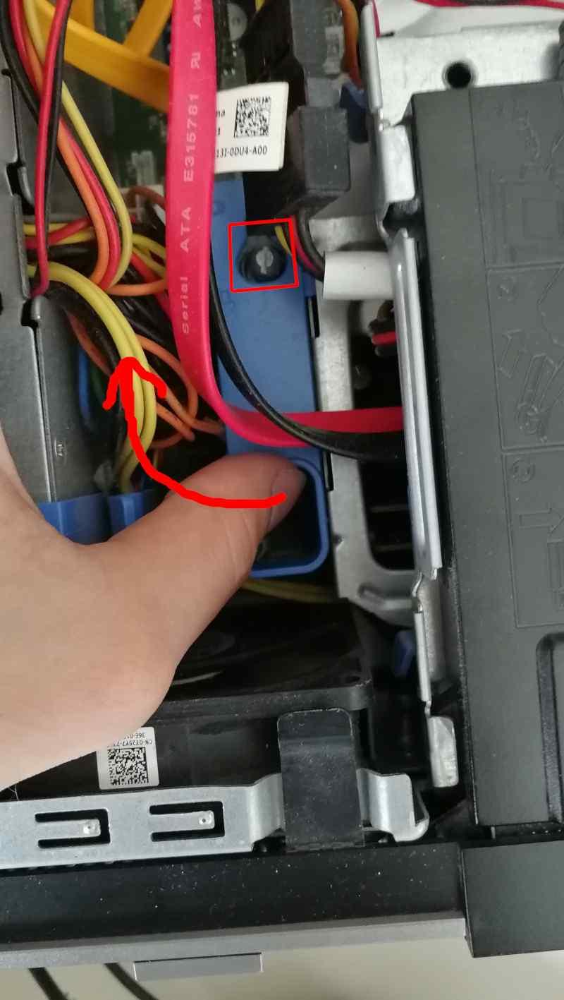

# Initial deployment

**Please read the [overview page](overview.md) first!**

Following documentation describe process of replacing original BIOS/UEFI
firmware with Dasharo open-source firmware. Following procedure is supported
for following models

<center>

| Vendor | Model |
:-------:|:-----:|
|Dell    | OptiPlex 7010 SFF |
|Dell    | OptiPlex 7010 DT |
|Dell    | OptiPlex 9010 SFF |

</center>

## Hardware preparation

### Flash descriptor security override

To perform any SPI NOR flash operations in the presence of ME, we have to put
it in the flash descriptor security override mode. Please follow the below
steps:

1. Open the case by lifting the handle on the case.

    

1. Lift the whole top cover and take it off.

    

1. Now, it is time to release the disk dock. Lift the handle of the CD/DVD drive
   bay.

    

1. Pull the CD/DVD drive bay to the CPU fan side.

    

1. Move the blue disk dock handle to the CPU fan side.

    

1. The screw should be at the giant hole now. Lift the whole dock to
   remove it.

    

1. When the dock is removed, the service mode jumper should be visible.

    

1. Place the jumper in the place marked by the red rectangle.

    

1. It should look like this.

    

1. Power on the machine. You should see a warning that the service jumper is
active. Press F1 to proceed and boot to your Linux system.

    

## OS booting

For simplicity, we are using
[Dasharo Tools Suite](../../../common-coreboot-docs/dasharo_tools_suite#bootable-usb-stick)
booted from USB.

* After booting to Dasharo Tools Suite, make sure to submit
[Dasharo HCL report](../../../common-coreboot-docs/dasharo_tools_suite#dasharo-hcl-report)
* Boot from USB and enter the shell.
* **TODO**: run commands/script required for seamless Dasharo deployment

**Note**: If you not saving Dasharo HCL report, please
[backup your vendor BIOS](../../..//osf-trivia-list/deployment/#how-to-use-flashrom-to-backup-vendor-bios).

## Get Dasharo

Download the Dell OptiPlex 7010/9010 Dasharo from the
[release section](releases.md#binaries) or
[build from source](building-manual.md).

<!--
TODO: to be replaced by Dasharo blobs transmission script
## Non-redistributable blobs

Some Dell OptiPlex 7010/9010 SFF binary blobs have an unknown license or
questionable redistribution policy. To avoid potential issues, we transfer
non-redistributable components from your original BIOS to Dell OptiPlex 9010
Dasharo binary using [fwdeploy](https://github.com/Dasharo/fwdeploy).

```bash
wget https://raw.githubusercontent.com/Dasharo/fwdeploy/main/run.sh
chmod +x run.sh
./run.sh <bios_backup> <dasharo_optiplex_9010_firmware>
```

After that procedure, `<dasharo_optiplex_9010_firmware>` can be flashed on your
Dell OptiPlex 7010/9010 SFF.

**NOTE:** We are gathering information about non-redistributable firmware
components in
[Dasharo fwdeploy](https://github.com/Dasharo/fwdeploy/blob/main/blobs/dell_optiplex_9010.sha256)
project. Feel free to report SHA256 of blobs from your platform.
TODO: publish known valid hashes for given coreboot version
TODO: add to script verification of expected hash of coreboot.rom
before adding blobs:
f6327df6578e5f0d2d0d16ecb23a5ba57b5ced50add79d53821f31fd050a9b2b  coreboot.rom
after adding blobs
8a0be7a199dd2917e86e0c8e4237dae4b67a417b237d108b0cc7501b93d951b5  coreboot.rom
-->

## Flashing

Following procedure will flash Dell OptiPlex 7010/9010 SFF Dasharo firmware to
your machine SPI NOR flash.

<!-- Link should be replaced with something that does not point to the 3mdeb cloud. The most
useful location would be at some HTTP server -->

Flash it on your Dell OptiPlex machine:

``` console
flashrom -p internal --ifd -i bios -i me -w <dasharo_optiplex_9010_firmware>
```

for example:

``` console
flashrom -p internal --ifd -i bios -i me -w /tmp/dasharo_workstation_v0.2_rc3.rom

flashrom v1.2-551-gf47ff31 on Linux 5.10.0-9-amd64 (x86_64)
flashrom is free software, get the source code at https://flashrom.org

Using clock_gettime for delay loops (clk_id: 1, resolution: 1ns).
Found chipset "Intel Q77".
Enabling flash write... SPI Configuration is locked down.
The Flash Descriptor Override Strap-Pin is set. Restrictions implied by
the Master Section of the flash descriptor are NOT in effect. Please note
that Protected Range (PR) restrictions still apply.
Enabling hardware sequencing due to multiple flash chips detected.
OK.
Found Programmer flash chip "Opaque flash chip" (12288 kB, Programmer-specific) mapped at physical address 0x0000000000000000.
Reading ich descriptor... done.
Using regions: "me", "bios".
Reading old flash chip contents... done.
Erasing and writing flash chip... Erase/write done.
Verifying flash... VERIFIED.
```

If you get a warning:

``` console
WARNING! You may be running flashrom on an unsupported laptop.
```

And programmer initialization failed, run command:

``` console
flashrom -p internal:laptop=this_is_not_a_laptop -w /tmp/dasharo_workstation_v0.2_rc3.rom --ifd -i bios -i me
```

If you have placed the jumper correctly, you should see the following message
in flashrom's output:

``` console
The Flash Descriptor Override Strap-Pin is set. Restrictions implied by
the Master Section of the flash descriptor are NOT in effect. Please note
that Protected Range (PR) restrictions still apply.
```

A newer version of flashrom may not display the warning about unsupported
chipset as it already may be marked as tested. Our team has verified that
the flashrom updates firmware reliably on this chipset.

If you face any issues, please refer to the [troubleshooting section](#troubleshooting).

## Verification

1. If everything went well (flashrom has verified the flash content),
1. Shut down the machine, move the jumper to the original place
1. Power on the machine.
1. After rebooting, you should see the Dasharo Workstation logo when booting.
   When the logo appears, you may press ++esc++ to select the boot device if
   you want to reboot from another source.

   

## Troubleshooting

If you do not see the logo after a few seconds, something probably went wrong,
or you encountered a bug. If the LED on the power button shines white, that
means the platform booted correctly.


If the power button LED constantly shines in orange color, that means you have
hit an error. The LED will start blinking soon.


If you see the logo and after that system does not starts (black screen), please
take the following steps:

1. Put a bootable USB stick to the USB port.
1. Restart the computer using the power button.
1. Press the ++esc++ key to enter a boot menu.
1. Choose a USB drive from the list.
1. Re-install the operating system.

Common deployment problems you can find in [FAQ](../../osf-trivia-list/deployment.md).

### Ubuntu installation

Ubuntu legacy installers have problems with graphical setup mode. When you see
this error:

``` console
graphics initialization failed
Error setting up gfxboot
boot:_
```

You need a workaround to proceed with the installation. To boot the installer,
type `live-install` and press `ENTER`. It will boot to Ubuntu Live, and the
installer will launch automatically.

Version affected: Dasharo Workstation v0.1.

If you see blinking yellow LED and black screen after reboot:
1. Unplug the power supply cable
2. Wait for the 30s
3. Plug in the power supply again (machine should start automatically)

### Bug reporting

If you encountered an error or bug, please report it in the [Dasharo Issues repo](https://github.com/Dasharo/dasharo-issues/issues).
