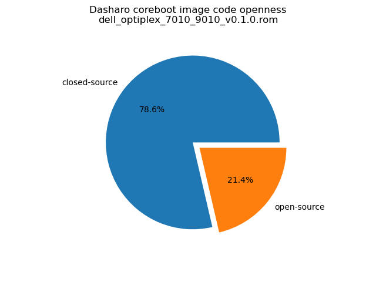

# Dasharo Openness Score

This page contains the [Dasharo Openness
Score](../../glossary.md#dasharo-openness-score) for Dasharo releases
compatible with Dell Optiplex 7010/9010. The content of the page is generated
with [Dasharo Openness Score
utility](https://github.com/Dasharo/Openness-Score).

## v0.1.0

Openness Score for dell_optiplex_7010_9010_v0.1.0.rom

Open-source code percentage: **21.4%**
Closed-source code percentage: **78.6%**

* Image size: 12582912 (0xc00000)
* Number of regions: 13
* Number of CBFSes: 1
* Total open-source code size: 1715361 (0x1a2ca1)
* Total closed-source code size: 6313984 (0x605800)
* Total data size: 408571 (0x63bfb)
* Total empty size: 4144996 (0x3f3f64)

> Numbers given above already include the calculations from CBFS regions
> presented below

### FMAP regions

| FMAP region | Offset | Size | Category |
| ----------- | ------ | ---- | -------- |
| SI_ME | 0x5000 | 0x5fb000 | closed-source |
| SI_DESC | 0x0 | 0x1000 | data |
| SMMSTORE | 0x800000 | 0x40000 | data |
| RW_MRC_CACHE | 0x840000 | 0x10000 | data |
| RW_ELOG | 0x850000 | 0x10000 | data |
| FMAP | 0x860000 | 0x800 | data |
| UNUSED | 0x600000 | 0x200000 | empty |

### CBFS COREBOOT

* CBFS size: 3799040
* Number of files: 15
* Open-source files size: 1715361 (0x1a2ca1)
* Closed-source files size: 26624 (0x6800)
* Data size: 9211 (0x23fb)
* Empty size: 2047844 (0x1f3f64)

> Numbers given above are already normalized (i.e. they already include size
> of metadata and possible closed-source LAN drivers included in the payload
> which are not visible in the table below)

| CBFS filename | CBFS filetype | Size | Compression | Category |
| ------------- | ------------- | ---- | ----------- | -------- |
| fallback/payload | simple elf | 1383398 | none | open-source |
| fallback/romstage | stage | 110096 | none | open-source |
| fallback/ramstage | stage | 139824 | LZMA | open-source |
| fallback/dsdt.aml | raw | 14827 | none | open-source |
| fallback/postcar | stage | 32656 | none | open-source |
| bootblock | bootblock | 34560 | none | open-source |
| cpu_microcode_blob.bin | microcode | 26624 | none | closed-source |
| cbfs_master_header | cbfs header | 32 | none | data |
| config | raw | 3928 | LZMA | data |
| revision | raw | 863 | none | data |
| build_info | raw | 114 | none | data |
| vbt.bin | raw | 1438 | LZMA | data |
| cmos.default | cmos_default | 256 | none | data |
| cmos_layout.bin | cmos_layout | 1204 | none | data |
| (empty) | null | 2047844 | none | empty |
