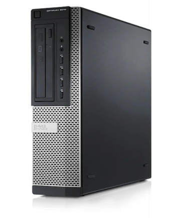

# Overview

<!--

_**TBD**: this page should contain most important information about Dasharo OSF
support for Dell OptiPlex 7010/9010 including presentations, demos, external
resources, reviews etc. Currently it just points to subsecations of the
documentation._

-->

## Dell OptiPlex 7010/9010 SFF

OptiPlex is a computer series by Dell aimed at office workloads coming in
different form factors and quality levels.

Dasharo supports the IvyBridge equipped 7010 and 9010 SFF models which share
the same board. There exists also three other versions sharing most of the
internals but differ a bit regarding expansion possibilities. Additionally the
Precision T1650 has essentially the same board as the MT featuring a workstation
grade C216 chipset.

|                 | MT - Medium Tower           | DT - Desktop                | SFF - Small Form Factor | USFF - Ultra Small Form Factor |
| --------------- | --------------------------- | --------------------------- | ----------------------- | ------------------------------ |
| UDIMM           | 4                           | 4                           | 4                       | 2                              |
| USB 2           | 2 Front, 4 Back, 1 Internal | 2 Front, 4 Back, 1 Internal | 2 Front, 4 Back         | 2 Back                         |
| USB 3           | 2 Front, 2 Back             | 2 Front, 2 Back             | 2 Front, 2 Back         | 2 Front, 2 Back                |
| SATA 2.0        | 2                           | 1                           | 1                       | -                              |
| SATA 3.0        | 2                           | 2                           | 2                       | 2                              |
| Expansion Cards | 4 full height               | 4 half height               | 2 half height           | 1 MiniPCIe half height         |
| PCI 2.3         | 1                           | 1                           | -                       | -                              |
| PCIe 2.0        | 1x4, 1x1                    | 1x4, 1x1                    | 1x4                     | 1x                             |
| PCIe 3.0        | 1x16                        | 1x16                        | 1x16                    | -                              |
| Height          | 36.00 cm                    | 36.00 cm                    | 29.00 cm                | 23.70 cm                       |
| Width           | 17.50 cm                    | 10.20 cm                    | 9.30 cm                 | 6.50 cm                        |
| Depth           | 41.70 cm                    | 41.00 cm                    | 31.20 cm                | 24.00 cm                       |
| Weight          | 9.40 kg                     | 7.90 kg                     | 6.00 kg                 | 3.30 kg                        |

Note: There also exists the OptiPlex Tower 7010 which has nothing to do with this
IvyBridge series from a firmware point of view.

If you wish to build, perform initial deployment, update or recover your setup,
please refer to [documentation](#documentation) sections.

To learn more about our process and motivation for the coreboot port and
Dasharo support, see [references](#references) section.

## History

Dasharo compatible with Dell OptiPlex 7010/9010 used to be a community-driven
effort. We would work on this in our free time, since we had no sponsor for
this project. To address the issue we used to host a virtual hackathon called
[OptiPlex Tuesday](https://3mdeb.com/events/) on Dasharo Matrix, almost every
Tuesday.

With the release of Dasharo firmware for this platform, the event series is
concluded. We would like to thank all participants, and we hope we'll meet
again at future events.

## Documentation

* [Releases](releases.md) - groups information about all releases.
* [Building manual](building-manual.md) - describes how to build Dasharo
  compatible with Dell OptiPlex 7010/9010.
* [Initial deployment](initial-deployment.md) - describes initial Dasharo
  deployment methods (i. e. flashing new firmware) compatible with Dell
  OptiPlex 7010/9010.
* [Firmware update](firmware-update.md) - explains supported Dasharo
  open-source firmware update methods.
* [Recovery](recovery.md) - gathers information on how to recover the platform
  from potential failure.
* [Hardware configuration matrix](hardware-matrix.md) - describes the
  platform's hardware configuration used during the Dasharo firmware
  validation procedure.
* [Test matrix](test-matrix.md) - describes validation scope used during
  Dasharo firmware validation procedure.
* [FAQ](faq.md) - answers to frequently asked questions.

## References

* [Dell OptiPlex and coreboot - a story about porting cursed hardware (part 1)](https://blog.3mdeb.com/2020/2020-06-24-dell-optiplex-port/)
* [Dell OptiPlex and coreboot - a story about porting cursed hardware (part 2)](https://blog.3mdeb.com/2021/2021-06-01-optiplex_part2/)
* [Dasharo for Dell OptiPlex 7010 / 9010](https://blog.3mdeb.com/2021/2021-11-26-optiplex-dasharo/)
* 7010: [Dell-Support](https://www.dell.com/support/product-details/en-us/product/optiplex-7010/resources/manuals),
 [Technical Guidebook](https://i.dell.com/sites/doccontent/shared-content/data-sheets/en/Documents/OptiPlex_7010_Technical_Guidebook.pdf),
 [3mdeb-Shop](https://shop.3mdeb.com/shop/dasharo-supported-hardware/dasharo-dell-optiplex-7010/)
* 9010: [Dell-Support](https://www.dell.com/support/product-details/en-us/product/optiplex-9010/resources/manuals),
 [Technical Guidebook](https://i.dell.com/sites/doccontent/shared-content/data-sheets/en/Documents/OptiPlex_9010_Technical_Guidebook.pdf),
 [3mdeb-Shop](https://shop.3mdeb.com/shop/dasharo-supported-hardware/dasharo-dell-optiplex-9010-sff-i7-3770-8gb-32gb-ram/)
