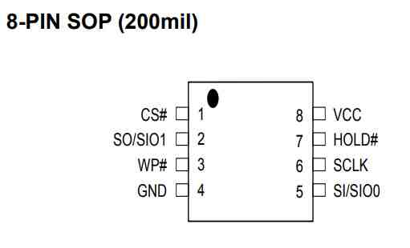
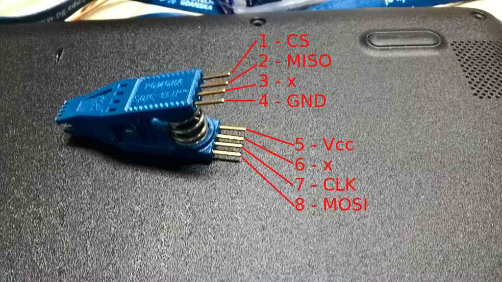
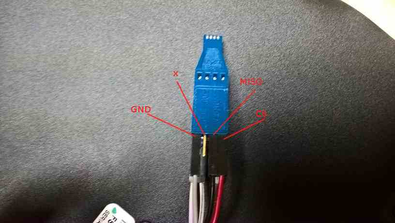
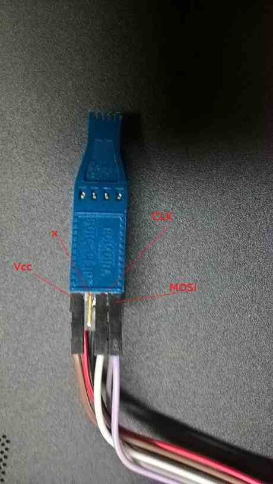
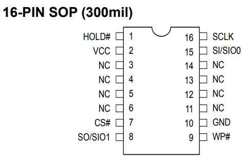
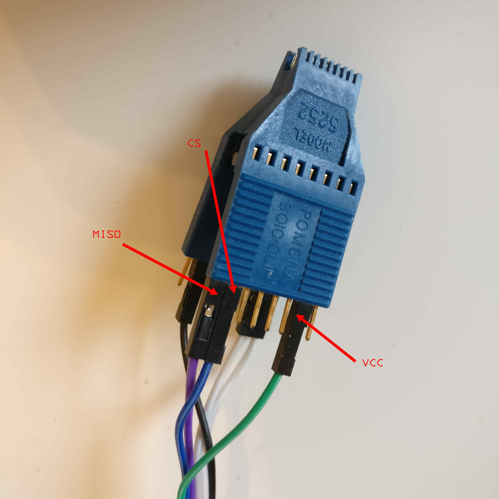

# Recovery

**Please read the [overview page](overview.md) first!**

---

Following documentation describes the process of recovering hardware from brick
state with [RTE](../../transparent-validation/rte/introduction.md) and Dasharo
open-source firmware. Following procedure is supported for following models

<center>

| Vendor | Model |
:-------:|:-----:|
|Dell    | OptiPlex 7010 SFF |
|Dell    | OptiPlex 7010 DT |
|Dell    | OptiPlex 9010 SFF |

</center>

## Step 1: Prepare hardware

1. To prepare hardware please follow
   [hardware preparation](initial-deployment.md#hardware-preparation)
   procedure.
2. Follow instruction in the video to remove heatsink:


## Step 2: Find SPI_1, SPI_2/SPI_3

<center>

</center>

## Step 3: Connect SOIC-8 Pomona clip between RTE and target

Connect SOIC-8 Pomona according to
[MX25L3206E datasheet](https://www.macronix.com/Lists/Datasheet/Attachments/8616/MX25L3206E,%203V,%2032Mb,%20v1.5.pdf).

<center>

</center>

<center>
 
</center>

<center>

 | RTE J7                                 | Pomona SOIC clip  |
 |:--------------------------------------:|:-----------------:|
 | CS                                     | pin 1 (upside)    |
 | MISO                                   | pin 2 (upside)    |
 | GND                                    | pin 4 (upside)    |
 | VCC (3.3V)                             | pin 5 (downside)  |
 | SCLK                                   | pin 7 (downside)  |
 | MOSI                                   | pin 8 (downside)  |

</center>

Numbers 1-4 have to be on one side and numbers 5-8 have to be on the other side
of the clip.

<center>

</center>

<center>

</center>

Clip on the `SPI_1` chip. Match pin 1 (`CS`) of the Pomona clip with the first
pin of `SPI_1` chip, marked with a small dot engraved on the chip.


## Step 4: Connect RTE

<center>

</center>

1. Connect J2 Orange Pi Zero system debug output
1. Power the board and confirm it boots
1. **Please note** typical convention of USB-UART converter colors is as follows
    - black - GND
    - red - +5V
    - green - TX
    - white - RX
1. Connect terminal to RTE and read OS version:

    ```shell
    sudo minicom -b 115200 -D /dev/ttyUSB0 -o -C /tmp/minicom.cap
    ```

    - `-b 115200` sets baudrate
    - `-D /dev/ttyUSB0` points to USB-UART converter device, it can be
      different if you already have some devices connected or you use different
      operating system
    - `-o` skip initialization
    - `-C /tmp/minicom.cap` capture serial terminal output, if you will have
      problems with exercises please post this file
1. Login using following credentials:

    ```shell
    login: root
    password: meta-rte
    ```

## Step 5: Prepare recovery binary

Following procedure assume that you use recovery binary created during [backup
process](../../osf-trivia-list/deployment.md#how-to-use-flashrom-to-backup-vendor-bios).
Backup has 12MB, so it have to be split

```bash
split -b4M bios_backup_YYYYMMDD.bin
```

## Step 6: Flash 4MB (BIOS) part

```bash
echo 1 > /sys/class/gpio/gpio405/value
```

```bash
echo 1 > /sys/class/gpio/gpio406/value
```

```bash
echo 1 > /sys/class/gpio/gpio404/value
```

`xac` is third file resulting from the previous binary split, so it contains
Dasharo code and data which fits into 4MB and in case of Dell OptiPlex
9010/7010 should be flashed to 4MB SPI.

```bash
flashrom -w xac -p linux_spi:dev=/dev/spidev1.0,spispeed=16000 -c "MX25L3205D/MX25L3208D"
```

## (Optional) Step 7: Flash 8MB (ME) part

If a more serious problem occurs, like
[broken ME](faq.md#cpu-was-replace-warm-reset-required-loop), or if you would
like to restore Dell firmware, it may be necessary to use your
[firmware backup](initial-deployment.md#bios-backup) and restore content of 8MB
chip.

### Step 7a: Connect SOIC-16 Pomona clip between RTE and target

Connect SOIC-16 Pomona according to
[MX25L6406E datasheet](https://www.digikey.ch/htmldatasheets/production/980657/0/0/1/MX25L6406E.pdf).

<center>

</center>

<center>
 
</center>

<center>

 | RTE J7                                 | Pomona SOIC clip  |
 |:--------------------------------------:|:-----------------:|
 | VCC (3.3V)                             | pin 2 (upside)    |
 | CS                                     | pin 7 (upside)    |
 | MISO                                   | pin 8 (upside)    |
 | SCLK                                   | pin 16 (downside) |
 | MOSI                                   | pin 15 (downside) |
 | GND                                    | pin 10 (downside) |

</center>

Numbers 1-8 have to be on one side and numbers 9-16 have to be on the other
side of the clip.

<center>

</center>

<center>

</center>

Clip on the `SPI_2/SPI_3` chip. Match pin 1 (`HOLD#`) of the Pomona clip with
the first pin of `SPI_2/SPI_3` chip, marked with a small dot engraved on the
chip.


### Step 7b: Flash 8MB (ME) part

```bash
echo 1 > /sys/class/gpio/gpio405/value
```

```bash
echo 1 > /sys/class/gpio/gpio406/value
```

```bash
echo 1 > /sys/class/gpio/gpio404/value
```

#### Dasharo recovery

Use following procedure if your 4M flash contain Dasharo open-source firmware.

```bash
cat > dell_optiplex.layout <<EOF
00000000:00000fff fd
00001000:00004fff gbe
00005000:005fffff me
00600000:007fffff unused
EOF
```

```bash
flashrom -w your_bios_backup.bin -p linux_spi:dev=/dev/spidev1.0,spispeed=16000 -c "MX25L6406E/MX25L6408E" -i fd -i me --layout dell_optiplex.layout
```

#### Vendor BIOS recovery

Use following procedure if your 4M flash contain vendor BIOS.

```bash
flashrom -w your_bios_backup_8M.bin -p linux_spi:dev=/dev/spidev1.0,spispeed=16000 -c "MX25L6406E/MX25L6408E"
```

# RaspberryPi Recovery

## Overview

If you attempted to flash dasharo, using the below command, without using
the Dasharo Tools Suite OEM you may have caused a break within the Intel ME
region of the flash chip.

```bash
flashrom -p internal --ifd -i bios -i me -w <dasharo_optiplex_9010_firmware>
```

## Required Items

You will need to purchase an
[8 Pin Pomona Clip](https://www.digikey.com/en/products/detail/pomona-electronics/5250/745102?s=N4IgTCBcDaIKxjgBgAQAUD2BbDA7AhiiALoC%2BQA),
a [16 Pin Pomona Clip](https://www.digikey.com/en/products/detail/pomona-electronics/5252/745103?s=N4IgTCBcDaIKxgQAgAoHsC2aB2BDJIAugL5A),
a [Raspberry pi 3B+ or above](https://www.adafruit.com/product/3775?src=raspberrypi),
and [female-to-female DuPont cables](https://www.amazon.com/40pcs-Female-2-54mm-Jumper-2x40pcs/dp/B00GSE2S98)

## Steps

1. Remove heatsink from CPU. [Linked video with correct timestamp](https://youtu.be/oFu3zpvo1Vg?t=240)

1. Plug your DuPont female-to-female connectors to the RPi as displayed below.

  Edge of pi (furthest from you)
              (UART)
             TX
L         GND | RX                    CS
E          |  |  |                    |
F +--------------------------------------------------------------+
T |  x  x  x  x  x  x  x  x  x  x  x  x  x  x  x  x  x  x  x  x  |
  |  x  x  x  x  x  x  x  x  x  x  x  x  x  x  x  x  x  x  x  x  |
E +--------------------------^--^--^--^-----------------------^--+
                             |  |  |  |                       20
D                     (VCC)-3.3V| MISO|                       |
G                             MOSI    CLK                    GND
E
  Body of Pi (closest to you)
CREDIT: [skulls](https://github.com/merge/skulls/blob/master/x230/README.md)

1. Activate your SPI interface on your RPi.

```bash
sudo raspi-config
```

Select _Interface Options_
Select _SPI_
Select _enable_

Confirm changes.

1. Split your backup file located on your RPi.

```bash
split -b8M bio_backup.bin
```

This should produce two (2) separate files within your directory,
xaa and xab. You xaa blob will be 8MB (ME blob) and your xab
will be 4MB (BIOS blob).

1. With your PC and your RPi powered off and power cords
_removed_ clip the 8 Pin Pomona Clip to the 8 Pin chip.

<center>
### 8 Pin Clip
Left Side Clip
x  x  x  x
^     ^  ^
|     |  |
GND  MISO|
         CS

Right Side Clip
x  x  x  x
^  ^     ^
|  |     |
MOSI    VCC
  CLK
</center>

1. Boot the RPi.

1. Test to ensure the RPi can read the chip.

```bash
sudo flashrom -p linux_spi:dev=/dev/spidev0.0,spispeed=16000 -V
```

If successful, flashrom will display the chips read (should have 4 chips read).

1. With the split backup (xaa and xab) in your current directory flash
the chip and wait.

```bash
sudo flashrom -w xab -p linux_spi:dev=/dev/spidev0.0,spispeed=16000 -c "MX25L3205D/MX25L3208D" -V
```

1. After a successful flash, shutdown the RPi and remove the clip.

1. Plug the DuPont female-to-female connectors to the 16 Pin Pomona Clip

<center>
### 16 Pin Clip
Left Side Clip
x  x  x  x  x  x  x  x
   ^              ^  ^
   |              |  |
  VCC            CS  |
                    MISO
Right Side Clip
x  x  x  x  x  x  x  x
^  ^                 ^
|  |                 |
CLK|                GND
  MOSI
</center>

1. With your PC and your RPi powered off and power cords _removed_ clip the
16 Pin Pomona Clip to the 16 Pin chip.

1. Boot the RPi.

1. Again, test to ensure the RPi can read the chip.

```bash
sudo flashrom -p linux_spi:dev=/dev/spidev0.0,spispeed=16000 -V
```

If successful, flashrom will display the chips read (should have 4 chips
read).

1. With the split backup (xaa and xab) in your current directory flash
the chip and wait.

```bash
sudo flashrom -w xaa -p linux_spi:dev=/dev/spidev0.0,spispeed=16000 -c "MX25L6406E/MX25L6408E" -V
```

1. After a successful flash, shutdown the RPi and remove the clip.

1. With the CMOS battery removed, plug in the power to the tower and power on.
If you have a successful boot (output displayed and white light on power button),
power down the machine and reinsert the CMOS battery. Again, power on the machine.

1. If successful, you will have a stable system to re-attampt flashing Dasharo.
