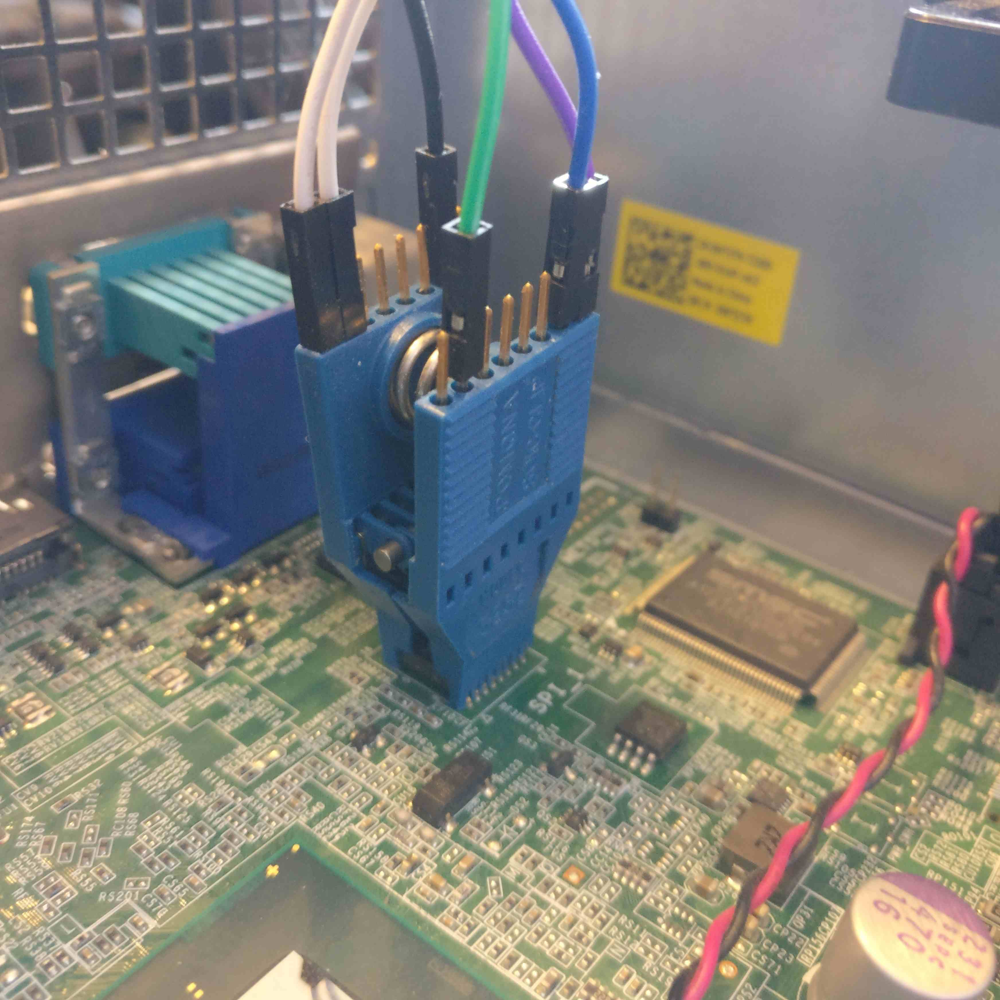

# Recovery

**Please read the [overview page](overview.md) first!**

---

Following documentation describes the process of recovering hardware from brick
state with [RTE](../../../transparent-validation/rte/introduction/) and Dasharo
open-source firmware. Following procedure is supported for following models

<center>

| Vendor | Model |
:-------:|:-----:|
|Dell    | OptiPlex 7010 SFF |
|Dell    | OptiPlex 7010 DT |
|Dell    | OptiPlex 9010 SFF |

</center>

## Step 1: Prepare hardware

1. To prepare hardware please follow [hardware preparation](../initial-deployment/#hardware-preparation)
   procedure.
2. Follow instruction in the video to remove heatsink:

<center>

</center>

## Step 2: Find SPI_1, SPI_2/SPI_3

<center>

</center>

## Step 3: Connect SOIC-8 Pomona clip between RTE and target

Connect SOIC-8 Pomona according to
[MX25L3206E datasheet](https://www.macronix.com/Lists/Datasheet/Attachments/8616/MX25L3206E,%203V,%2032Mb,%20v1.5.pdf).

<center>

</center>

<center>
 
</center>

<center>

 | RTE J7                                 | Pomona SOIC clip  |
 |:--------------------------------------:|:-----------------:|
 | CS                                     | pin 1 (upside)    |
 | MISO                                   | pin 2 (upside)    |
 | GND                                    | pin 4 (upside)    |
 | VCC                                    | pin 5 (downside)  |
 | SCLK                                   | pin 7 (downside)  |
 | MOSI                                   | pin 8 (downside)  |

</center>

Numbers 1-4 have to be on one side and numbers 5-8 have to be on the other side
of the clip.

<center>

</center>

<center>

</center>

Clip on the `SPI_1` chip. Match pin 1 (`CS`) of the Pomona clip with the first
pin of `SPI_1` chip, marked with a small dot engraved on the chip.


## Step 4: Connect RTE

<center>

</center>

1. Connect J2 Orange Pi Zero system debug output
1. Power the board and confirm it boots
1. **Please note** typical convention of USB-UART converter colors is as follows
    - black - GND
    - red - +5V
    - green - TX
    - white - RX
1. Connect terminal to RTE and read OS version:

    ```shell
    sudo minicom -b 115200 -D /dev/ttyUSB0 -o -C /tmp/minicom.cap
    ```

    - `-b 115200` sets baudrate
    - `-D /dev/ttyUSB0` points to USB-UART converter device, it can be
      different if you already have some devices connected or you use different
      operating system
    - `-o` skip initialization
    - `-C /tmp/minicom.cap` capture serial terminal output, if you will have
      problems with exercises please post this file
1. Login using following credentials:

    ```shell
    login: root
    password: meta-rte
    ```

## Step 5: Prepare recovery binary

Following procedure assume that you use recovery binary created during [backup
process](../../..//osf-trivia-list/deployment/#how-to-use-flashrom-to-backup-vendor-bios).
Backup has 12MB, so it have to be split

```bash
split -b4M bios_backup_YYYYMMDD.bin
```

## Step 6: Flash 4MB (BIOS) part

```bash
echo 1 > /sys/class/gpio/gpio405/value
```

```bash
echo 1 > /sys/class/gpio/gpio406/value
```

```bash
echo 1 > /sys/class/gpio/gpio404/value
```

`xac` is third file resulting from the previous binary split, so it contains
Dasharo code and data which fits into 4MB and in case of Dell OptiPlex
9010/7010 should be flashed to 4MB SPI.

```bash
flashrom -w xac -p linux_spi:dev=/dev/spidev1.0,spispeed=16000 -c "MX25L3205D/MX25L3208D"
```

## (Optional) Step 7: Flash 8MB (ME) part

If a more serious problem occurs, like
[broken ME](../faq/#cpu-was-replace-warm-reset-required-loop),
it may be necessary to use your
[firmware backup](../initial-deployment/#bios-backup)
and restore content of 8MB chip.

### Step 7a: Connect SOIC-16 Pomona clip between RTE and target

Connect SOIC-16 Pomona according to
[MX25L6406E datasheet](https://www.digikey.ch/htmldatasheets/production/980657/0/0/1/MX25L6406E.pdf).

<center>

</center>

<center>
 
</center>

<center>

 | RTE J7                                 | Pomona SOIC clip  |
 |:--------------------------------------:|:-----------------:|
 | VCC                                    | pin 2 (upside)    |
 | CS                                     | pin 7 (upside)    |
 | MISO                                   | pin 8 (upside)    |
 | SCLK                                   | pin 16 (downside) |
 | MOSI                                   | pin 15 (downside) |
 | GND                                    | pin 10 (downside) |

</center>

Numbers 1-8 have to be on one side and numbers 9-16 have to be on the other
side of the clip.

<center>

</center>

<center>

</center>

Clip on the `SPI_2/SPI_3` chip. Match pin 1 (`HOLD#`) of the Pomona clip with
the first pin of `SPI_2/SPI_3` chip, marked with a small dot engraved on the
chip.



### Step 7b: Flash 8MB (ME) part

```bash
echo 1 > /sys/class/gpio/gpio405/value
```

```bash
echo 1 > /sys/class/gpio/gpio406/value
```

```bash
echo 1 > /sys/class/gpio/gpio404/value
```

#### Dasharo recovery

Use following procedure if your 4M flash contain Dasharo open-source firmware.

```bash
cat > dell_optiplex.layout <<EOF
00000000:00000fff fd
00001000:00004fff gbe
00005000:005fffff me
00600000:007fffff unused
EOF
```

```bash
flashrom -w your_bios_backup.bin -p linux_spi:dev=/dev/spidev1.0,spispeed=16000 -c "MX25L6406E/MX25L6408E" -i fd -i me --layout dell_optiplex.layout
```

#### Vendor BIOS recovery

Use following procedure if your 4M flash contain vendor BIOS.

```bash
flashrom -w your_bios_backup_8M.bin -p linux_spi:dev=/dev/spidev1.0,spispeed=16000 -c "MX25L6406E/MX25L6408E"
```
