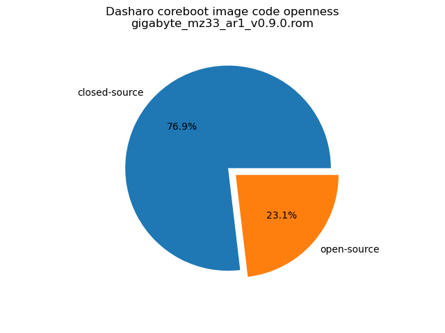
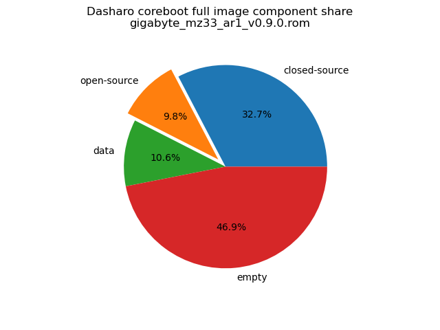

# Dasharo Openness Score

This page contains the [Dasharo Openness
Score](../../glossary.md#dasharo-openness-score) for Gigabyte MZ33-AR1 Dasharo
releases. The content of the page is generated with [Dasharo Openness Score
utility](https://github.com/Dasharo/Openness-Score).

## v0.9.0

Openness Score for gigabyte_mz33_ar1_v0.9.0.rom

Open-source code percentage: **23.1%**
Closed-source code percentage: **76.9%**

* Image size: 33554432 (0x2000000)
* Number of regions: 30
* Number of CBFSes: 4
* Total open-source code size: 1648422 (0x192726)
* Total closed-source code size: 5480640 (0x53a0c0)
* Total data size: 1779366 (0x1b26a6)
* Total empty size: 7868788 (0x781174)

> Numbers given above already include the calculations from CBFS regions
> presented below

### FMAP regions

| FMAP region | Offset | Size | Category |
| ----------- | ------ | ---- | -------- |
| RO_VPD | 0x0 | 0x4000 | data |
| FMAP | 0x4000 | 0x1000 | data |
| RO_FRID | 0x5000 | 0x100 | data |
| RO_FRID_PAD | 0x5100 | 0x700 | data |
| GBB | 0x5800 | 0x3000 | data |
| VBLOCK_A | 0x800000 | 0x10000 | data |
| RW_FWID_A | 0xafff00 | 0x100 | data |
| VBLOCK_B | 0xb00000 | 0x10000 | data |
| RW_FWID_B | 0xdfff00 | 0x100 | data |
| RW_ELOG | 0xe00000 | 0x4000 | data |
| SHARED_DATA | 0xe04000 | 0x2000 | data |
| VBLOCK_DEV | 0xe06000 | 0x2000 | data |
| RW_VPD | 0xe08000 | 0x2000 | data |
| RW_NVRAM | 0xe0a000 | 0x6000 | data |
| CONSOLE | 0xe50000 | 0x20000 | data |
| SMMSTORE | 0xeb0000 | 0x80000 | data |
| RW_MRC_CACHE | 0xf30000 | 0xd0000 | data |

### CBFS COREBOOT

* CBFS size: 8353792
* Number of files: 21
* Open-source files size: 1648422 (0x192726)
* Closed-source files size: 5185728 (0x4f20c0)
* Data size: 40018 (0x9c52)
* Empty size: 1479624 (0x1693c8)

> Numbers given above are already normalized (i.e. they already include size
> of metadata and possible closed-source LAN drivers included in the payload
> which are not visible in the table below)

| CBFS filename | CBFS filetype | Size | Compression | Category |
| ------------- | ------------- | ---- | ----------- | -------- |
| fallback/payload | simple elf | 1342255 | none | open-source |
| fallback/romstage | stage | 33487 | LZ4 | open-source |
| fallback/ramstage | stage | 254144 | LZMA | open-source |
| fallback/dsdt.aml | raw | 18536 | none | open-source |
| cpu_microcode_b100.bin | microcode | 14368 | none | closed-source |
| cpu_microcode_b110.bin | microcode | 14368 | none | closed-source |
| cpu_microcode_b000.bin | microcode | 14368 | none | closed-source |
| cpu_microcode_b010.bin | microcode | 14368 | none | closed-source |
| cpu_microcode_b020.bin | microcode | 14368 | none | closed-source |
| cpu_microcode_b021.bin | microcode | 14368 | none | closed-source |
| apu/amdfw | amdfw | 5099520 | none | closed-source |
| cbfs_master_header | cbfs header | 32 | none | data |
| config | raw | 4719 | LZMA | data |
| revision | raw | 910 | none | data |
| build_info | raw | 106 | none | data |
| cmos_layout.bin | cmos_layout | 864 | none | data |
| logo.bmp | raw | 11977 | LZMA | data |
| sbom | raw | 19700 | none | data |
| header_pointer | cbfs header | 4 | none | data |
| (empty) | null | 2340 | none | empty |
| (empty) | null | 1477284 | none | empty |

### CBFS FW_MAIN_A

* CBFS size: 3079936
* Number of files: 1
* Open-source files size: 0 (0x0)
* Closed-source files size: 0 (0x0)
* Data size: 28 (0x1c)
* Empty size: 3079908 (0x2efee4)

> Numbers given above are already normalized (i.e. they already include size
> of metadata and possible closed-source LAN drivers included in the payload
> which are not visible in the table below)

| CBFS filename | CBFS filetype | Size | Compression | Category |
| ------------- | ------------- | ---- | ----------- | -------- |
| (empty) | null | 3079908 | none | empty |

### CBFS FW_MAIN_B

* CBFS size: 3079936
* Number of files: 1
* Open-source files size: 0 (0x0)
* Closed-source files size: 0 (0x0)
* Data size: 28 (0x1c)
* Empty size: 3079908 (0x2efee4)

> Numbers given above are already normalized (i.e. they already include size
> of metadata and possible closed-source LAN drivers included in the payload
> which are not visible in the table below)

| CBFS filename | CBFS filetype | Size | Compression | Category |
| ------------- | ------------- | ---- | ----------- | -------- |
| (empty) | null | 3079908 | none | empty |

### CBFS BOOTSPLASH

* CBFS size: 229376
* Number of files: 1
* Open-source files size: 0 (0x0)
* Closed-source files size: 0 (0x0)
* Data size: 28 (0x1c)
* Empty size: 229348 (0x37fe4)

> Numbers given above are already normalized (i.e. they already include size
> of metadata and possible closed-source LAN drivers included in the payload
> which are not visible in the table below)

| CBFS filename | CBFS filetype | Size | Compression | Category |
| ------------- | ------------- | ---- | ----------- | -------- |
| (empty) | null | 229348 | none | empty |
