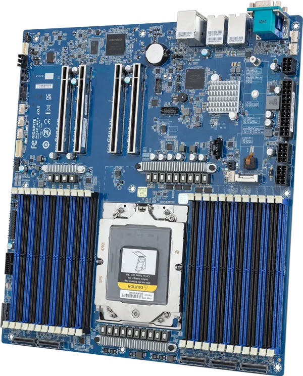

# Overview

## Hardkernel Gigabyte MZ33-AR1

Gigabyte MZ33-AR1 is a full-fledged single socket server board supporting
AMD Genoa and AMD Turin EPYC server processors.

## Documentation

- [Releases](./releases.md) - Groups information about all releases.
- [Building Manual](./building-manual.md) - Describes how to build Dasharo
  compatible with the Gigabyte MZ33-AR1.
- [Initial Deployment](./initial-deployment.md) - Describes initial Dasharo
  deployment methods (i. e. flashing new firmware) compatible with Gigabyte
  MZ33-AR1.
- [Recovery](./recovery.md) - Gathers information on how to recover the platform
    from potential failure.
- [Hardware Configuration Matrix](./hardware-matrix.md) - Describes the
    platform's hardware configuration used during the Dasharo firmware
    validation procedure.
- [Test Matrix](./test-matrix.md) - Describes validation scope used during
    Dasharo firmware validation procedure.
