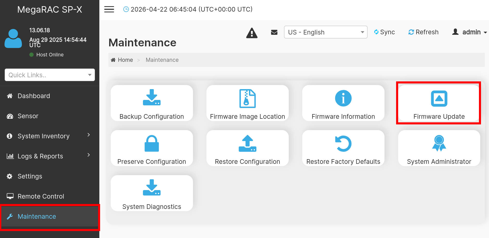
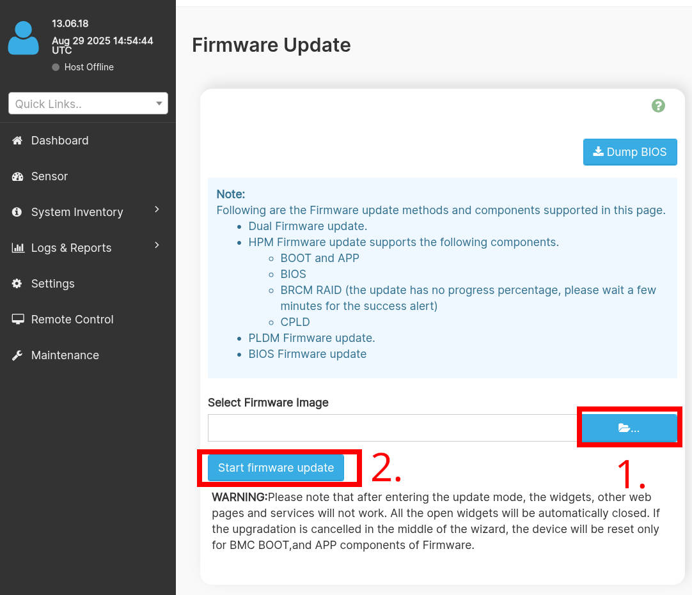

# Recovery

## Intro

The following documentation describes the process of recovering hardware from
the brick state using an [RTE](../../transparent-validation/rte/introduction.md)
and Dasharo open-source firmware.

## Flashing via BMC

1. Ensure the board is soft powered off and BMC active (PSU connected and
   powered).
2. Log in to BMC admin panel with unique credentials for your platform. Login
   is `admin` and password is unique , present on a sticker on the board box.
3. Navigate to `Maintenance` -> `Firmware Update`

   { class="center" }

4. In the file selection field, press the file selection button and find the
   `gigabyte_mz33_ar1_v0.9.x.rbu` file on your host device.
5. Click to proceed with flashing and confirm.

   { class="center" }

6. Wait until the process completes and then power on the board.

## External flashing

The external programming and recovery from bricks caused by Dasharo can be
achieved by flashing o

=== "RTE"
    ### Prerequisites

    * [Prepared RTE](../../transparent-validation/rte/v1.1.0/quick-start-guide.md)
    * 6x female-female wire cables
    * pomona SOIC8 clip

    ### Connections

    To prepare the stand for flashing follow the steps described in
    the [Generic test stand setup](../../unified-test-documentation/generic-testing-stand-setup.md#detailed-description-of-the-process)

    ### Firmware flashing

    To flash firmware follow the steps described below:

    1. Login to RTE via `ssh` or `minicom`.
    2. Turn on the platform by connecting the power supply.
    3. Wait at least 5 seconds.
    4. Turn off the platform by using the power button.
    5. Wait at least 3 seconds.
    6. Set the proper state of the SPI by using the following commands on RTE:

        ```bash
        # set SPI Vcc to 3.3V
        echo 1 > /sys/class/gpio/gpio405/value
        # SPI Vcc on
        echo 1 > /sys/class/gpio/gpio406/value
        # SPI lines ON
        echo 1 > /sys/class/gpio/gpio404/value
        ```

        > Starting with RTE distro v0.8.x the GPIOS are 517, 518, 516.

    7. Wait at least 2 seconds.
    8. Disconnect the power supply from the platform.
    9. Wait at least 2 seconds.
    10. Check if the flash chip is connected properly

        ```bash
        flashrom -p linux_spi:dev=/dev/spidev1.0,spispeed=16000
        ```

    11. Flash the platform by using the following command:

        ```bash
        flashrom -p linux_spi:dev=/dev/spidev1.0,spispeed=16000 \
            -w [path_to_binary]
        ```

        > The board sinks too much current which results in SPI Vcc to drop
        > below an acceptable level when writing to flash. Reads are reliable,
        > but write often fail. When PSU is off, the voltage on SPI chip is
        > 2.5V-2.6V only from RTE. Sometimes it happens to go smoothly, but most
        > of the time not. Using CH341A is more reliable, but leaves VCC always
        > connected to the board, which tends to put the board in a limbo state.
        > Recovering from such limbo requires disconnecting all power sources
        > from the board (both PSU and CH341A). However, with
        > [OSFV cli](https://github.com/Dasharo/osfv-scripts/tree/main/osfv_cli)
        > the writes are somehow reliable, so it is recommended to use the
        > utility.

    12. Change back the state of the SPI by using the following commands:

        ```bash
        echo 0 > /sys/class/gpio/gpio404/value
        echo 0 > /sys/class/gpio/gpio405/value
        echo 0 > /sys/class/gpio/gpio406/value
        ```

        > Starting with RTE distro v0.8.x the GPIOS are 516, 517, 518.

    13. Turn on the platform by connecting the power supply.

    The AMD board take longer to boot due to memory training happening on PSP
    side. Thus the first signs of life from open-source firmware may appear
    even after a couple of minutes (depends on amount of populated RAM).

=== "CH341A"

    ### Prerequisites

    * CH341a USB to SPI programmer
    * 6x female-female wire cables
    * pomona SOIC8 clip

    ### Connections

    1. Connect pomona SOIC8 clip to the CH341a programmer.
    2. Clip on the BIOS flash chip on the board.

    ### Firmware flashing

    To flash firmware follow the steps described below:

    3. Disconnect the power supply from the platform.
    4. Wait at least 2 seconds.
    5. Check if the flash chip is connected properly

        ```bash
        flashrom -p ch341a_spi
        ```

    6.  Flash the platform by using the following command:

        ```bash
        flashrom -p ch341a_spi -w [path_to_binary]
        ```

    7. Take off the pomona clip from the chip.
    8. Turn on the platform by connecting the power supply.

    The AMD board take longer to boot due to memory training happening on PSP
    side. Thus the first signs of life from open-source firmware may appear
    even after a couple of minutes (depends on amount of populated RAM).
