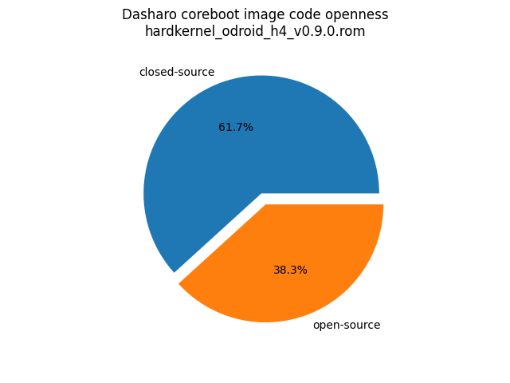
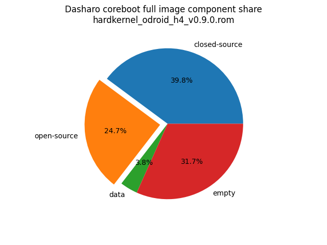

# Dasharo Openness Score

This page contains the [Dasharo Openness
Score](../../glossary.md#dasharo-openness-score) for Hardkernel ODROID H4+
Dasharo releases. The content of the page is generated with [Dasharo Openness
Score utility](https://github.com/Dasharo/Openness-Score).

## v0.9.0

Report has been generated with Openness Score utility version v0.2

Openness Score for hardkernel_odroid_h4_v0.9.0.rom

Open-source code percentage: **38.3%**
Closed-source code percentage: **61.7%**

* Image size: 16777216 (0x1000000)
* Number of regions: 21
* Number of CBFSes: 3
* Total open-source code size: 4143436 (0x3f394c)
* Total closed-source code size: 6684614 (0x65ffc6)
* Total data size: 632358 (0x9a626)
* Total empty size: 5316808 (0x5120c8)

> Numbers given above already include the calculations from CBFS regions
> presented below

### FMAP regions

| FMAP region | Offset | Size | Category |
| ----------- | ------ | ---- | -------- |
| SMMSTORE | 0x600000 | 0x40000 | data |
| RECOVERY_MRC_CACHE | 0x640000 | 0x20000 | data |
| RW_MRC_CACHE | 0x660000 | 0x20000 | data |
| RW_NVRAM | 0x680000 | 0x1000 | data |
| VBLOCK_A | 0x6c0000 | 0x10000 | data |
| RW_FWID_A | 0xafff00 | 0x100 | data |
| FMAP | 0xb00000 | 0x800 | data |
| RO_FRID | 0xb00800 | 0x100 | data |
| RO_FRID_PAD | 0xb00900 | 0x700 | data |
| GBB | 0xb01000 | 0x3000 | data |

### IFD regions

| IFD region | Start | End | Size | Category |
| -------------- | ----- | --- | ---- | -------- |
| Intel ME | 0x00001000 | 0x00413fff | 0x413000 | closed-source |
| Flash Descriptor | 0x00000000 | 0x00000fff | 0x1000 | data |
| Device Exp2 | 0x00414000 | 0x005fffff | 0x1ec000 | empty |

### CBFS BOOTSPLASH

* CBFS size: 258048
* Number of files: 1
* Open-source files size: 0 (0x0)
* Closed-source files size: 0 (0x0)
* Data size: 28 (0x1c)
* Empty size: 258020 (0x3efe4)

> Numbers given above are already normalized (i.e. they already include size
> of metadata and possible closed-source LAN drivers included in the payload
> which are not visible in the table below)

| CBFS filename | CBFS filetype | Size | Compression | Category |
| ------------- | ------------- | ---- | ----------- | -------- |
| (empty) | null | 258020 | none | empty |

### CBFS FW_MAIN_A

* CBFS size: 4390656
* Number of files: 13
* Open-source files size: 2027238 (0x1eeee6)
* Closed-source files size: 1206243 (0x1267e3)
* Data size: 8603 (0x219b)
* Empty size: 1148572 (0x11869c)

> Numbers given above are already normalized (i.e. they already include size
> of metadata and possible closed-source LAN drivers included in the payload
> which are not visible in the table below)

| CBFS filename | CBFS filetype | Size | Compression | Category |
| ------------- | ------------- | ---- | ----------- | -------- |
| fallback/payload | simple elf | 1727490 | none | open-source |
| fallback/romstage | stage | 98320 | none | open-source |
| fallback/ramstage | stage | 145034 | LZMA | open-source |
| fallback/dsdt.aml | raw | 18114 | none | open-source |
| fallback/postcar | stage | 38280 | none | open-source |
| cpu_microcode_blob.bin | microcode | 138240 | none | closed-source |
| fspm.bin | fsp | 786432 | none | closed-source |
| fsps.bin | fsp | 281571 | LZ4 | closed-source |
| config | raw | 5421 | LZMA | data |
| revision | raw | 860 | none | data |
| build_info | raw | 108 | none | data |
| vbt.bin | raw | 1272 | LZMA | data |
| (empty) | null | 2404 | none | empty |

### CBFS COREBOOT

* CBFS size: 5226496
* Number of files: 17
* Open-source files size: 2116198 (0x204a66)
* Closed-source files size: 1206243 (0x1267e3)
* Data size: 9071 (0x236f)
* Empty size: 1894984 (0x1cea48)

> Numbers given above are already normalized (i.e. they already include size
> of metadata and possible closed-source LAN drivers included in the payload
> which are not visible in the table below)

| CBFS filename | CBFS filetype | Size | Compression | Category |
| ------------- | ------------- | ---- | ----------- | -------- |
| fallback/payload | simple elf | 1727490 | none | open-source |
| fallback/romstage | stage | 98320 | none | open-source |
| fallback/ramstage | stage | 145034 | LZMA | open-source |
| fallback/dsdt.aml | raw | 18114 | none | open-source |
| fallback/postcar | stage | 38280 | none | open-source |
| bootblock | bootblock | 88960 | none | open-source |
| cpu_microcode_blob.bin | microcode | 138240 | none | closed-source |
| fspm.bin | fsp | 786432 | none | closed-source |
| fsps.bin | fsp | 281571 | LZ4 | closed-source |
| cbfs_master_header | cbfs header | 32 | none | data |
| intel_fit | intel_fit | 80 | none | data |
| config | raw | 5421 | LZMA | data |
| revision | raw | 860 | none | data |
| build_info | raw | 108 | none | data |
| vbt.bin | raw | 1272 | LZMA | data |
| (empty) | null | 2148 | none | empty |
| (empty) | null | 1892836 | none | empty |
