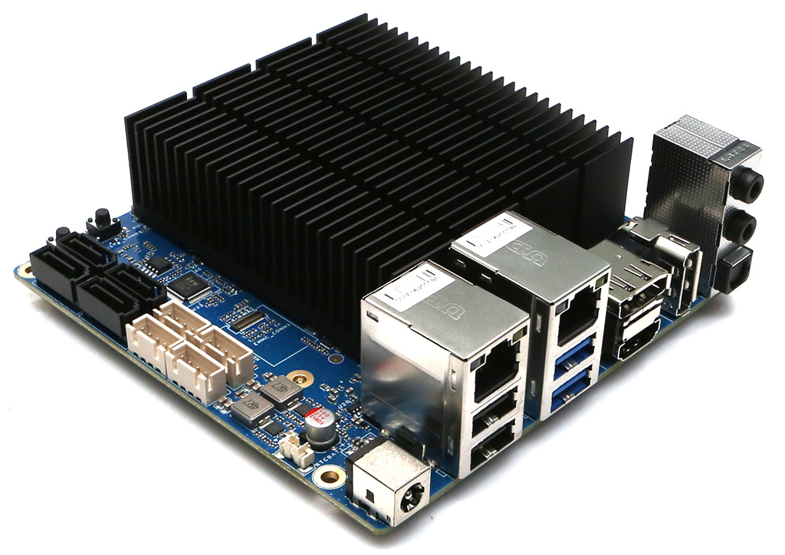

# Overview

## Hardkernel ODROID-H4 PLUS

Hardkernel ODROID-H4 PLUS is a small single-board computer with publicly
available schematics and documentation. One of it's most noteworthy features is the
use of two distinct switchable BIOS flash memory chips. This makes it a perfect
device for experimenting with firmware by making the recovery process after
bricking the device a breeze.

The device is described in detail on [blog.3mdeb.com](https://blog.3mdeb.com/2024/2024-07-25-odroid-h4-getting-started/)

The Hardkernel ODROID-H4 PLUS is available as part of the [Dasharo Pro Package](https://shop.3mdeb.com/shop/dasharo-pro-package/1-year-dasharo-entry-subscription-for-network-appliance/).
Subscribe to the Dasharo Pro Package to access exclusive pre-built binaries.
For added convenience, you can also purchase a [platform with a subscription](https://shop.3mdeb.com/shop/dasharo-supported-hardware/odroid-h4-plus-with-dasharo-corebootuefi-pro-package-for-network-appliance/)
directly from our shop.

## Documentation

- [Releases](./releases.md) - Groups information about all releases.
- [Building Manual](./building-manual.md) - Describes how to build Dasharo
  compatible with the ODROID-H4 PLUS.
- [Initial Deployment](./initial-deployment.md) - Describes initial Dasharo
  deployment methods (i. e. flashing new firmware) compatible with ODROID-H4
  PLUS.
- [Firmware Update](./firmware-update.md) - Explains supported Dasharo
    open-source firmware update methods.
- [Recovery](./recovery.md) - Gathers information on how to recover the platform
    from potential failure.
- [Hardware Configuration Matrix](./hardware-matrix.md) - Describes the
    platform's hardware configuration used during the Dasharo firmware
    validation procedure.
- [Test Matrix](./test-matrix.md) - Describes validation scope used during
    Dasharo firmware validation procedure.
