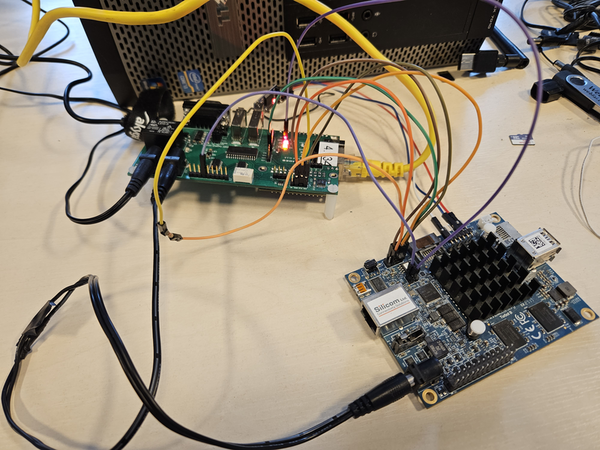

# Dasharo compatible with MinnowBoard Turbot - lab assembly guide

## Intro

This document gathers various notes and documentation useful for development of
Dasharo compatible with the MinnowBoard Turbot platform.

## Hardware connection

### Requirements

- [RTE](https://3mdeb.com/open-source-hardware/#rte)

- USB-UART converter

- DC Jack - DC Jack wire

### Serial

MinnowBoard exposes a pin header with debug UART on `J4`.

- Attach the pins on MinnowBoard to the USB-UART converter.

| USB-UART converter | Minnowboard Uart header (J4)|
|:------------------:|:-------------------------:  |
|    GND             | 1 (GND)                     |
|    TX              | 4 (RX)                      |
|    RX              | 5 (TX)                      |

### SPI

| RTE header J7 pin | Minnowboard header J1 pin       |
|:-----------------:|:-------------------------:      |
| 1 (NC)            | 3.3V connect from RTE J9 pin 1  |
| 2 (GND)           | 2 (GND)                         |
| 3 (CS)            | 3 (SPICS#) via 1.2 kOhm resistor|
| 4 (SCLK)          | 4 (SPICLK)                      |
| 5 (MISO)          | 5 (SPIDI)                       |
| 6 (MOSI)          | 6 (SPIDO)                       |
| 7 (NC)            | Not connected                   |
| 8 (NC)            | Not connected                   |

### Power supply

- Connect 5V power supply to RTE `J12` connector
- Connect RTE `J13` connector to MinnowBoard `J9` connector with a DC Jack - DC
  Jack wire

There are two ways to control the power supply.

- You can toggle power supply using the `rte_ctrl` located in `/usr/bin/`:

```bash
/usr/bin rte_ctrl rel
```

- You can control power supply by directly setting the state of GPIO 199. Turn
on power by setting it to `1` and turn it off by setting it to `0`:

```bash
echo 1 > /sys/class/gpio/gpio199/value
```

```bash
echo 0 > /sys/class/gpio/gpio199/value
```

- Power switch can also be controlled from the RTE. Connect the power control
pins according to the following table:

| RTE       | MinnowBoard |
|:---------:|:-----------:|
| J11 Pin 6 | J5 Pin 1    |
| J15 GND   | J5 Pin 2    |

The power state can be controlled with the `rte_ctrl` script:

```bash
/usr/bin rte_ctrl pon
/usr/bin rte_ctrl poff
```

- Example setup:



## Flashing firmware

You can flash firmware with the
[osfv_cli](https://github.com/Dasharo/osfv-scripts/tree/main/osfv_cli)
tool. Before trying to flash make sure that SPI is connected properly.

```bash
osfv_cli rte --rte_ip <rte_ip> --model minnowmax flash write --rom <path_to_binary>
```

Note that if multiple chips are found, you may be asked to specify which one you
would like to flash.

```bash
Found Winbond flash chip "W25Q64BV/W25Q64CV/W25Q64FV" (8192 kB, SPI) on linux_spi.

Found Winbond flash chip "W25Q64JV-.Q" (8192 kB, SPI) on linux_spi.
Multiple flash chip definitions match the detected chip(s): "W25Q64BV/W25Q64CV/W25Q64FV", "W25Q64JV-.Q"
Please specify which chip definition to use with the -c <chipname> option.
```

In that case, you need to modify line 295 of the `rte.py` script by appending
the `-c <chipname>` option to the arguments:

```python
args = self.flash_create_args(f"-w {self.FW_PATH_WRITE} -c W25Q64BV/W25Q64CV/W25Q64FV")
```
