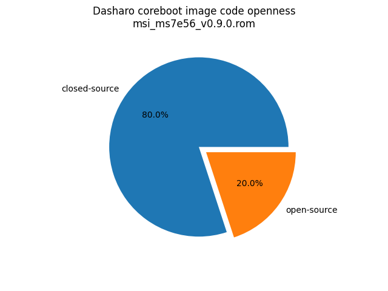
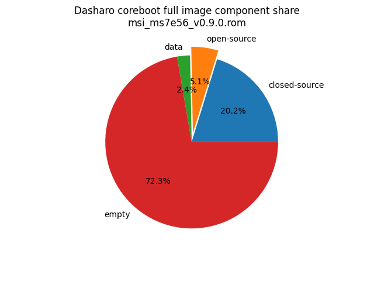

# Dasharo Openness Score

This page contains the [Dasharo Openness
Score](../../glossary.md#dasharo-openness-score) for Dasharo releases
compatible with MSI PRO B850-P WIFI. The content of the page is generated with
[Dasharo Openness Score utility](https://github.com/Dasharo/Openness-Score).

## v0.9.0

Openness Score for msi_ms7e56_v0.9.0.rom

Open-source code percentage: **20.0%**
Closed-source code percentage: **80.0%**

* Image size: 33554432 (0x2000000)
* Number of regions: 12
* Number of CBFSes: 2
* Total open-source code size: 1694586 (0x19db7a)
* Total closed-source code size: 6793582 (0x67a96e)
* Total data size: 813932 (0xc6b6c)
* Total empty size: 24252332 (0x1720fac)

> Numbers given above already include the calculations from CBFS regions
> presented below

### FMAP regions

| FMAP region | Offset | Size | Category |
| ----------- | ------ | ---- | -------- |
| FMAP | 0x0 | 0x1000 | data |
| SMMSTORE | 0xf80000 | 0x80000 | data |
| RW_MRC_CACHE | 0x1000000 | 0x40000 | data |
| UNUSED | 0x1060000 | 0xaf0000 | empty |

### CBFS COREBOOT

* CBFS size: 16248832
* Number of files: 17
* Open-source files size: 1694586 (0x19db7a)
* Closed-source files size: 5937518 (0x5a996e)
* Data size: 23376 (0x5b50)
* Empty size: 8593352 (0x831fc8)

> Numbers given above are already normalized (i.e. they already include size
> of metadata and possible closed-source LAN drivers included in the payload
> which are not visible in the table below)

| CBFS filename | CBFS filetype | Size | Compression | Category |
| ------------- | ------------- | ---- | ----------- | -------- |
| fallback/romstage | stage | 27069 | LZ4 | open-source |
| fallback/dsdt.aml | raw | 18682 | none | open-source |
| fallback/payload | simple elf | 1467446 | none | open-source |
| fallback/ramstage | stage | 253967 | LZMA | open-source |
| cpu_microcode_a752.bin | microcode | 5568 | none | closed-source |
| cpu_microcode_a780.bin | microcode | 5568 | none | closed-source |
| pci1002,15bf.rom | optionrom | 16896 | none | closed-source |
| apu/amdfw | amdfw | 5836800 | none | closed-source |
| cbfs_master_header | cbfs header | 32 | none | data |
| config | raw | 4695 | LZMA | data |
| revision | raw | 903 | none | data |
| build_info | raw | 138 | none | data |
| sbom | raw | 16378 | none | data |
| header_pointer | cbfs header | 4 | none | data |
| (empty) | null | 29988 | none | empty |
| (empty) | null | 8563364 | none | empty |

### CBFS BOOTSPLASH

* CBFS size: 4190208
* Number of files: 1
* Open-source files size: 0 (0x0)
* Closed-source files size: 0 (0x0)
* Data size: 28 (0x1c)
* Empty size: 4190180 (0x3fefe4)

> Numbers given above are already normalized (i.e. they already include size
> of metadata and possible closed-source LAN drivers included in the payload
> which are not visible in the table below)

| CBFS filename | CBFS filetype | Size | Compression | Category |
| ------------- | ------------- | ---- | ----------- | -------- |
| (empty) | null | 4190180 | none | empty |
