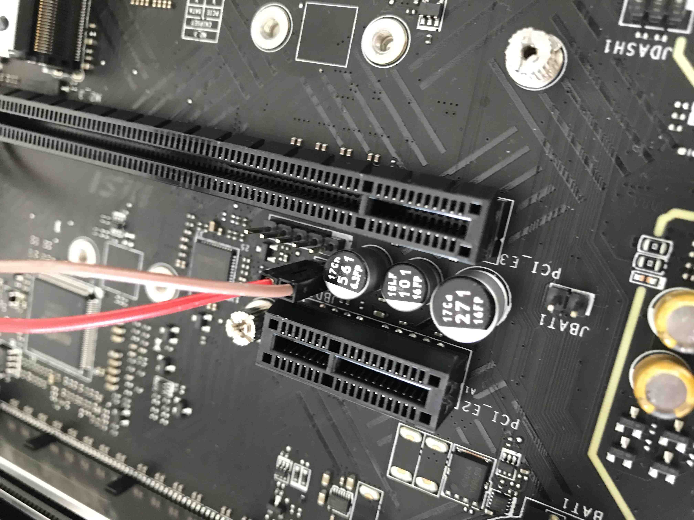
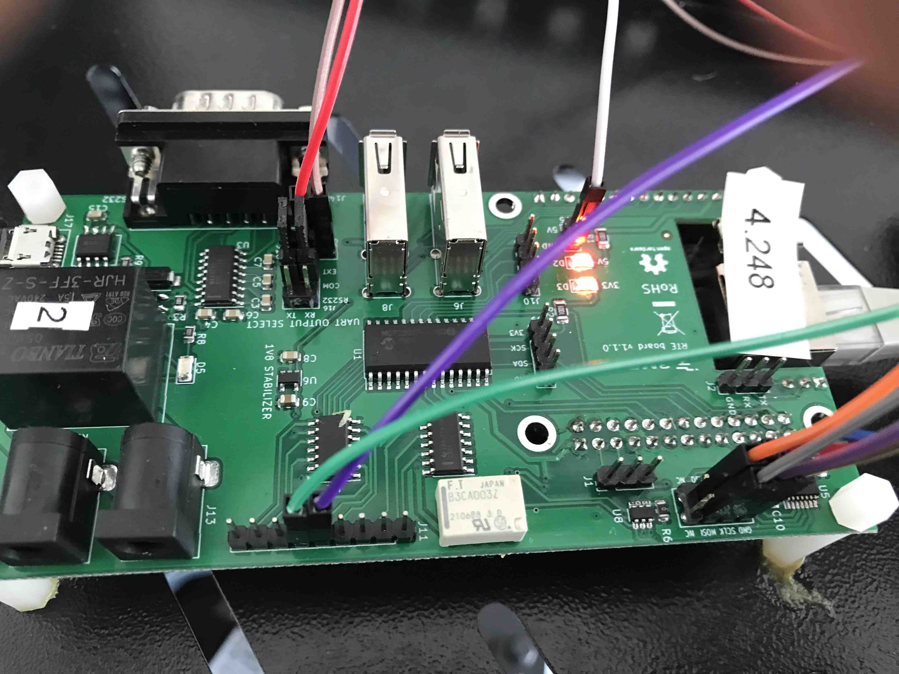
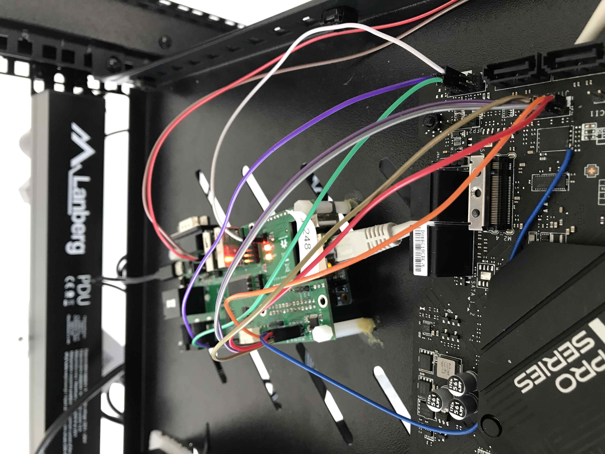

# Dasharo compatible with MSI PRO Z690-A - development

## Intro

This document gather various notes and documentation useful for development of
Dasharo compatible with the MSI PRO Z690-A platform.

## Hardware connection

### Requirements

- peripherals listed in the [Hardware Configuration Matrix](hardware-matrix.md)
- [RTE](https://3mdeb.com/open-source-hardware/#rte)
- [Sonoff S20 Smart Plug](https://wiki.iteadstudio.com/S20_Smart_Socket)
   with [custom firmware](https://esphome.io/devices/sonoff_s20.html)

### Serial debug

- Attach the jumpers in `J16` header to enable header `J18` according to the
  table below:

| Jumper position (TX)      | Jumper position (RX)            |
|:-------------------------:|:-------------------------------:|
| EXT + COM                 | EXT + COM                       |

- Connect signals from the `J18` header to serial receiver:

| RTE             | Msi Z690                                  |
|:---------------:|:-----------------------------------------:|
| J18 pin 1 (GND) | JBD1 pin 1 (pin closer to JBAT1)          |
| J18 pin 2 (RX)  | JBD1 pin 2 (pin further from JBAT1)       |

> Pins on JBD1 are not described in the documentation. They have been
> discovered experimentally. Pay attention to the connections.

Please also note that this is uni-directional communication. We can gether logs
from booting, but we cannot provide input to the platform at the same time.

### SPI

- For external flashing, connect `RTE` with motherboard according to the table
  below:

| RTE SPI header      | MSI Z690-A                                           |
|:-------------------:|:----------------------------------------------------:|
| J7 pin 1 (Vcc)      | JTPM1 pin 1 (SPI Power)                              |
| J7 pin 2 (GND)      | JTPM1 pin 7 (GND)                                    |
| J7 pin 3 (CS)       | JTPM1 pin 5 (RESERVED / BIOS SPI CS pin)             |
| J7 pin 4 (SCLK)     | JTPM1 pin 6 (SPI Clock)                              |
| J7 pin 5 (MISO)     | JTPM1 pin 3 (MISO)                                   |
| J7 pin 6 (MOSI)     | JTPM1 pin 4 (MOSI)                                   |

> JTPM1 is a 2mm pitch header, you will need 2mm to 2.54mm female-female dupont
> wires to connect to RTE.

The JTPM1 pin5 is actually BIOS SPI CS pin (marked as reserved in the board
manual).

- Example connection:

### Power control

#### Power buttons control

- Connect 12V/4A power supply to RTE J13 connector to power on RTE

- Connect power control pins from mainboard to RTE according to the table below:

> JFP1 is located in the corner of the mainbaord, near SATA interface ports

| RTE            | Msi Z690                    |
|:--------------:|:---------------------------:|
| J11 pin 9      | JFP1 pin 6 (PWR_ON)         |
| J11 pin 8      | JFP1 pin 7 (RST)            |
| J15 pin 1 (GND)| JFP1 pin 5 (GND)            |

#### Power supply control

Connect `SeaSonic FOCUS Plus Platinum` power supply unit to the mains via
`Sonoff S20 Smart Plug`. To power control via RTE, `Sonoff` smart plug
