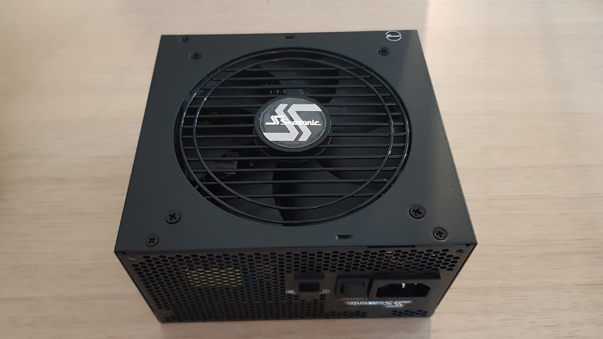
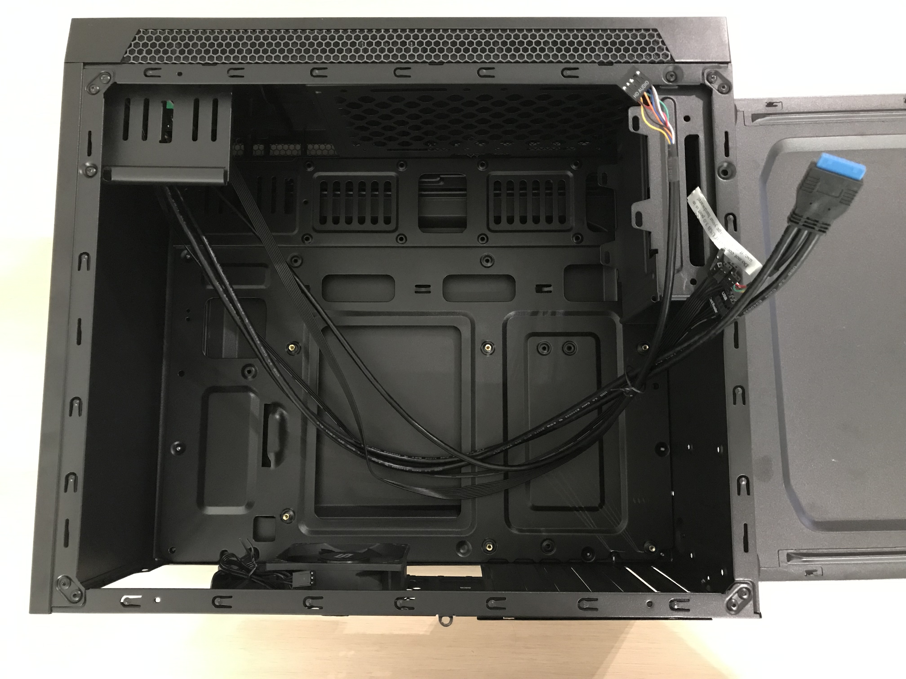

# Dasharo compatible with MSI PRO Z690-A DDR4 - montage

## Intro

This document describes the montage procedure of the MSI PRO Z690-A DDR4 with
specified in [requirements](#requirements) components.

## Requirements

| Part         | Model Name                                                      | Image                                   |
|:-------------|:---------------------------------------------------------------:|:---------------------------------------:|
| Motherboard  | MSI PRO Z-690A DDR4                                             |   |
| CPU          | Intel Core i5-12600K, 3.7G                                      |                   |
| Cooling      | Noctua CPU NH-U12S Redux (w/ Noctua NM-i17xx-MP78 Mounting Kit) |         |
| RAM          | Kingston Fury Beast, DDR4, 4*8GB (32GB Total), 3600MHz, CL17    |                |
| Power Supply | Seasonic Focus PX 750W 80 Plus Platinum                         | |
| Storage      | SSD Intel 670p 512 GB M.2 2280 PCI-E x4 Gen3 NVMe               |           |
| Enclosure    | SilentiumPC Armis AR1                                           |       |

Additionally, you will need a regular Phillips screwdriver.

## Montage 

1. Unpack all equipment.
1. Place the motherboard in front of you, this is component with which most of
    the operations will be performed. It's best to put something softer unders
    the board so as not to damage it, e.g. during instalation of RAM modules.

    

1. To install the CPU on motherboard, first open the CPU socket:

    

1. Insert the processor carefully and tighten it with the dedicated mechanism:

    

1. Use thermal paste TBD COLLER

1. Install the memory module into the DIMM slots. To insert a single module,
    open the latch on both sides. Then insert the RAM and gently press the
    module downward at both ends of the module and the latch will close
    automatically. Always insert memory modules in the DIMMA2 slot first.

    

1. Install the M.2 solid-state drive (SSD) into the M.2 slot. Remove the two
    screws from the cover and the one responsible for disk stabilization. Insert
    the SSD into the M.2 slot and tighten the previously removed screws.

    

1. Take the enclosure of computer and open one side as shown in the picture
    below:

    

1. Insert Motherboard into encloasure

NEXT CONNECTIONS TBD

## Usefull content

* [Building manual](building-manual.md) - how to build Dasharo compatible with
  the MSI PRO Z690-A DDR4
* [Installation manual](installation-manual.md) - how to install Dasharo
  firmware on the MSI PRO Z690-A DDR4
* [Board manual](https://download.msi.com/archive/mnu_exe/mb/PROZ690-AWIFIDDR4_PROZ690-ADDR4100x150.pdf) -
    there you will find detailed information about the motherboard and its
    operations.
