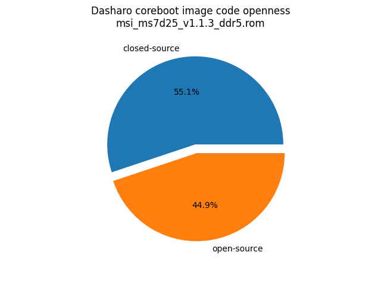
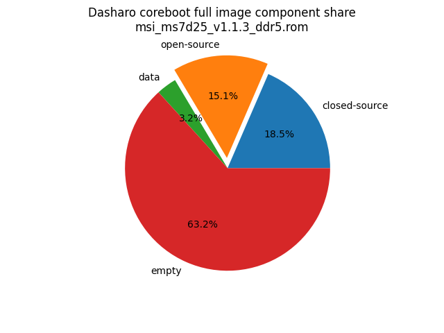

# Dasharo Openness Score

This page contains the [Dasharo Openness
Score](../../glossary.md#dasharo-openness-score) for Dasharo releases
compatible with MSI PRO Z690-A boards. The content of the page is generated
with [Dasharo Openness Score
utility](https://github.com/Dasharo/Openness-Score).

The very first historical attempt to measure the openness of an firmware image
is available [here](openness_analysis.md).

## v1.1.3

Openness Score for msi_ms7d25_v1.1.3_ddr5.rom

Open-source code percentage: **41.9%**
Closed-source code percentage: **58.1%**

* Image size: 33554432 (0x2000000)
* Number of regions: 37
* Number of CBFSes: 4
* Total open-source code size: 6927010 (0x69b2a2)
* Total closed-source code size: 9608432 (0x929cf0)
* Total data size: 948324 (0xe7864)
* Total empty size: 16070666 (0xf5380a)

> Numbers given above already include the calculations from CBFS regions
> presented below

### FMAP regions

| FMAP region | Offset | Size | Category |
| ----------- | ------ | ---- | -------- |
| SI_ME | 0x1000 | 0x3ff000 | closed-source |
| SI_DESC | 0x0 | 0x1000 | data |
| SMMSTORE | 0x1000000 | 0x40000 | data |
| RECOVERY_MRC_CACHE | 0x10a0000 | 0x20000 | data |
| RW_MRC_CACHE | 0x10c0000 | 0x20000 | data |
| RW_ELOG | 0x10e0000 | 0x4000 | data |
| SHARED_DATA | 0x10e4000 | 0x2000 | data |
| VBLOCK_DEV | 0x10e6000 | 0x2000 | data |
| RW_VPD | 0x10e8000 | 0x2000 | data |
| RW_NVRAM | 0x10ea000 | 0x6000 | data |
| CONSOLE | 0x10f0000 | 0x20000 | data |
| HSPHY_FW | 0x1110000 | 0x8000 | data |
| VBLOCK_A | 0x1318000 | 0x10000 | data |
| RW_FWID_A | 0x17bff00 | 0x100 | data |
| VBLOCK_B | 0x17e0000 | 0x10000 | data |
| RW_FWID_B | 0x1bfff00 | 0x100 | data |
| RO_VPD | 0x1c00000 | 0x4000 | data |
| FMAP | 0x1c04000 | 0x800 | data |
| RO_FRID | 0x1c04800 | 0x100 | data |
| RO_FRID_PAD | 0x1c04900 | 0x700 | data |
| GBB | 0x1c05000 | 0x3000 | data |
| UNUSED | 0x400000 | 0xc00000 | empty |

### CBFS BOOTSPLASH

* CBFS size: 2097152
* Number of files: 1
* Open-source files size: 0 (0x0)
* Closed-source files size: 0 (0x0)
* Data size: 28 (0x1c)
* Empty size: 2097124 (0x1fffe4)

> Numbers given above are already normalized (i.e. they already include size
> of metadata and possible closed-source LAN drivers included in the payload
 > which are not visible in the table below)

| CBFS filename | CBFS filetype | Size | Compression | Category |
| ------------- | ------------- | ---- | ----------- | -------- |
| (empty) | null | 2097124 | none | empty |

### CBFS FW_MAIN_A

* CBFS size: 4816640
* Number of files: 13
* Open-source files size: 2279286 (0x22c776)
* Closed-source files size: 1631312 (0x18e450)
* Data size: 8587 (0x218b)
* Empty size: 897455 (0xdb1af)

> Numbers given above are already normalized (i.e. they already include size
> of metadata and possible closed-source LAN drivers included in the payload
 > which are not visible in the table below)

| CBFS filename | CBFS filetype | Size | Compression | Category |
| ------------- | ------------- | ---- | ----------- | -------- |
| fallback/romstage | stage | 103280 | none | open-source |
| fallback/ramstage | stage | 149213 | LZMA | open-source |
| fallback/dsdt.aml | raw | 11264 | none | open-source |
| fallback/postcar | stage | 34328 | none | open-source |
| fallback/payload | simple elf | 2111285 | none | open-source |
| cpu_microcode_blob.bin | microcode | 431104 | none | closed-source |
| fspm.bin | fsp | 786432 | none | closed-source |
| fsps.bin | fsp | 283692 | LZ4 | closed-source |
| config | raw | 5393 | LZMA | data |
| revision | raw | 850 | none | data |
| build_info | raw | 138 | none | data |
| vbt.bin | raw | 1257 | LZMA | data |
| (empty) | null | 1252 | none | empty |

### CBFS FW_MAIN_B

* CBFS size: 4259584
* Number of files: 13
* Open-source files size: 2279286 (0x22c776)
* Closed-source files size: 1631312 (0x18e450)
* Data size: 8587 (0x218b)
* Empty size: 340399 (0x531af)

> Numbers given above are already normalized (i.e. they already include size
> of metadata and possible closed-source LAN drivers included in the payload
 > which are not visible in the table below)

| CBFS filename | CBFS filetype | Size | Compression | Category |
| ------------- | ------------- | ---- | ----------- | -------- |
| fallback/romstage | stage | 103280 | none | open-source |
| fallback/ramstage | stage | 149213 | LZMA | open-source |
| fallback/dsdt.aml | raw | 11264 | none | open-source |
| fallback/postcar | stage | 34328 | none | open-source |
| fallback/payload | simple elf | 2111285 | none | open-source |
| cpu_microcode_blob.bin | microcode | 431104 | none | closed-source |
| fspm.bin | fsp | 786432 | none | closed-source |
| fsps.bin | fsp | 283692 | LZ4 | closed-source |
| config | raw | 5393 | LZMA | data |
| revision | raw | 850 | none | data |
| build_info | raw | 138 | none | data |
| vbt.bin | raw | 1257 | LZMA | data |
| (empty) | null | 1252 | none | empty |

### CBFS COREBOOT

* CBFS size: 4161536
* Number of files: 17
* Open-source files size: 2368438 (0x2423b6)
* Closed-source files size: 1631312 (0x18e450)
* Data size: 9010 (0x2332)
* Empty size: 152776 (0x254c8)

> Numbers given above are already normalized (i.e. they already include size
> of metadata and possible closed-source LAN drivers included in the payload
 > which are not visible in the table below)

| CBFS filename | CBFS filetype | Size | Compression | Category |
| ------------- | ------------- | ---- | ----------- | -------- |
| fallback/romstage | stage | 103280 | none | open-source |
| fallback/ramstage | stage | 149213 | LZMA | open-source |
| fallback/dsdt.aml | raw | 11264 | none | open-source |
| fallback/postcar | stage | 34328 | none | open-source |
| fallback/payload | simple elf | 2111285 | none | open-source |
| bootblock | bootblock | 89152 | none | open-source |
| cpu_microcode_blob.bin | microcode | 431104 | none | closed-source |
| fspm.bin | fsp | 786432 | none | closed-source |
| fsps.bin | fsp | 283692 | LZ4 | closed-source |
| cbfs_master_header | cbfs header | 28 | none | data |
| intel_fit | intel_fit | 80 | none | data |
| config | raw | 5393 | LZMA | data |
| revision | raw | 850 | none | data |
| build_info | raw | 138 | none | data |
| vbt.bin | raw | 1257 | LZMA | data |
| (empty) | null | 996 | none | empty |
| (empty) | null | 151780 | none | empty |
