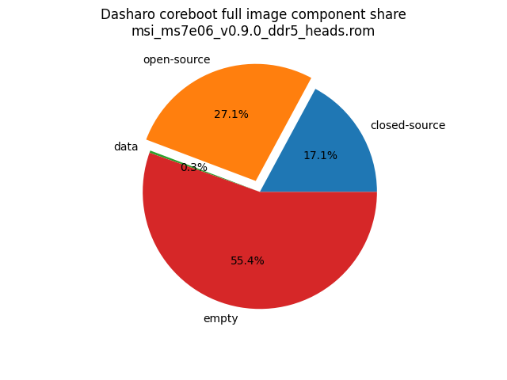
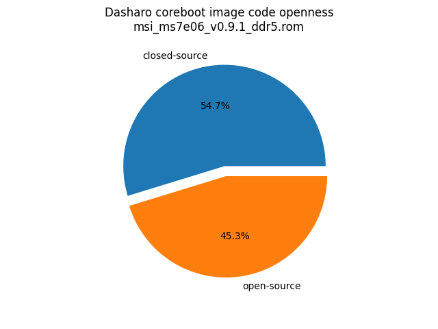
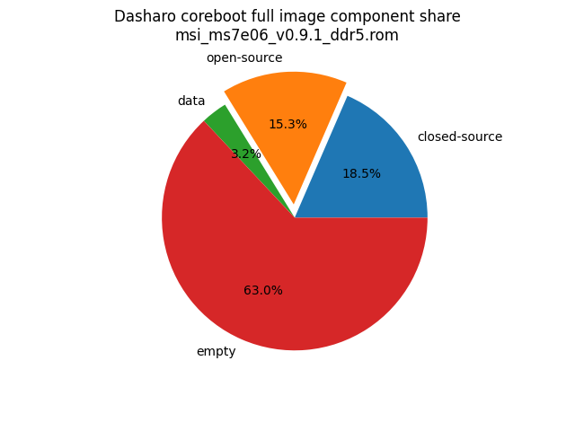
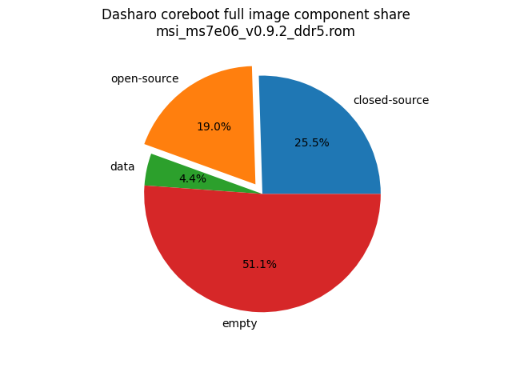

# Dasharo Openness Score

This page contains the [Dasharo Openness
Score](../../glossary.md#dasharo-openness-score) for Dasharo releases
compatible with MSI PRO Z790-P boards. The content of the page is generated
with [Dasharo Openness Score
utility](https://github.com/Dasharo/Openness-Score).

## v0.9.3

Openness Score for msi_ms7e06_v0.9.3_ddr5.rom

Open-source code percentage: **38.3%**
Closed-source code percentage: **61.7%**

* Image size: 33554432 (0x2000000)
* Number of regions: 37
* Number of CBFSes: 4
* Total open-source code size: 5740100 (0x579644)
* Total closed-source code size: 9233747 (0x8ce553)
* Total data size: 949317 (0xe7c45)
* Total empty size: 17631268 (0x10d0824)

> Numbers given above already include the calculations from CBFS regions
> presented below

### FMAP regions

| FMAP region | Offset | Size | Category |
| ----------- | ------ | ---- | -------- |
| SI_ME | 0x1000 | 0x3ff000 | closed-source |
| SI_DESC | 0x0 | 0x1000 | data |
| SMMSTORE | 0x1000000 | 0x40000 | data |
| RECOVERY_MRC_CACHE | 0x10a0000 | 0x20000 | data |
| RW_MRC_CACHE | 0x10c0000 | 0x20000 | data |
| RW_ELOG | 0x10e0000 | 0x4000 | data |
| SHARED_DATA | 0x10e4000 | 0x2000 | data |
| VBLOCK_DEV | 0x10e6000 | 0x2000 | data |
| RW_VPD | 0x10e8000 | 0x2000 | data |
| RW_NVRAM | 0x10ea000 | 0x6000 | data |
| CONSOLE | 0x10f0000 | 0x20000 | data |
| HSPHY_FW | 0x1110000 | 0x8000 | data |
| VBLOCK_A | 0x1318000 | 0x10000 | data |
| RW_FWID_A | 0x17bff00 | 0x100 | data |
| VBLOCK_B | 0x17e0000 | 0x10000 | data |
| RW_FWID_B | 0x1bfff00 | 0x100 | data |
| RO_VPD | 0x1c00000 | 0x4000 | data |
| FMAP | 0x1c04000 | 0x800 | data |
| RO_FRID | 0x1c04800 | 0x100 | data |
| RO_FRID_PAD | 0x1c04900 | 0x700 | data |
| GBB | 0x1c05000 | 0x3000 | data |
| UNUSED | 0x400000 | 0xc00000 | empty |

### CBFS BOOTSPLASH

* CBFS size: 2097152
* Number of files: 1
* Open-source files size: 0 (0x0)
* Closed-source files size: 0 (0x0)
* Data size: 28 (0x1c)
* Empty size: 2097124 (0x1fffe4)

> Numbers given above are already normalized (i.e. they already include size
> of metadata and possible closed-source LAN drivers included in the payload
> which are not visible in the table below)

| CBFS filename | CBFS filetype | Size | Compression | Category |
| ------------- | ------------- | ---- | ----------- | -------- |
| (empty) | null | 2097124 | none | empty |

### CBFS FW_MAIN_A

* CBFS size: 4816640
* Number of files: 13
* Open-source files size: 1881964 (0x1cb76c)
* Closed-source files size: 1506417 (0x16fc71)
* Data size: 8903 (0x22c7)
* Empty size: 1419356 (0x15a85c)

> Numbers given above are already normalized (i.e. they already include size
> of metadata and possible closed-source LAN drivers included in the payload
> which are not visible in the table below)

| CBFS filename | CBFS filetype | Size | Compression | Category |
| ------------- | ------------- | ---- | ----------- | -------- |
| fallback/payload | simple elf | 1538090 | none | open-source |
| fallback/romstage | stage | 106504 | none | open-source |
| fallback/ramstage | stage | 157420 | LZMA | open-source |
| fallback/dsdt.aml | raw | 11398 | none | open-source |
| fallback/postcar | stage | 68552 | none | open-source |
| cpu_microcode_blob.bin | microcode | 436224 | none | closed-source |
| fspm.bin | fsp | 786432 | none | closed-source |
| fsps.bin | fsp | 283761 | LZ4 | closed-source |
| config | raw | 5830 | LZMA | data |
| revision | raw | 850 | none | data |
| build_info | raw | 138 | none | data |
| vbt.bin | raw | 1258 | LZMA | data |
| (empty) | null | 2532 | none | empty |

### CBFS FW_MAIN_B

* CBFS size: 4259584
* Number of files: 13
* Open-source files size: 1881964 (0x1cb76c)
* Closed-source files size: 1506417 (0x16fc71)
* Data size: 8903 (0x22c7)
* Empty size: 862300 (0xd285c)

> Numbers given above are already normalized (i.e. they already include size
> of metadata and possible closed-source LAN drivers included in the payload
> which are not visible in the table below)

| CBFS filename | CBFS filetype | Size | Compression | Category |
| ------------- | ------------- | ---- | ----------- | -------- |
| fallback/payload | simple elf | 1538090 | none | open-source |
| fallback/romstage | stage | 106504 | none | open-source |
| fallback/ramstage | stage | 157420 | LZMA | open-source |
| fallback/dsdt.aml | raw | 11398 | none | open-source |
| fallback/postcar | stage | 68552 | none | open-source |
| cpu_microcode_blob.bin | microcode | 436224 | none | closed-source |
| fspm.bin | fsp | 786432 | none | closed-source |
| fsps.bin | fsp | 283761 | LZ4 | closed-source |
| config | raw | 5830 | LZMA | data |
| revision | raw | 850 | none | data |
| build_info | raw | 138 | none | data |
| vbt.bin | raw | 1258 | LZMA | data |
| (empty) | null | 2532 | none | empty |

### CBFS COREBOOT

* CBFS size: 4161536
* Number of files: 17
* Open-source files size: 1976172 (0x1e276c)
* Closed-source files size: 1506417 (0x16fc71)
* Data size: 9371 (0x249b)
* Empty size: 669576 (0xa3788)

> Numbers given above are already normalized (i.e. they already include size
> of metadata and possible closed-source LAN drivers included in the payload
> which are not visible in the table below)

| CBFS filename | CBFS filetype | Size | Compression | Category |
| ------------- | ------------- | ---- | ----------- | -------- |
| fallback/payload | simple elf | 1538090 | none | open-source |
| fallback/romstage | stage | 106504 | none | open-source |
| fallback/ramstage | stage | 157420 | LZMA | open-source |
| fallback/dsdt.aml | raw | 11398 | none | open-source |
| fallback/postcar | stage | 68552 | none | open-source |
| bootblock | bootblock | 94208 | none | open-source |
| cpu_microcode_blob.bin | microcode | 436224 | none | closed-source |
| fspm.bin | fsp | 786432 | none | closed-source |
| fsps.bin | fsp | 283761 | LZ4 | closed-source |
| cbfs_master_header | cbfs header | 32 | none | data |
| intel_fit | intel_fit | 80 | none | data |
| config | raw | 5830 | LZMA | data |
| revision | raw | 850 | none | data |
| build_info | raw | 138 | none | data |
| vbt.bin | raw | 1258 | LZMA | data |
| (empty) | null | 2276 | none | empty |
| (empty) | null | 667300 | none | empty |

## v0.9.0 heads

Report has been generated with Openness Score utility version v0.2

Openness Score for msi_ms7e06_v0.9.0_ddr5_heads.rom

Open-source code percentage: **61.3%**
Closed-source code percentage: **38.7%**

* Image size: 33554432 (0x2000000)
* Number of regions: 7
* Number of CBFSes: 1
* Total open-source code size: 9099383 (0x8ad877)
* Total closed-source code size: 5749077 (0x57b955)
* Total data size: 105592 (0x19c78)
* Total empty size: 18600380 (0x11bd1bc)

> Numbers given above already include the calculations from CBFS regions
> presented below

### FMAP regions

| FMAP region | Offset | Size | Category |
| ----------- | ------ | ---- | -------- |
| RW_MRC_CACHE | 0x400000 | 0x10000 | data |
| FMAP | 0x418000 | 0x200 | data |

### IFD regions

| IFD region | Start | End | Size | Category |
| -------------- | ----- | --- | ---- | -------- |
| Intel ME | 0x00001000 | 0x003d8fff | 0x3d8000 | closed-source |
| Flash Descriptor | 0x00000000 | 0x00000fff | 0x1000 | data |
| Device Exp2 | 0x003d9000 | 0x003fffff | 0x27000 | empty |

### CBFS COREBOOT

* CBFS size: 29261312
* Number of files: 25
* Open-source files size: 9099383 (0x8ad877)
* Closed-source files size: 1685845 (0x19b955)
* Data size: 35448 (0x8a78)
* Empty size: 18440636 (0x11961bc)

> Numbers given above are already normalized (i.e. they already include size
> of metadata and possible closed-source LAN drivers included in the payload
> which are not visible in the table below)

| CBFS filename | CBFS filetype | Size | Compression | Category |
| ------------- | ------------- | ---- | ----------- | -------- |
| fallback/payload | simple elf | 8782653 | none | open-source |
| fallback/romstage | stage | 95448 | none | open-source |
| fallback/ramstage | stage | 141286 | LZMA | open-source |
| fallback/dsdt.aml | raw | 11268 | none | open-source |
| fallback/postcar | stage | 31288 | none | open-source |
| bootblock | bootblock | 37440 | none | open-source |
| fspm.bin | fsp | 786432 | none | closed-source |
| fsps.bin | fsp | 283692 | LZ4 | closed-source |
| cpu_microcode_blob.bin | microcode | 431104 | none | closed-source |
| cbfs_master_header | cbfs header | 28 | none | data |
| config | raw | 4520 | LZMA | data |
| revision | raw | 867 | none | data |
| bootsplash.jpg | bootsplash | 26784 | none | data |
| vbt.bin | raw | 1258 | LZMA | data |
| build_info | raw | 141 | none | data |
| intel_fit | intel_fit | 80 | none | data |
| (empty) | null | 228 | none | empty |
| (empty) | null | 2317220 | none | empty |
| (empty) | null | 523940 | none | empty |
| (empty) | null | 7536548 | none | empty |
| (empty) | null | 142948 | none | empty |
| (empty) | null | 7695268 | none | empty |
| (empty) | null | 224484 | none | empty |

## v0.9.1

Report has been generated with Openness Score utility version v0.2

Openness Score for msi_ms7e06_v0.9.1_ddr5.rom

Open-source code percentage: **45.3%**
Closed-source code percentage: **54.7%**

* Image size: 33554432 (0x2000000)
* Number of regions: 37
* Number of CBFSes: 4
* Total open-source code size: 7057492 (0x6bb054)
* Total closed-source code size: 8534148 (0x823884)
* Total data size: 1472654 (0x16788e)
* Total empty size: 29073050 (0x1bb9e9a)

> Numbers given above already include the calculations from CBFS regions
> presented below

### FMAP regions

| FMAP region | Offset | Size | Category |
| ----------- | ------ | ---- | -------- |
| SMMSTORE | 0x1000000 | 0x40000 | data |
| RESERVED | 0x1040000 | 0x40000 | data |
| BPA | 0x1080000 | 0x20000 | data |
| RECOVERY_MRC_CACHE | 0x10a0000 | 0x20000 | data |
| RW_MRC_CACHE | 0x10c0000 | 0x20000 | data |
| RW_ELOG | 0x10e0000 | 0x4000 | data |
| SHARED_DATA | 0x10e4000 | 0x2000 | data |
| VBLOCK_DEV | 0x10e6000 | 0x2000 | data |
| RW_VPD | 0x10e8000 | 0x2000 | data |
| RW_NVRAM | 0x10ea000 | 0x6000 | data |
| CONSOLE | 0x10f0000 | 0x20000 | data |
| HSPHY_FW | 0x1110000 | 0x8000 | data |
| VBLOCK_A | 0x1318000 | 0x10000 | data |
| RW_FWID_A | 0x17bff00 | 0x100 | data |
| ROMHOLE | 0x17c0000 | 0x20000 | data |
| VBLOCK_B | 0x17e0000 | 0x10000 | data |
| RW_FWID_B | 0x1bfff00 | 0x100 | data |
| RO_VPD | 0x1c00000 | 0x4000 | data |
| FMAP | 0x1c04000 | 0x800 | data |
| RO_FRID | 0x1c04800 | 0x100 | data |
| RO_FRID_PAD | 0x1c04900 | 0x700 | data |
| GBB | 0x1c05000 | 0x3000 | data |
| UNUSED | 0x400000 | 0xc00000 | empty |

### IFD regions

| IFD region | Start | End | Size | Category |
| -------------- | ----- | --- | ---- | -------- |
| Intel ME | 0x00001000 | 0x003d8fff | 0x3d8000 | closed-source |
| Flash Descriptor | 0x00000000 | 0x00000fff | 0x1000 | data |
| Device Exp2 | 0x003d9000 | 0x00ffffff | 0xc27000 | empty |

### CBFS BOOTSPLASH

* CBFS size: 2097152
* Number of files: 1
* Open-source files size: 0 (0x0)
* Closed-source files size: 0 (0x0)
* Data size: 28 (0x1c)
* Empty size: 2097124 (0x1fffe4)

> Numbers given above are already normalized (i.e. they already include size
> of metadata and possible closed-source LAN drivers included in the payload
> which are not visible in the table below)

| CBFS filename | CBFS filetype | Size | Compression | Category |
| ------------- | ------------- | ---- | ----------- | -------- |
| (empty) | null | 2097124 | none | empty |

### CBFS FW_MAIN_A

* CBFS size: 4816640
* Number of files: 13
* Open-source files size: 2322780 (0x23715c)
* Closed-source files size: 1501228 (0x16e82c)
* Data size: 8609 (0x21a1)
* Empty size: 984023 (0xf03d7)

> Numbers given above are already normalized (i.e. they already include size
> of metadata and possible closed-source LAN drivers included in the payload
> which are not visible in the table below)

| CBFS filename | CBFS filetype | Size | Compression | Category |
| ------------- | ------------- | ---- | ----------- | -------- |
| fallback/romstage | stage | 103440 | none | open-source |
| fallback/ramstage | stage | 150907 | LZMA | open-source |
| fallback/dsdt.aml | raw | 11264 | none | open-source |
| fallback/postcar | stage | 69188 | none | open-source |
| fallback/payload | simple elf | 1987981 | none | open-source |
| cpu_microcode_blob.bin | microcode | 431104 | none | closed-source |
| fspm.bin | fsp | 786432 | none | closed-source |
| fsps.bin | fsp | 283692 | LZ4 | closed-source |
| config | raw | 5379 | LZMA | data |
| revision | raw | 850 | none | data |
| build_info | raw | 138 | none | data |
| vbt.bin | raw | 1258 | LZMA | data |
| (empty) | null | 740 | none | empty |

### CBFS FW_MAIN_B

* CBFS size: 4259584
* Number of files: 13
* Open-source files size: 2322780 (0x23715c)
* Closed-source files size: 1501228 (0x16e82c)
* Data size: 8609 (0x21a1)
* Empty size: 426967 (0x683d7)

> Numbers given above are already normalized (i.e. they already include size
> of metadata and possible closed-source LAN drivers included in the payload
> which are not visible in the table below)

| CBFS filename | CBFS filetype | Size | Compression | Category |
| ------------- | ------------- | ---- | ----------- | -------- |
| fallback/romstage | stage | 103440 | none | open-source |
| fallback/ramstage | stage | 150907 | LZMA | open-source |
| fallback/dsdt.aml | raw | 11264 | none | open-source |
| fallback/postcar | stage | 69188 | none | open-source |
| fallback/payload | simple elf | 1987981 | none | open-source |
| cpu_microcode_blob.bin | microcode | 431104 | none | closed-source |
| fspm.bin | fsp | 786432 | none | closed-source |
| fsps.bin | fsp | 283692 | LZ4 | closed-source |
| config | raw | 5379 | LZMA | data |
| revision | raw | 850 | none | data |
| build_info | raw | 138 | none | data |
| vbt.bin | raw | 1258 | LZMA | data |
| (empty) | null | 740 | none | empty |

### CBFS COREBOOT

* CBFS size: 4161536
* Number of files: 17
* Open-source files size: 2411932 (0x24cd9c)
* Closed-source files size: 1501228 (0x16e82c)
* Data size: 9008 (0x2330)
* Empty size: 239368 (0x3a708)

> Numbers given above are already normalized (i.e. they already include size
> of metadata and possible closed-source LAN drivers included in the payload
> which are not visible in the table below)

| CBFS filename | CBFS filetype | Size | Compression | Category |
| ------------- | ------------- | ---- | ----------- | -------- |
| fallback/romstage | stage | 103440 | none | open-source |
| fallback/ramstage | stage | 150907 | LZMA | open-source |
| fallback/dsdt.aml | raw | 11264 | none | open-source |
| fallback/postcar | stage | 69188 | none | open-source |
| fallback/payload | simple elf | 1987981 | none | open-source |
| bootblock | bootblock | 89152 | none | open-source |
| cpu_microcode_blob.bin | microcode | 431104 | none | closed-source |
| fspm.bin | fsp | 786432 | none | closed-source |
| fsps.bin | fsp | 283692 | LZ4 | closed-source |
| cbfs_master_header | cbfs header | 28 | none | data |
| intel_fit | intel_fit | 80 | none | data |
| config | raw | 5379 | LZMA | data |
| revision | raw | 850 | none | data |
| build_info | raw | 138 | none | data |
| vbt.bin | raw | 1258 | LZMA | data |
| (empty) | null | 484 | none | empty |
| (empty) | null | 238884 | none | empty |

## v0.9.2

Report has been generated with Openness Score utility version v0.2

Openness Score for msi_ms7e06_v0.9.2_ddr5.rom

Open-source code percentage: **42.7%**
Closed-source code percentage: **57.3%**

* Image size: 33554432 (0x2000000)
* Number of regions: 37
* Number of CBFSes: 4
* Total open-source code size: 6370867 (0x613633)
* Total closed-source code size: 8549715 (0x827553)
* Total data size: 1473158 (0x167a86)
* Total empty size: 17160692 (0x105d9f4)

> Numbers given above already include the calculations from CBFS regions
> presented below

### FMAP regions

| FMAP region | Offset | Size | Category |
| ----------- | ------ | ---- | -------- |
| SMMSTORE | 0x1000000 | 0x40000 | data |
| RESERVED | 0x1040000 | 0x40000 | data |
| BPA | 0x1080000 | 0x20000 | data |
| RECOVERY_MRC_CACHE | 0x10a0000 | 0x20000 | data |
| RW_MRC_CACHE | 0x10c0000 | 0x20000 | data |
| RW_ELOG | 0x10e0000 | 0x4000 | data |
| SHARED_DATA | 0x10e4000 | 0x2000 | data |
| VBLOCK_DEV | 0x10e6000 | 0x2000 | data |
| RW_VPD | 0x10e8000 | 0x2000 | data |
| RW_NVRAM | 0x10ea000 | 0x6000 | data |
| CONSOLE | 0x10f0000 | 0x20000 | data |
| HSPHY_FW | 0x1110000 | 0x8000 | data |
| VBLOCK_A | 0x1318000 | 0x10000 | data |
| RW_FWID_A | 0x17bff00 | 0x100 | data |
| ROMHOLE | 0x17c0000 | 0x20000 | data |
| VBLOCK_B | 0x17e0000 | 0x10000 | data |
| RW_FWID_B | 0x1bfff00 | 0x100 | data |
| RO_VPD | 0x1c00000 | 0x4000 | data |
| FMAP | 0x1c04000 | 0x800 | data |
| RO_FRID | 0x1c04800 | 0x100 | data |
| RO_FRID_PAD | 0x1c04900 | 0x700 | data |
| GBB | 0x1c05000 | 0x3000 | data |
| UNUSED | 0x400000 | 0xc00000 | empty |

### IFD regions

| IFD region | Start | End | Size | Category |
| -------------- | ----- | --- | ---- | -------- |
| Intel ME | 0x00001000 | 0x003d8fff | 0x3d8000 | closed-source |
| Flash Descriptor | 0x00000000 | 0x00000fff | 0x1000 | data |
| Device Exp2 | 0x003d9000 | 0x003fffff | 0x27000 | empty |

### CBFS BOOTSPLASH

* CBFS size: 2097152
* Number of files: 1
* Open-source files size: 0 (0x0)
* Closed-source files size: 0 (0x0)
* Data size: 28 (0x1c)
* Empty size: 2097124 (0x1fffe4)

> Numbers given above are already normalized (i.e. they already include size
> of metadata and possible closed-source LAN drivers included in the payload
> which are not visible in the table below)

| CBFS filename | CBFS filetype | Size | Compression | Category |
| ------------- | ------------- | ---- | ----------- | -------- |
| (empty) | null | 2097124 | none | empty |

### CBFS FW_MAIN_A

* CBFS size: 4816640
* Number of files: 13
* Open-source files size: 2091793 (0x1feb11)
* Closed-source files size: 1506417 (0x16fc71)
* Data size: 8762 (0x223a)
* Empty size: 1209668 (0x127544)

> Numbers given above are already normalized (i.e. they already include size
> of metadata and possible closed-source LAN drivers included in the payload
> which are not visible in the table below)

| CBFS filename | CBFS filetype | Size | Compression | Category |
| ------------- | ------------- | ---- | ----------- | -------- |
| fallback/payload | simple elf | 1773739 | none | open-source |
| fallback/romstage | stage | 110688 | none | open-source |
| fallback/ramstage | stage | 155027 | LZMA | open-source |
| fallback/dsdt.aml | raw | 11347 | none | open-source |
| fallback/postcar | stage | 40992 | none | open-source |
| cpu_microcode_blob.bin | microcode | 436224 | none | closed-source |
| fspm.bin | fsp | 786432 | none | closed-source |
| fsps.bin | fsp | 283761 | LZ4 | closed-source |
| config | raw | 5634 | LZMA | data |
| revision | raw | 850 | none | data |
| build_info | raw | 138 | none | data |
| vbt.bin | raw | 1258 | LZMA | data |
| (empty) | null | 100 | none | empty |

### CBFS FW_MAIN_B

* CBFS size: 4259584
* Number of files: 13
* Open-source files size: 2091793 (0x1feb11)
* Closed-source files size: 1506417 (0x16fc71)
* Data size: 8762 (0x223a)
* Empty size: 652612 (0x9f544)

> Numbers given above are already normalized (i.e. they already include size
> of metadata and possible closed-source LAN drivers included in the payload
> which are not visible in the table below)

| CBFS filename | CBFS filetype | Size | Compression | Category |
| ------------- | ------------- | ---- | ----------- | -------- |
| fallback/payload | simple elf | 1773739 | none | open-source |
| fallback/romstage | stage | 110688 | none | open-source |
| fallback/ramstage | stage | 155027 | LZMA | open-source |
| fallback/dsdt.aml | raw | 11347 | none | open-source |
| fallback/postcar | stage | 40992 | none | open-source |
| cpu_microcode_blob.bin | microcode | 436224 | none | closed-source |
| fspm.bin | fsp | 786432 | none | closed-source |
| fsps.bin | fsp | 283761 | LZ4 | closed-source |
| config | raw | 5634 | LZMA | data |
| revision | raw | 850 | none | data |
| build_info | raw | 138 | none | data |
| vbt.bin | raw | 1258 | LZMA | data |
| (empty) | null | 100 | none | empty |

### CBFS COREBOOT

* CBFS size: 4161536
* Number of files: 17
* Open-source files size: 2187281 (0x216011)
* Closed-source files size: 1506417 (0x16fc71)
* Data size: 9206 (0x23f6)
* Empty size: 458632 (0x6ff88)

> Numbers given above are already normalized (i.e. they already include size
> of metadata and possible closed-source LAN drivers included in the payload
> which are not visible in the table below)

| CBFS filename | CBFS filetype | Size | Compression | Category |
| ------------- | ------------- | ---- | ----------- | -------- |
| fallback/payload | simple elf | 1773739 | none | open-source |
| fallback/romstage | stage | 110688 | none | open-source |
| fallback/ramstage | stage | 155027 | LZMA | open-source |
| fallback/dsdt.aml | raw | 11347 | none | open-source |
| fallback/postcar | stage | 40992 | none | open-source |
| bootblock | bootblock | 95488 | none | open-source |
| cpu_microcode_blob.bin | microcode | 436224 | none | closed-source |
| fspm.bin | fsp | 786432 | none | closed-source |
| fsps.bin | fsp | 283761 | LZ4 | closed-source |
| cbfs_master_header | cbfs header | 32 | none | data |
| intel_fit | intel_fit | 80 | none | data |
| config | raw | 5634 | LZMA | data |
| revision | raw | 850 | none | data |
| build_info | raw | 138 | none | data |
| vbt.bin | raw | 1258 | LZMA | data |
| (empty) | null | 2596 | none | empty |
| (empty) | null | 456036 | none | empty |
