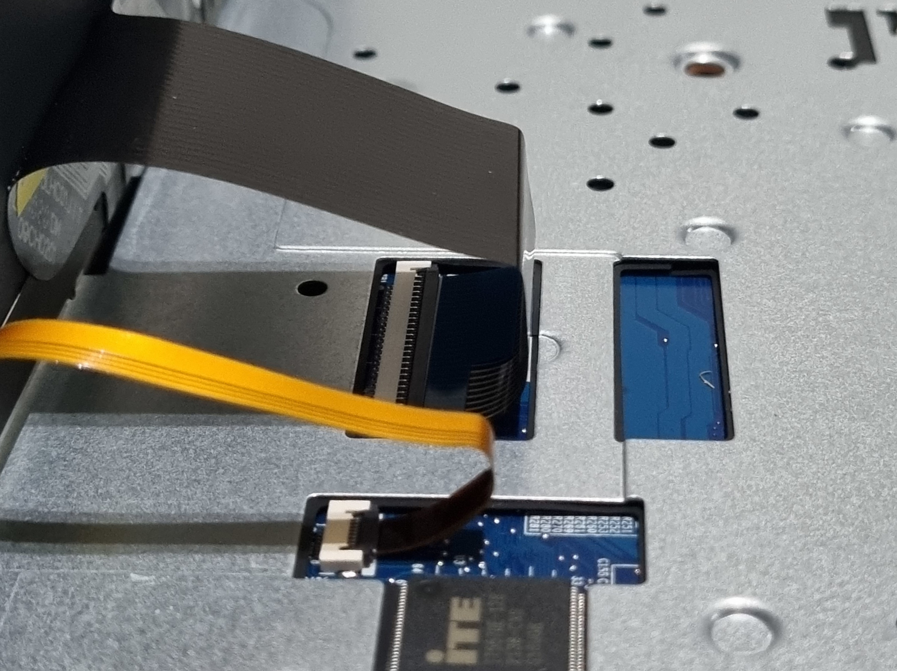
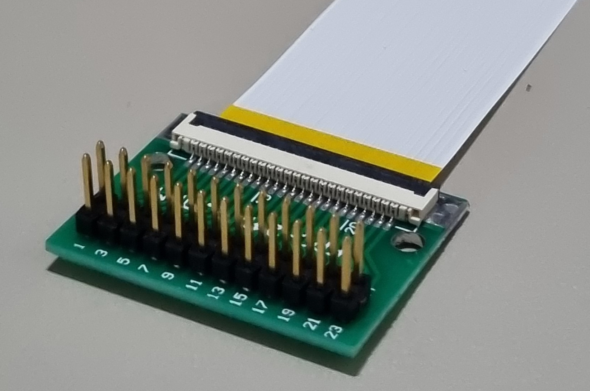
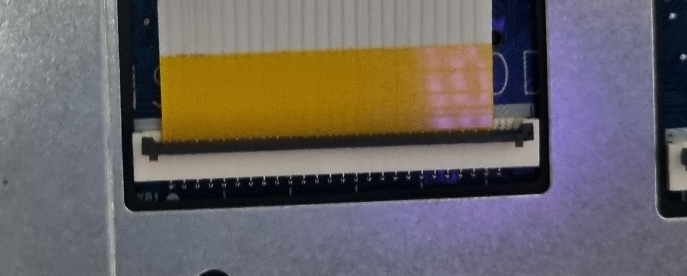

# EC firmware recovery

## Introduction

This document describes the process of flashing EC firmware externally, in case
it has been flashed using incompatible or broken firmware. This document is not
intented for most users, but for developers, testers and advanced users
experimenting with the EC firmware.

## Prereqisites

You will need:

- an Arduino Mega 2560
- a 24-pin FFC cable with a 1.0mm pitch, same-sided (connectors on the same side
  on both ends of the cable)
- a 24-pin FFC breakout board with a 1.0mm pitch FFC connector and a 2.54mm
  pitch pin header
- USB-A to USB-B cable to connect the Arduino to the host
- USB-C cable for grouding

## Preparation

- Clone the EC repository:

```bash
git clone https://github.com/Dasharo/ec.git
```

- Install dependencies:

```bash
./scripts/deps.sh
```

- If `rustup` was installed as part of the previous step, run:

```bash
source $HOME/.cargo/env
```

- Connect the Arduino to the computer using a USB-A to USB-B cable

- Build and flash firmware for the Arduino, which will serve as the flasher:

```bash
make BOARD=arduino/mega2560
make BOARD=arduino/mega2560 flash
```

- Build the firmware for your laptop:

```bash
make BOARD=clevo/ns50mu
```

The firmware should now be built.

## Flashing

- Unscrew the bottom cover from the laptop

  

- Disconnect the battery

> All power must be removed from the laptop during flashing.

  

- Reattach the bottom cover (without screwing it in) and flip the laptop over
- Using a prying tool like a credit card, pull up the keyboard from the laptop

> Start prying at the top of the keyboard. Be extra careful when removing the
> keyboard to avoid damaging the keyboard cable, which is extremely fragile

  

- Disconnect the keyboard from the laptop

  

- Connect the USB-C cable to the Thunderbolt port on the laptop and to the host
  computer. This will provide grounding
- Connect the FFC cable to the FFC breakout board

  

- Insert the breakout into Arduino's digital pin header, pins 22-45, with the
  FFC connector facing outwards

  

- Connect the other end of the FFC cable to the keyboard connector on the
  laptop, taking care to align pin 1 of the FFC cable to pin 1 (leftmost) pin
  of the connector

  

  

- Connect the Arduino to the host using the USB-A to USB-B cable
- Flash the firmware:

```bash
make BOARD=clevo/ns50mu flash_external
```

The output will contain:

```bash
Buffer size: 128
ID: 5570 VER: 2
```

If it contains other values or the connection times out, reattach the FFC cable
to the laptop and the breakout board.

- Reassemble the laptop: disconnect the Arduino from the laptop, reattach the
  keyboard, disconnect the USB-C cable, reconnect the battery and screw in the
  bottom cover
